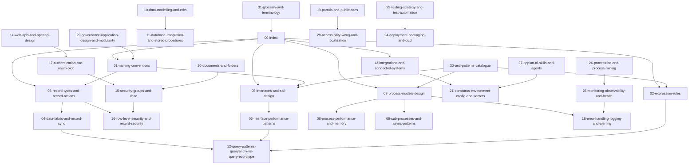

# Appian 26.x Engineering Knowledge Base Index

## 1. Purpose

This file is the retrieval entry point for the Appian 26.x engineering knowledge base. It tells a human developer or downstream large language model which file to retrieve for a build, review, refactor, performance, security or deployment request. It prevents the common failure mode where an LLM retrieves a broad file, misses the governing pattern, and then generates Appian code that compiles poorly, performs badly, or bypasses governance. Use this file first whenever the user request spans more than one Appian artefact type.

## 2. Scope

- **In scope:** Retrieval routing, cross-file dependency mapping, global Appian rules, LLM retrieval hints and repository navigation.
- **Out of scope:** Detailed implementation rules. Retrieve the topic-specific file listed in the routing table.

## 3. Core Principles

1. Retrieve the most specific file first. A request about grid performance must retrieve the interface performance file before the general SAIL file.
2. Treat every file as self-contained. RAG retrieval often gives the downstream LLM one file at a time.
3. Use Appian-native patterns before custom patterns. Native records, process models, connected systems and web APIs reduce upgrade risk.
4. Default to record-centric design for operational applications. Persist business state in records and audit tables, not only in process variables.
5. Enforce bounded data access. Default `batchSize` is `25`; client-side rendering must not exceed `500` rows.
6. Keep interfaces small and deterministic. Keep top-level `local!` variables under `30` and rendered components under `50`.
7. Keep process models lean. Keep process models under `50` nodes and use sub-processes for flows used `2+` times.
8. Secure at the lowest enforceable layer. Interface visibility is not an authorisation boundary.
9. Externalise environment-specific configuration. Never hardcode secrets, URLs or credentials in Appian artefacts.
10. Make generated code reviewable by machines. Use stable prefixes, consistent object names, bounded queries and explicit null handling.

## 4. Detailed Best Practices

### Global rules

| Rule ID | Rule | Applies to | Primary file |
|---|---|---|---|
| GLOBAL-01 | Never invent Appian functions, component parameters, record fields, process variables, table names or prefixes. | All artefacts | `30-anti-patterns-catalogue.md` |
| GLOBAL-02 | Use the supplied application prefix for every generated Appian object. | All Appian objects | `01-naming-conventions.md` |
| GLOBAL-03 | Use `a!queryRecordType()` for record-backed queries. Use `a!queryEntity()` only for approved legacy data store entity patterns. | Rules, interfaces | `12-query-patterns-queryentity-vs-queryrecordtype.md` |
| GLOBAL-04 | Never call `a!queryEntity()` or `a!queryRecordType()` inside `a!forEach()` when the loop can exceed `5` items. | Rules, interfaces | `06-interface-performance-patterns.md` |
| GLOBAL-05 | Always bound paging. Default `batchSize` is `25`; larger values require justification. | Queries, grids | `12-query-patterns-queryentity-vs-queryrecordtype.md` |
| GLOBAL-06 | Store business state in database-backed record types, not only in process variables. | Process models | `03-record-types-and-record-actions.md` |
| GLOBAL-07 | Enforce security through groups, object security, process start security and record security. | Security | `15-security-groups-and-rbac.md` |
| GLOBAL-08 | Store credentials only in connected systems or approved secret mechanisms. | Integrations | `21-constants-environment-config-and-secrets.md` |
| GLOBAL-09 | Archive standard transactional process models after `7` days unless audit rules require more. | Process models | `08-process-performance-and-memory.md` |
| GLOBAL-10 | Every production-facing interface must meet WCAG 2.2 AA design and test expectations. | Interfaces | `28-accessibility-wcag-and-localisation.md` |

### When to retrieve which file

| User-intent keywords | Primary file | Secondary files |
|---|---|---|
| naming, prefix, object name, convention | `01-naming-conventions.md` | `29-governance-application-design-and-modularity.md` |
| expression rule, rule input, local variable | `02-expression-rules.md` | `12-query-patterns-queryentity-vs-queryrecordtype.md` |
| record type, record action, related action | `03-record-types-and-record-actions.md` | `16-row-level-security-and-record-security.md` |
| data fabric, record sync, source filter | `04-data-fabric-and-record-sync.md` | `12-query-patterns-queryentity-vs-queryrecordtype.md` |
| SAIL form, interface, dashboard, grid | `05-interfaces-and-sail-design.md` | `06-interface-performance-patterns.md` |
| slow interface, refreshVariable, grid performance | `06-interface-performance-patterns.md` | `12-query-patterns-queryentity-vs-queryrecordtype.md` |
| process model, approval, task, gateway | `07-process-models-design.md` | `18-error-handling-logging-and-alerting.md` |
| process memory, MNI, archive | `08-process-performance-and-memory.md` | `09-sub-processes-and-async-patterns.md` |
| async, queue, background job | `09-sub-processes-and-async-patterns.md` | `18-error-handling-logging-and-alerting.md` |
| CDT, data model, data store entity | `10-data-modelling-and-cdts.md` | `11-database-integration-and-stored-procedures.md` |
| stored procedure, SQL, transaction | `11-database-integration-and-stored-procedures.md` | `24-deployment-packaging-and-cicd.md` |
| queryEntity, queryRecordType, pagingInfo | `12-query-patterns-queryentity-vs-queryrecordtype.md` | `06-interface-performance-patterns.md` |
| connected system, REST integration, SOAP | `13-integrations-and-connected-systems.md` | `18-error-handling-logging-and-alerting.md` |
| web API, OpenAPI, inbound API | `14-web-apis-and-openapi-design.md` | `17-authentication-sso-oauth-oidc.md` |
| groups, RBAC, object security | `15-security-groups-and-rbac.md` | `16-row-level-security-and-record-security.md` |
| record security, row-level access | `16-row-level-security-and-record-security.md` | `03-record-types-and-record-actions.md` |
| SSO, OIDC, OAuth, SAML | `17-authentication-sso-oauth-oidc.md` | `15-security-groups-and-rbac.md` |
| error handling, logging, alerts | `18-error-handling-logging-and-alerting.md` | `25-monitoring-observability-and-health.md` |
| portal, public form, anonymous user | `19-portals-and-public-sites.md` | `28-accessibility-wcag-and-localisation.md` |
| document upload, folder, knowledge centre | `20-documents-and-folders.md` | `15-security-groups-and-rbac.md` |
| constant, environment config, secret | `21-constants-environment-config-and-secrets.md` | `24-deployment-packaging-and-cicd.md` |
| plug-in, smart service, custom function | `22-plugins-and-custom-smart-services.md` | `30-anti-patterns-catalogue.md` |
| tests, test automation, regression | `23-testing-strategy-and-test-automation.md` | `24-deployment-packaging-and-cicd.md` |
| deployment, package, CI/CD, rollback | `24-deployment-packaging-and-cicd.md` | `21-constants-environment-config-and-secrets.md` |
| monitoring, Health Check, logs | `25-monitoring-observability-and-health.md` | `18-error-handling-logging-and-alerting.md` |
| Process HQ, process mining, bottleneck | `26-process-hq-and-process-mining.md` | `25-monitoring-observability-and-health.md` |
| AI Skill, Agent Studio, extraction | `27-appian-ai-skills-and-agents.md` | `21-constants-environment-config-and-secrets.md` |
| accessibility, WCAG, localisation | `28-accessibility-wcag-and-localisation.md` | `05-interfaces-and-sail-design.md` |
| modularity, shared app, governance | `29-governance-application-design-and-modularity.md` | `01-naming-conventions.md` |
| anti-pattern, refactor, code review | `30-anti-patterns-catalogue.md` | Topic-specific file |
| terminology, acronym, definition | `31-glossary-and-terminology.md` | `00-index.md` |
| search employees, server-side paging | `05-interfaces-and-sail-design.md` | `06-interface-performance-patterns.md`, `15-security-groups-and-rbac.md` |
| build approval workflow | `07-process-models-design.md` | `03-record-types-and-record-actions.md` |
| reference data admin screen | `03-record-types-and-record-actions.md` | `21-constants-environment-config-and-secrets.md` |
| expose data to external system | `14-web-apis-and-openapi-design.md` | `17-authentication-sso-oauth-oidc.md` |
| consume external REST API | `13-integrations-and-connected-systems.md` | `18-error-handling-logging-and-alerting.md` |
| optimise dashboard | `06-interface-performance-patterns.md` | `25-monitoring-observability-and-health.md` |
| fix production incident | `25-monitoring-observability-and-health.md` | `30-anti-patterns-catalogue.md` |
| database migration script | `11-database-integration-and-stored-procedures.md` | `24-deployment-packaging-and-cicd.md` |
| secure document access | `20-documents-and-folders.md` | `16-row-level-security-and-record-security.md` |
| portal intake form | `19-portals-and-public-sites.md` | `05-interfaces-and-sail-design.md` |
| review generated Appian code | `30-anti-patterns-catalogue.md` | Artefact-specific file |

### Topic dependency graph



## 5. Decision Matrix

| Option | When to use | When NOT to use | Performance profile | Memory/IO cost | Governance impact | Notes |
|---|---|---|---|---|---|---|
| Retrieve one specific file | User request clearly maps to one artefact. | Request spans architecture, security and deployment. | Fastest retrieval. | Low. | Low. | Default for simple code generation. |
| Retrieve primary plus secondary files | User request includes one artefact and one adjacent concern. | User asks for full application blueprint. | Balanced. | Medium. | Recommended. | Use the routing table. |
| Retrieve governance plus topic file | User asks for application structure or full build plan. | User asks for a small rule only. | Medium. | Medium. | High. | Pair `29-governance` with topic files. |
| Retrieve anti-patterns plus topic file | User asks for review or refactor. | User asks for net-new design without existing code. | Medium. | Medium. | High quality control. | Use `30-anti-patterns` as reviewer lens. |

## 6. Worked End-to-End Example

### Requirement

Build an Appian interface to search employees with server-side paging and role-based column visibility.

### Design decision

Retrieve `05-interfaces-and-sail-design.md` first because the deliverable is a SAIL interface. Retrieve `06-interface-performance-patterns.md` because the request includes server-side paging. Retrieve `15-security-groups-and-rbac.md` because the request includes role-based column visibility. Retrieve `12-query-patterns-queryentity-vs-queryrecordtype.md` because the interface requires a query expression rule.

### Full code shape

```sail
a!localVariables(
  local!pagingInfo: a!pagingInfo(startIndex: 1, batchSize: cons!APP_PAGE_SIZE_DEFAULT),
  local!canViewSensitiveColumns: a!isUserMemberOfGroup(
    username: loggedInUser(),
    groups: cons!APP_GRP_AppAdmin
  ),
  local!employeeData: rule!APP_QRY_GetEmployees(
    searchText: ri!searchText,
    pagingInfo: local!pagingInfo
  ),
  a!gridField(
    label: "Employees",
    data: local!employeeData.data,
    totalCount: local!employeeData.totalCount,
    columns: {
      a!gridColumn(label: "Employee Name", value: fv!row[recordType!APP_REC_Employee.fields.fullName]),
      a!gridColumn(label: "Status", value: fv!row[recordType!APP_REC_Employee.fields.status]),
      a!gridColumn(
        label: "Sensitive Reference",
        value: fv!row[recordType!APP_REC_Employee.fields.sensitiveReference],
        showWhen: local!canViewSensitiveColumns
      )
    },
    pageSize: local!pagingInfo.batchSize
  )
)
```

### Verification steps

1. Confirm the interface has one top-level `a!localVariables()`.
2. Confirm the query is delegated to an expression rule and uses bounded paging.
3. Confirm sensitive column visibility is driven by group membership.
4. Confirm record-level security still protects restricted records even when the column is hidden.
5. Confirm `batchSize` defaults to `25`.
6. Confirm no query runs inside `a!forEach()`.

## 7. Code Review Checklist

- Does the response use the supplied application prefix for every generated Appian object?
- Does the response avoid client-specific and proprietary references?
- Does every query include bounded paging?
- Does every query select only required fields?
- Does the design avoid querying inside loops above `5` iterations?
- Does the design use record types and record actions for business records where appropriate?
- Does interface logic avoid relying on `showWhen` as the only security control?
- Does the process design keep business state in records rather than only in process variables?
- Does every integration have timeout, retry, idempotency and error handling rules?
- Does every externalised value use constants, customisation files or approved credential storage?
- Does every user-facing interface include WCAG 2.2 AA considerations?
- Does every deployment design include rollback and smoke testing?

## 8. Common Failure Modes in Production

- **Symptom:** Interface takes 5-10 seconds to load after data volume increases. → **Prevented by:** `06-interface-performance-patterns`, `12-query-patterns-queryentity-vs-queryrecordtype`
- **Symptom:** Users start a process directly despite hidden buttons. → **Prevented by:** `15-security-groups-and-rbac`, `16-row-level-security-and-record-security`
- **Symptom:** Process instances consume excessive memory. → **Prevented by:** `07-process-models-design`, `08-process-performance-and-memory`
- **Symptom:** Integration creates duplicate external transactions after retry. → **Prevented by:** `13-integrations-and-connected-systems`, `18-error-handling-logging-and-alerting`
- **Symptom:** Deployment fails because endpoint URLs differ between environments. → **Prevented by:** `21-constants-environment-config-and-secrets`, `24-deployment-packaging-and-cicd`
- **Symptom:** Generated SAIL contains non-Appian syntax. → **Prevented by:** `30-anti-patterns-catalogue`, `05-interfaces-and-sail-design`

## 9. References

- Appian functions: `a!localVariables()`, `a!refreshVariable()`, `a!queryRecordType()`, `a!queryEntity()`, `a!pagingInfo()`, `a!gridField()`, `a!recordData()`, `a!forEach()`, `a!isUserMemberOfGroup()`, `loggedInUser()`.
- Appian designer object types: application, expression rule, interface, record type, record action, process model, integration, connected system, web API, constant, group, folder, document, data store entity, CDT, plug-in and smart service.
- Cross-reference this index before generating or reviewing Appian code.
