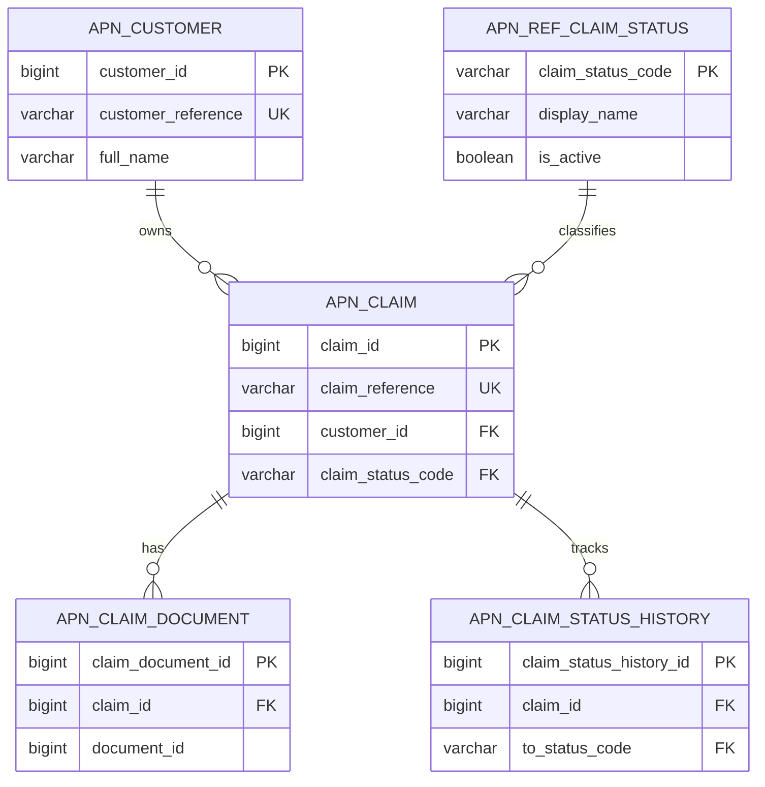

# Appian Database Design Technical Specification Standard

## Table of contents

1. [Purpose](#purpose)
2. [How to use this standard](#how-to-use-this-standard)
3. [Technical specification header standard](#technical-specification-header-standard)
4. [Section 1: Design decisions](#section-1-design-decisions)
5. [Section 2: Object inventory](#section-2-object-inventory)
6. [Section 3: DDL standards](#section-3-ddl-standards)
7. [Section 4: Relationship standards](#section-4-relationship-standards)
8. [Section 5: Record type mapping standards](#section-5-record-type-mapping-standards)
9. [Section 6: CDT and data store mapping standards](#section-6-cdt-and-data-store-mapping-standards)
10. [Section 7: Expression rule standards](#section-7-expression-rule-standards)
11. [Section 8: Process and write pattern standards](#section-8-process-and-write-pattern-standards)
12. [Section 9: Migration and release standards](#section-9-migration-and-release-standards)
13. [Section 10: Build checklist standard](#section-10-build-checklist-standard)
14. [Section 11: End-to-end database test script standard](#section-11-end-to-end-database-test-script-standard)
15. [Common mistakes](#common-mistakes)
16. [References](#references)

## Purpose

This document defines the recommended technical specification style and engineering standard for Appian database design, table relationships, table-to-record mapping, CDT mapping and database release governance.

This is a recommended house standard. It is not an Appian-enforced platform rule.

## How to use this standard

Use this document when creating a database design specification for a new Appian feature or domain module.

The standard is intentionally structured like a build-ready technical specification. Each project should replace the example prefix, table names, record type names and business terminology with the current project details.

Do not copy the example objects directly into a project unless they genuinely match the current domain.

## Technical specification header standard

Every database technical specification should start with a clear header block.

```sql
/*
 * ============================================================================
 * APPIAN DATABASE TECHNICAL SPECIFICATION
 * <Feature or Domain Name>
 * ============================================================================
 *
 * WHAT THIS FILE IS:
 *   A build-ready database and Appian mapping specification for one feature,
 *   module or domain area. It defines tables, relationships, record type
 *   mapping, CDT mapping where required, query rules, write patterns,
 *   release sequencing and test coverage.
 *
 * WHAT THIS FILE IS NOT:
 *   - A generic SQL dump without Appian context.
 *   - A replacement for official Appian documentation.
 *   - A place to invent unsupported Appian object features.
 *
 * APPLICATION PREFIX:
 *   APN
 *
 * NAMING STANDARD:
 *   Database tables:        apn_<entity>
 *   Reference tables:       apn_ref_<reference_name>
 *   Integration tables:     apn_int_<purpose>
 *   Record types:           APN_REC_<Entity>
 *   CDTs:                   APN_CDT_<Entity>
 *   Query rules:            APN_QRY_<Verb><Entity>
 *   Process models:         APN_PM_<BusinessProcess>
 *   Interfaces:             APN_UI_<Purpose>
 *
 * DESIGN STATUS:
 *   Draft / Review / Approved / Implemented
 *
 * LAST UPDATED:
 *   <DD Month YYYY>
 *
 * OWNER:
 *   <Technical owner>
 *
 * ============================================================================
 */
```

## Section 1: Design decisions

Capture decisions before writing DDL. This helps reviewers understand why the data model exists and what trade-offs have been made.

```sql
/*
 * ============================================================================
 * SECTION 1: DESIGN DECISIONS
 * ============================================================================
 *
 * 1. Record-first design.
 *    Tables are designed to map cleanly to Appian record types. Each primary
 *    business entity should normally have one main record type.
 *
 * 2. Surrogate primary keys.
 *    Business tables use numeric surrogate primary keys such as claim_id.
 *    Business reference numbers are stored in separate unique columns.
 *
 * 3. Explicit relationships.
 *    Parent-child relationships are represented using foreign key columns.
 *    Foreign key constraints should be created unless the project has a
 *    documented operational reason not to enforce them.
 *
 * 4. Reference data is governed.
 *    Statuses, types and categories are stored in lookup/reference tables
 *    where the values are reported on, integrated or controlled by governance.
 *
 * 5. Auditability is mandatory for business tables.
 *    Business tables include created_on, created_by, updated_on and updated_by.
 *
 * 6. Soft delete is preferred for business records.
 *    Use is_deleted, deleted_on and deleted_by where records should remain
 *    available for operational history, audit or reporting.
 *
 * 7. Database changes are release-managed.
 *    DDL, seed data, index changes and rollback guidance are managed through
 *    version-controlled migration scripts.
 * ============================================================================
 */
```

## Section 2: Object inventory

Include an inventory so the build order is clear.

```sql
/*
 * ============================================================================
 * SECTION 2: OBJECT INVENTORY
 * ============================================================================
 *
 * DATABASE:
 *   - apn_ref_claim_status        New reference table
 *   - apn_customer                New parent business table
 *   - apn_claim                   New child business table
 *   - apn_claim_document          New child attachment mapping table
 *   - apn_claim_status_history    New child history table
 *
 * APPIAN RECORD TYPES:
 *   - APN_REC_ClaimStatus         Maps to apn_ref_claim_status
 *   - APN_REC_Customer            Maps to apn_customer
 *   - APN_REC_Claim               Maps to apn_claim
 *   - APN_REC_ClaimDocument       Maps to apn_claim_document
 *   - APN_REC_ClaimStatusHistory  Maps to apn_claim_status_history
 *
 * EXPRESSION RULES:
 *   - APN_QRY_GetClaimById
 *   - APN_QRY_GetClaimsForCustomer
 *   - APN_QRY_GetClaimDocuments
 *   - APN_QRY_GetClaimStatusHistory
 *   - APN_QRY_GetActiveClaimStatuses
 *
 * PROCESS MODELS:
 *   - APN_PM_CreateClaim
 *   - APN_PM_UpdateClaimStatus
 *   - APN_PM_AddClaimDocument
 *
 * INTERFACES:
 *   - APN_UI_ClaimSummary
 *   - APN_UI_CreateClaim
 *   - APN_UI_ClaimDocumentsGrid
 *   - APN_UI_ClaimStatusHistoryGrid
 *
 * CONSTANTS:
 *   - APN_CONS_ClaimStatusOpen
 *   - APN_CONS_ClaimStatusInReview
 *   - APN_CONS_ClaimStatusApproved
 *   - APN_CONS_ClaimStatusRejected
 * ============================================================================
 */
```

## Section 3: DDL standards

### 3.1 Table naming standard

Physical table names should use lowercase snake case and start with the application prefix.

| Table type | Pattern | Example |
|---|---|---|
| Business table | `apn_<entity>` | `apn_claim` |
| Reference table | `apn_ref_<reference>` | `apn_ref_claim_status` |
| Integration table | `apn_int_<purpose>` | `apn_int_error_log` |
| Junction table | `apn_<entity>_<entity>` | `apn_case_tag` |
| History table | `apn_<entity>_history` | `apn_claim_status_history` |

### 3.2 Reference table example

```sql
/* --------------------------------------------------------------------------
 * 3.2  apn_ref_claim_status
 * --------------------------------------------------------------------------
 * Purpose:
 *   Governed lookup table for claim status values used by Appian interfaces,
 *   record filters, process decisions and reporting.
 *
 * Appian mapping:
 *   Record Type: APN_REC_ClaimStatus
 *   Display field: display_name
 *   Primary key: claim_status_code
 * --------------------------------------------------------------------------
 */

CREATE TABLE apn_ref_claim_status (
  claim_status_code VARCHAR(50)  NOT NULL,
  display_name      VARCHAR(100) NOT NULL,
  description       VARCHAR(500) NULL,
  sort_order        INTEGER      NOT NULL DEFAULT 0,
  is_active         BOOLEAN      NOT NULL DEFAULT TRUE,
  created_on        TIMESTAMP    NOT NULL,
  created_by        VARCHAR(255) NOT NULL,
  updated_on        TIMESTAMP    NOT NULL,
  updated_by        VARCHAR(255) NOT NULL,
  CONSTRAINT pk_apn_ref_claim_status PRIMARY KEY (claim_status_code)
);
```

### 3.3 Parent business table example

```sql
/* --------------------------------------------------------------------------
 * 3.3  apn_customer
 * --------------------------------------------------------------------------
 * Purpose:
 *   Parent business table for customer or stakeholder records.
 *
 * Appian mapping:
 *   Record Type: APN_REC_Customer
 *   Primary key field: customerId
 *   Display field: customerReference
 * --------------------------------------------------------------------------
 */

CREATE TABLE apn_customer (
  customer_id        BIGINT       GENERATED ALWAYS AS IDENTITY,
  customer_reference VARCHAR(50)  NOT NULL,
  full_name          VARCHAR(255) NOT NULL,
  email_address      VARCHAR(255) NULL,
  phone_number       VARCHAR(50)  NULL,
  is_active          BOOLEAN      NOT NULL DEFAULT TRUE,
  is_deleted         BOOLEAN      NOT NULL DEFAULT FALSE,
  deleted_on         TIMESTAMP    NULL,
  deleted_by         VARCHAR(255) NULL,
  created_on         TIMESTAMP    NOT NULL,
  created_by         VARCHAR(255) NOT NULL,
  updated_on         TIMESTAMP    NOT NULL,
  updated_by         VARCHAR(255) NOT NULL,
  version_number     INTEGER      NOT NULL DEFAULT 1,
  CONSTRAINT pk_apn_customer PRIMARY KEY (customer_id),
  CONSTRAINT uq_apn_customer_reference UNIQUE (customer_reference)
);
```

### 3.4 Child business table example

```sql
/* --------------------------------------------------------------------------
 * 3.4  apn_claim
 * --------------------------------------------------------------------------
 * Purpose:
 *   Child business table for claim records. Each claim belongs to one customer.
 *
 * Appian mapping:
 *   Record Type: APN_REC_Claim
 *   Primary key field: claimId
 *   Display field: claimReference
 *
 * Relationships:
 *   APN_REC_Claim.customer -> APN_REC_Customer
 *   APN_REC_Claim.claimStatus -> APN_REC_ClaimStatus
 * --------------------------------------------------------------------------
 */

CREATE TABLE apn_claim (
  claim_id          BIGINT        GENERATED ALWAYS AS IDENTITY,
  claim_reference   VARCHAR(50)   NOT NULL,
  customer_id       BIGINT        NOT NULL,
  claim_status_code VARCHAR(50)   NOT NULL,
  lodged_on         TIMESTAMP     NULL,
  approved_amount   DECIMAL(18,2) NULL,
  is_deleted        BOOLEAN       NOT NULL DEFAULT FALSE,
  deleted_on        TIMESTAMP     NULL,
  deleted_by        VARCHAR(255)  NULL,
  created_on        TIMESTAMP     NOT NULL,
  created_by        VARCHAR(255)  NOT NULL,
  updated_on        TIMESTAMP     NOT NULL,
  updated_by        VARCHAR(255)  NOT NULL,
  version_number    INTEGER       NOT NULL DEFAULT 1,
  CONSTRAINT pk_apn_claim PRIMARY KEY (claim_id),
  CONSTRAINT uq_apn_claim_reference UNIQUE (claim_reference),
  CONSTRAINT fk_apn_claim_customer
    FOREIGN KEY (customer_id)
    REFERENCES apn_customer (customer_id),
  CONSTRAINT fk_apn_claim_status
    FOREIGN KEY (claim_status_code)
    REFERENCES apn_ref_claim_status (claim_status_code)
);
```

### 3.5 Document mapping table example

```sql
/* --------------------------------------------------------------------------
 * 3.5  apn_claim_document
 * --------------------------------------------------------------------------
 * Purpose:
 *   Links Appian document IDs to claim records.
 *
 * Note:
 *   document_id stores the Appian document identifier. File security and
 *   folder security must be governed in Appian as well as in the data model.
 * --------------------------------------------------------------------------
 */

CREATE TABLE apn_claim_document (
  claim_document_id BIGINT       GENERATED ALWAYS AS IDENTITY,
  claim_id          BIGINT       NOT NULL,
  document_id       BIGINT       NOT NULL,
  document_name     VARCHAR(255) NOT NULL,
  document_type_code VARCHAR(50) NULL,
  uploaded_on       TIMESTAMP    NOT NULL,
  uploaded_by       VARCHAR(255) NOT NULL,
  is_deleted        BOOLEAN      NOT NULL DEFAULT FALSE,
  created_on        TIMESTAMP    NOT NULL,
  created_by        VARCHAR(255) NOT NULL,
  updated_on        TIMESTAMP    NOT NULL,
  updated_by        VARCHAR(255) NOT NULL,
  version_number    INTEGER      NOT NULL DEFAULT 1,
  CONSTRAINT pk_apn_claim_document PRIMARY KEY (claim_document_id),
  CONSTRAINT fk_apn_claim_document_claim
    FOREIGN KEY (claim_id)
    REFERENCES apn_claim (claim_id)
);
```

### 3.6 History table example

```sql
/* --------------------------------------------------------------------------
 * 3.6  apn_claim_status_history
 * --------------------------------------------------------------------------
 * Purpose:
 *   Stores claim status changes for audit, reporting and user visibility.
 *
 * Design decision:
 *   Status history is append-only. Do not update historical rows except for
 *   approved data correction scenarios.
 * --------------------------------------------------------------------------
 */

CREATE TABLE apn_claim_status_history (
  claim_status_history_id BIGINT       GENERATED ALWAYS AS IDENTITY,
  claim_id                BIGINT       NOT NULL,
  from_status_code         VARCHAR(50)  NULL,
  to_status_code           VARCHAR(50)  NOT NULL,
  change_reason            VARCHAR(500) NULL,
  changed_on               TIMESTAMP    NOT NULL,
  changed_by               VARCHAR(255) NOT NULL,
  CONSTRAINT pk_apn_claim_status_history PRIMARY KEY (claim_status_history_id),
  CONSTRAINT fk_apn_claim_status_history_claim
    FOREIGN KEY (claim_id)
    REFERENCES apn_claim (claim_id),
  CONSTRAINT fk_apn_claim_status_history_to_status
    FOREIGN KEY (to_status_code)
    REFERENCES apn_ref_claim_status (claim_status_code)
);
```

### 3.7 Seed data example

```sql
/* --------------------------------------------------------------------------
 * 3.7  Seed data: apn_ref_claim_status
 * --------------------------------------------------------------------------
 * Seed reference values should be stable and repeatable across environments.
 * Do not use environment-specific IDs for reference data where code values
 * are sufficient.
 * --------------------------------------------------------------------------
 */

INSERT INTO apn_ref_claim_status
  (claim_status_code, display_name, description, sort_order, is_active, created_on, created_by, updated_on, updated_by)
VALUES
  ('OPEN', 'Open', 'Claim has been created and is awaiting review.', 10, TRUE, CURRENT_TIMESTAMP, 'system', CURRENT_TIMESTAMP, 'system'),
  ('IN_REVIEW', 'In Review', 'Claim is under active assessment.', 20, TRUE, CURRENT_TIMESTAMP, 'system', CURRENT_TIMESTAMP, 'system'),
  ('APPROVED', 'Approved', 'Claim has been approved.', 30, TRUE, CURRENT_TIMESTAMP, 'system', CURRENT_TIMESTAMP, 'system'),
  ('REJECTED', 'Rejected', 'Claim has been rejected.', 40, TRUE, CURRENT_TIMESTAMP, 'system', CURRENT_TIMESTAMP, 'system');
```

## Section 4: Relationship standards

### 4.1 Relationship diagram



### 4.2 Relationship rules

| Relationship type | Database standard | Appian standard |
|---|---|---|
| One-to-many | Child table stores parent primary key as a foreign key. | Configure record relationship from child to parent. |
| Reference lookup | Business table stores reference code. | Configure relationship to reference record type where useful. |
| Document mapping | Junction table stores Appian document ID and parent ID. | Use child record type or query rule to show documents. |
| History | Append-only child table. | Use related record grid or query rule sorted by changed date. |
| Many-to-many | Use a bridge table with two foreign keys. | Use a record relationship through the bridge where suitable. |

## Section 5: Record type mapping standards

Document every record type mapping in the spec.

```sql
/* --------------------------------------------------------------------------
 * 5.1  APN_REC_Claim
 * --------------------------------------------------------------------------
 * Record Type Name:    APN_REC_Claim
 * Description:         Main record type for claim records.
 * Source Table:        apn_claim
 * Primary Key Field:   claimId
 * Display Name Field:  claimReference
 *
 * Field Mapping:
 *   claim_id           -> claimId
 *   claim_reference    -> claimReference
 *   customer_id        -> customerId
 *   claim_status_code  -> claimStatusCode
 *   lodged_on          -> lodgedOn
 *   approved_amount    -> approvedAmount
 *   is_deleted         -> isDeleted
 *   created_on         -> createdOn
 *   created_by         -> createdBy
 *   updated_on         -> updatedOn
 *   updated_by         -> updatedBy
 *   version_number     -> versionNumber
 *
 * Relationships:
 *   customer:
 *     APN_REC_Claim.customerId -> APN_REC_Customer.customerId
 *
 *   claimStatus:
 *     APN_REC_Claim.claimStatusCode -> APN_REC_ClaimStatus.claimStatusCode
 *
 *   documents:
 *     APN_REC_Claim.claimId -> APN_REC_ClaimDocument.claimId
 *
 *   statusHistory:
 *     APN_REC_Claim.claimId -> APN_REC_ClaimStatusHistory.claimId
 *
 * Security:
 *   View:   APN_GRP_ReadOnlyUsers, APN_GRP_CaseManagers, APN_GRP_Admins
 *   Create: APN_GRP_CaseManagers, APN_GRP_Admins
 *   Edit:   APN_GRP_CaseManagers, APN_GRP_Admins
 * --------------------------------------------------------------------------
 */
```

### 5.2 Record type unit tests

```sql
/*
 * RECORD TYPE UNIT TESTS:
 *
 * RT-TEST-1: APN_REC_Claim syncs successfully from apn_claim.
 *   Expected:
 *     - Primary key maps to claimId.
 *     - Display field maps to claimReference.
 *     - Audit fields are visible in the record data model.
 *
 * RT-TEST-2: APN_REC_Claim customer relationship resolves.
 *   Expected:
 *     - Claim record can navigate to its customer record.
 *     - Invalid customer_id values are not present due to FK constraint.
 *
 * RT-TEST-3: APN_REC_Claim claimStatus relationship resolves.
 *   Expected:
 *     - Claim status display name is available through the relationship.
 *
 * RT-TEST-4: APN_REC_ClaimDocument relationship resolves.
 *   Expected:
 *     - Documents linked to the claim are returned correctly.
 *
 * RT-TEST-5: Security rules are validated.
 *   Expected:
 *     - Read-only users cannot create or update claim records.
 */
```

## Section 6: CDT and data store mapping standards

Use CDTs and data stores where required by the architecture, legacy application design or write pattern. Prefer record type patterns for modern Appian design where they fit the use case.

```sql
/* --------------------------------------------------------------------------
 * 6.1  APN_CDT_Claim
 * --------------------------------------------------------------------------
 * CDT Name:           APN_CDT_Claim
 * Source Table:       apn_claim
 * Primary Key Field:  claimId
 *
 * Mapping:
 *   claim_id           -> claimId           Number Integer
 *   claim_reference    -> claimReference    Text
 *   customer_id        -> customerId        Number Integer
 *   claim_status_code  -> claimStatusCode   Text
 *   lodged_on          -> lodgedOn          Date and Time
 *   approved_amount    -> approvedAmount    Decimal
 *   is_deleted         -> isDeleted         Boolean
 *   created_on         -> createdOn         Date and Time
 *   created_by         -> createdBy         Text
 *   updated_on         -> updatedOn         Date and Time
 *   updated_by         -> updatedBy         Text
 *   version_number     -> versionNumber     Number Integer
 *
 * Data Store Entity:
 *   APN_DSE_Claim
 *
 * Guidance:
 *   Keep CDT write structures shallow and explicit. Avoid deep nested writes
 *   unless the behaviour is intentionally designed and tested.
 * --------------------------------------------------------------------------
 */
```

## Section 7: Expression rule standards

Query rules should be null-safe, explicitly paged and aligned to the database indexes.

```appian
/* --------------------------------------------------------------------------
 * 7.1  APN_QRY_GetClaimsForCustomer
 * --------------------------------------------------------------------------
 * Description:
 *   Returns active, non-deleted claims for a customer.
 *
 * Inputs:
 *   customerId  Number Integer  Required
 *
 * Output:
 *   List of APN_REC_Claim records
 *
 * Index dependency:
 *   idx_apn_claim_customer_id
 * --------------------------------------------------------------------------
 */

a!localVariables(
  local!customerId: ri!customerId,
  if(
    isnull(local!customerId),
    {},
    a!queryRecordType(
      recordType: recordType!APN_REC_Claim,
      fields: {
        recordType!APN_REC_Claim.fields.claimId,
        recordType!APN_REC_Claim.fields.claimReference,
        recordType!APN_REC_Claim.fields.claimStatusCode,
        recordType!APN_REC_Claim.fields.lodgedOn,
        recordType!APN_REC_Claim.fields.createdOn
      },
      filters: {
        a!queryFilter(
          field: recordType!APN_REC_Claim.fields.customerId,
          operator: "=",
          value: local!customerId
        ),
        a!queryFilter(
          field: recordType!APN_REC_Claim.fields.isDeleted,
          operator: "=",
          value: false
        )
      },
      pagingInfo: a!pagingInfo(
        startIndex: 1,
        batchSize: 50,
        sort: a!sortInfo(
          field: recordType!APN_REC_Claim.fields.createdOn,
          ascending: false
        )
      )
    ).data
  )
)
```

```sql
/*
 * EXPRESSION RULE UNIT TESTS:
 *
 * ER-TEST-1: customerId = null.
 *   Expected: returns empty list and does not throw an error.
 *
 * ER-TEST-2: customer has three active claims.
 *   Expected: returns three claim records ordered by createdOn descending.
 *
 * ER-TEST-3: customer has deleted claim rows.
 *   Expected: deleted rows are excluded.
 *
 * ER-TEST-4: customer has no claims.
 *   Expected: returns empty list.
 */
```

## Section 8: Process and write pattern standards

Document how Appian writes to the tables. Do not leave write behaviour implicit.

```sql
/* --------------------------------------------------------------------------
 * 8.1  APN_PM_CreateClaim
 * --------------------------------------------------------------------------
 * Description:
 *   Creates a claim for a customer and writes the initial status history row.
 *
 * Process Variables:
 *   Name            Type                  Parameter  Default
 *   --------------- --------------------- ---------- -----------------
 *   customerRecord  APN_REC_Customer      Yes        -
 *   claimRecord     APN_REC_Claim         No         blank
 *   statusHistory   APN_REC_StatusHistory No         blank
 *   isCancelled     Boolean               No         false
 *
 * Flow:
 *   [Start Form: APN_UI_CreateClaim]
 *      -> [XOR: isCancelled?]
 *        -> YES -> [End: Cancelled]
 *        -> NO  -> [Write Records: APN_REC_Claim]
 *               -> [Write Records: APN_REC_ClaimStatusHistory]
 *               -> [End: Complete]
 *
 * Write standards:
 *   - created_on and updated_on must be stamped.
 *   - created_by and updated_by must be stamped with loggedInUser() or system.
 *   - status history must be written after the claim primary key is available.
 *   - partial write failure must raise an alert to APN_GRP_Admins.
 * --------------------------------------------------------------------------
 */
```

## Section 9: Migration and release standards

### 9.1 Migration file naming

```text
V<major>.<minor>.<patch>__<description>.sql
```

Examples:

```text
V1.0.0__create_claim_core_tables.sql
V1.0.1__seed_claim_status_reference_data.sql
V1.0.2__create_claim_indexes.sql
V1.1.0__add_claim_status_history.sql
```

### 9.2 Deployment sequencing

```sql
/*
 * DEPLOYMENT ORDER:
 *
 * 1. Run database DDL scripts.
 * 2. Run reference data seed scripts.
 * 3. Run index scripts.
 * 4. Import Appian constants, groups and folders.
 * 5. Import record types and data store entities.
 * 6. Configure or verify record relationships.
 * 7. Import expression rules.
 * 8. Import interfaces.
 * 9. Import process models and record actions.
 * 10. Run smoke tests and record sync checks.
 */
```

### 9.3 Rollback guidance

```sql
/*
 * ROLLBACK STANDARD:
 *
 * Every database migration must include one of the following:
 *   - a tested rollback script; or
 *   - a documented remediation plan; or
 *   - an explanation of why rollback is not safe or not applicable.
 *
 * Destructive operations, including DROP COLUMN, DROP TABLE and data deletes,
 * must be reviewed and approved before production deployment.
 */
```

## Section 10: Build checklist standard

```sql
/*
 * ============================================================================
 * SECTION 10: END-TO-END IMPLEMENTATION CHECKLIST
 * ============================================================================
 *
 * Build in dependency order:
 *
 * #  Object                              Type                  Owner Status
 * -- ----------------------------------- --------------------- ----- ------
 * 1  apn_ref_claim_status                Reference table        [ ]   [ ]
 * 2  apn_customer                        Parent table           [ ]   [ ]
 * 3  apn_claim                           Child table            [ ]   [ ]
 * 4  apn_claim_document                  Child table            [ ]   [ ]
 * 5  apn_claim_status_history            History table          [ ]   [ ]
 * 6  FK constraints                      Database constraints   [ ]   [ ]
 * 7  Indexes                             Database indexes       [ ]   [ ]
 * 8  APN_REC_ClaimStatus                 Record type            [ ]   [ ]
 * 9  APN_REC_Customer                    Record type            [ ]   [ ]
 * 10 APN_REC_Claim                       Record type            [ ]   [ ]
 * 11 APN_REC_ClaimDocument               Record type            [ ]   [ ]
 * 12 APN_REC_ClaimStatusHistory          Record type            [ ]   [ ]
 * 13 Record relationships                Appian configuration   [ ]   [ ]
 * 14 APN_QRY_GetClaimsForCustomer        Expression rule        [ ]   [ ]
 * 15 APN_QRY_GetClaimById                Expression rule        [ ]   [ ]
 * 16 APN_PM_CreateClaim                  Process model          [ ]   [ ]
 * 17 APN_UI_CreateClaim                  Interface              [ ]   [ ]
 * 18 Record action configuration         Appian configuration   [ ]   [ ]
 * 19 Record sync validation              Test activity          [ ]   [ ]
 * 20 End-to-end database test script     Test activity          [ ]   [ ]
 * ============================================================================
 */
```

## Section 11: End-to-end database test script standard

```sql
/*
 * ============================================================================
 * SECTION 11: END-TO-END DATABASE TEST SCRIPT
 * ============================================================================
 *
 * TEST DATA SETUP:
 *   - Create one test customer.
 *   - Create at least four claim status reference values.
 *   - Ensure APN_GRP_CaseManagers test user can create claim records.
 *   - Ensure APN_GRP_ReadOnlyUsers test user cannot create claim records.
 *
 * --------------------------------------------------------------------------
 * SCENARIO 1: Create customer
 * --------------------------------------------------------------------------
 * Actor:
 *   Case manager
 *
 * Steps:
 *   1. Create a new customer through the Appian interface or test process.
 *   2. Save the customer.
 *
 * Expected results:                                      Pass or Fail
 *   - Row created in apn_customer                        [ ]
 *   - customer_id generated                              [ ]
 *   - customer_reference unique                          [ ]
 *   - created_on and updated_on populated                [ ]
 *   - created_by and updated_by populated                [ ]
 *   - APN_REC_Customer syncs and displays the record      [ ]
 *
 * --------------------------------------------------------------------------
 * SCENARIO 2: Create claim for customer
 * --------------------------------------------------------------------------
 * Actor:
 *   Case manager
 *
 * Steps:
 *   1. Open the customer record.
 *   2. Start the Create Claim action.
 *   3. Enter valid claim details.
 *   4. Submit.
 *
 * Expected results:                                      Pass or Fail
 *   - Row created in apn_claim                           [ ]
 *   - customer_id matches parent customer                [ ]
 *   - claim_status_code is valid                         [ ]
 *   - claim_reference is unique                          [ ]
 *   - APN_REC_Claim relationship to customer resolves     [ ]
 *   - APN_REC_Claim relationship to status resolves       [ ]
 *
 * --------------------------------------------------------------------------
 * SCENARIO 3: Add claim document
 * --------------------------------------------------------------------------
 * Actor:
 *   Case manager
 *
 * Steps:
 *   1. Open an existing claim.
 *   2. Upload a document.
 *   3. Save.
 *
 * Expected results:                                      Pass or Fail
 *   - Appian document is created in the target folder     [ ]
 *   - Row created in apn_claim_document                  [ ]
 *   - document_id stores the Appian document identifier   [ ]
 *   - claim relationship resolves in APN_REC_Claim        [ ]
 *
 * --------------------------------------------------------------------------
 * SCENARIO 4: Update claim status
 * --------------------------------------------------------------------------
 * Actor:
 *   Case manager
 *
 * Steps:
 *   1. Open a claim.
 *   2. Change status from OPEN to IN_REVIEW.
 *   3. Submit.
 *
 * Expected results:                                      Pass or Fail
 *   - apn_claim.claim_status_code updated                [ ]
 *   - apn_claim.updated_on and updated_by updated         [ ]
 *   - apn_claim.version_number incremented               [ ]
 *   - apn_claim_status_history row created               [ ]
 *   - Status history displays in Appian                   [ ]
 *
 * --------------------------------------------------------------------------
 * SCENARIO 5: Soft delete behaviour
 * --------------------------------------------------------------------------
 * Actor:
 *   Case manager
 *
 * Steps:
 *   1. Soft delete a claim through the approved action.
 *   2. Refresh claim search and customer claim list.
 *
 * Expected results:                                      Pass or Fail
 *   - apn_claim.is_deleted = true                        [ ]
 *   - deleted_on and deleted_by populated                [ ]
 *   - Default query rules exclude deleted claim           [ ]
 *   - Admin reporting can still locate deleted claim      [ ]
 *
 * --------------------------------------------------------------------------
 * SCENARIO 6: Relationship integrity
 * --------------------------------------------------------------------------
 * Actor:
 *   Database reviewer or automated migration check
 *
 * Steps:
 *   1. Attempt to insert a claim with an invalid customer_id.
 *   2. Attempt to insert a claim with an invalid claim_status_code.
 *
 * Expected results:                                      Pass or Fail
 *   - Invalid customer_id insert fails                   [ ]
 *   - Invalid claim_status_code insert fails             [ ]
 *   - Valid inserts still succeed                        [ ]
 *
 * --------------------------------------------------------------------------
 * SCENARIO 7: Performance smoke test
 * --------------------------------------------------------------------------
 * Actor:
 *   Developer or tester
 *
 * Steps:
 *   1. Load a customer with multiple claims.
 *   2. Open the related claim grid.
 *   3. Filter by status and created date.
 *
 * Expected results:                                      Pass or Fail
 *   - Grid loads within agreed project threshold          [ ]
 *   - Query uses indexed fields where applicable          [ ]
 *   - No query-in-loop pattern is introduced              [ ]
 * ============================================================================
 */
```

## Common mistakes

| Mistake | Why it causes issues | Recommended approach |
|---|---|---|
| Creating DDL without Appian mapping notes | Developers cannot build records and relationships consistently. | Include record type, field and relationship mapping beside DDL. |
| Using generic primary key names such as `id` | Joins and Appian mappings become unclear. | Use `claim_id`, `customer_id`, `payment_id`. |
| Missing audit fields | Weak supportability and governance. | Include standard audit columns on business tables. |
| Free-text status values | Inconsistent reporting and filtering. | Use governed reference tables. |
| No index plan | Appian grids and record queries may perform poorly. | Add indexes for joins, filters and date range searches. |
| Deep nested CDT writes by default | Hard to troubleshoot partial failures. | Keep write models explicit and shallow. |
| No migration rollback plan | Production releases become high risk. | Include rollback or remediation notes for each migration. |
| No end-to-end test script | Build may pass unit tests but fail integrated behaviour. | Include database, Appian mapping and user-flow scenarios. |

## References

Official Appian 26.4 documentation remains the source of truth:

- https://docs.appian.com/suite/help/26.4/
- https://docs.appian.com/suite/help/26.4/Records.html
- https://docs.appian.com/suite/help/26.4/Record_Type_Object.html
- https://docs.appian.com/suite/help/26.4/record-type-relationships.html
- https://docs.appian.com/suite/help/26.4/Data_Stores.html
- https://docs.appian.com/suite/help/26.4/Custom_Data_Types.html
- https://docs.appian.com/suite/help/26.4/Mapping_CDTs_to_Pre-defined_Database_Tables.html
