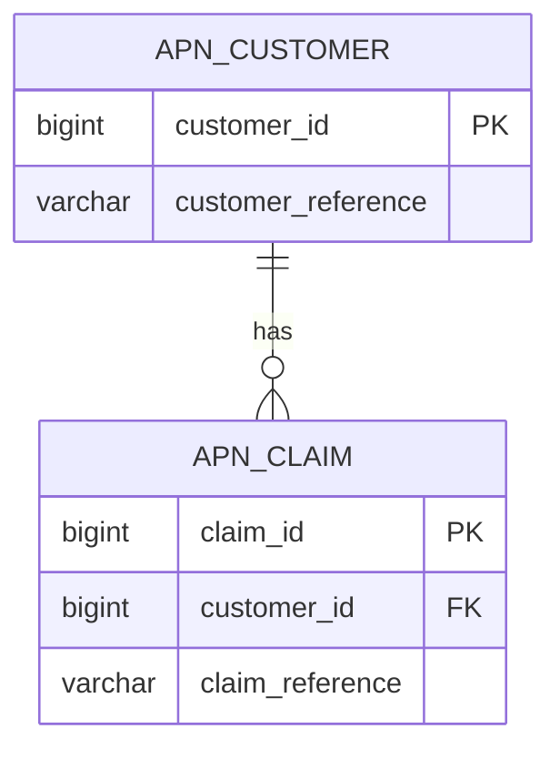
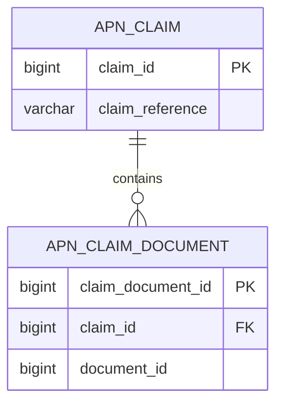
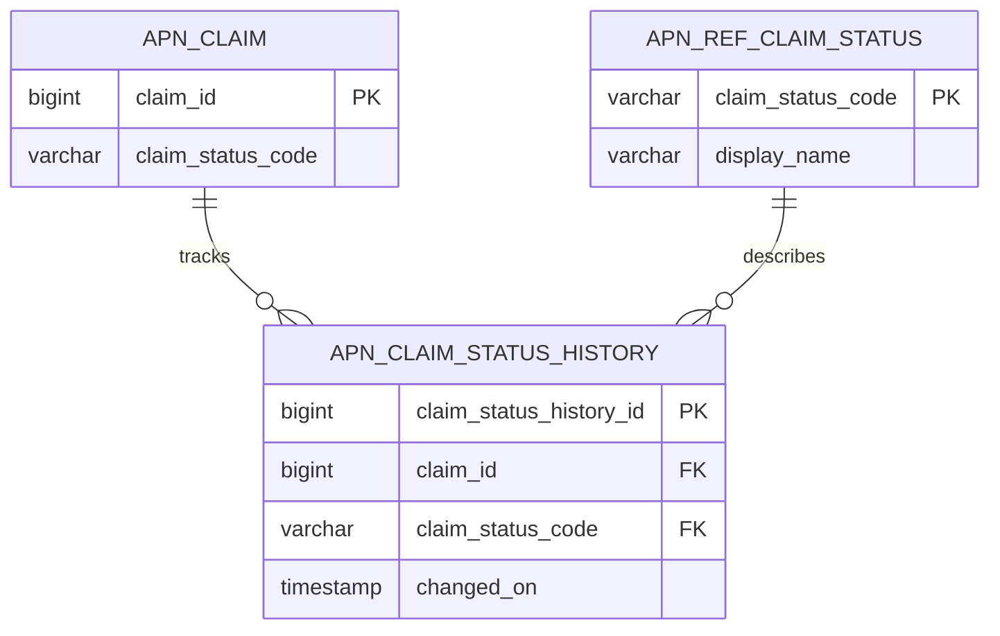
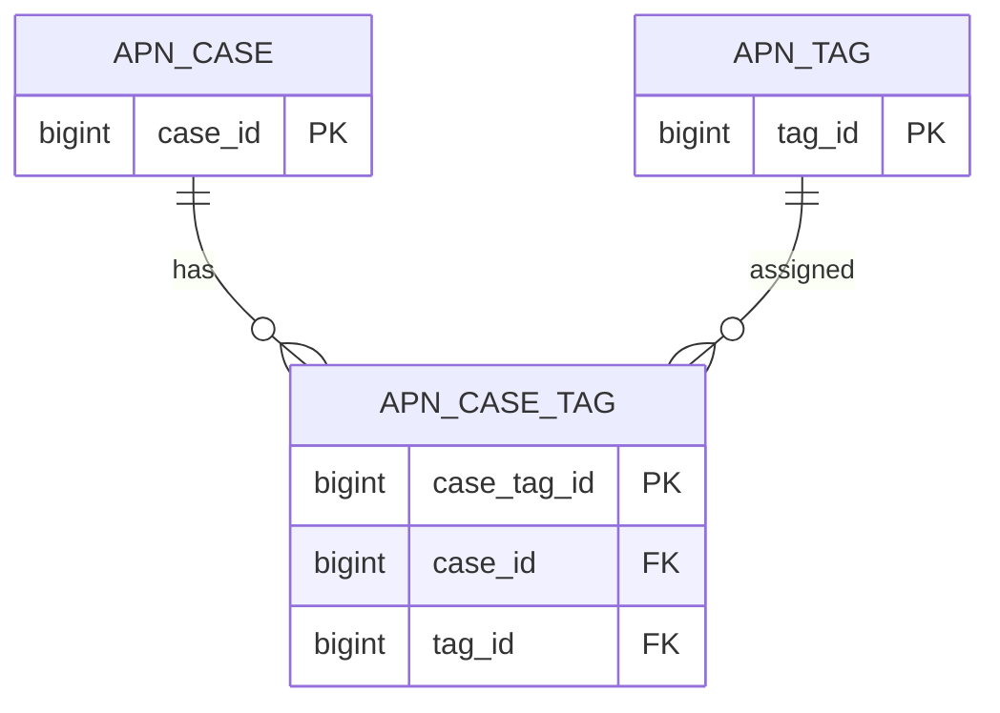

# Appian Database Design and Table Mapping Standards

## Table of contents

1. [Purpose](#purpose)
2. [Scope and source of truth](#scope-and-source-of-truth)
3. [Core design principles](#core-design-principles)
4. [Recommended schema structure](#recommended-schema-structure)
5. [Table naming standards](#table-naming-standards)
6. [Column naming standards](#column-naming-standards)
7. [Primary key strategy](#primary-key-strategy)
8. [Foreign key and relationship strategy](#foreign-key-and-relationship-strategy)
9. [Lookup and reference table standards](#lookup-and-reference-table-standards)
10. [Audit column standards](#audit-column-standards)
11. [Soft delete standards](#soft-delete-standards)
12. [Version and optimistic locking standards](#version-and-optimistic-locking-standards)
13. [Indexing standards](#indexing-standards)
14. [Views versus tables](#views-versus-tables)
15. [Appian record type mapping standards](#appian-record-type-mapping-standards)
16. [CDT and data store entity mapping standards](#cdt-and-data-store-entity-mapping-standards)
17. [Table relationship patterns](#table-relationship-patterns)
18. [Appian object mapping standards](#appian-object-mapping-standards)
19. [Database migration standards](#database-migration-standards)
20. [SQL examples](#sql-examples)
21. [Review checklist](#review-checklist)
22. [Common mistakes](#common-mistakes)
23. [References](#references)

## Purpose

This document defines recommended database design, table mapping and relationship standards for Appian applications.

The objective is to create database tables that are easy to map to Appian record types, CDTs, data store entities, process models, reports and integrations.

## Scope and source of truth

This document is a recommended house standard. It is not an Appian-enforced platform rule.

Use official Appian 26.4 documentation as the source of truth for exact platform behaviour, supported object features and implementation steps.

## Core design principles

Recommendation:

| Principle | Standard |
|---|---|
| Clear ownership | Each table should have one clear business owner and purpose. |
| Record-first design | Prefer table structures that map cleanly to Appian record types. |
| Explicit relationships | Use clear foreign keys between parent and child tables. |
| Auditability | Include standard audit columns on business tables. |
| Performance by design | Add indexes for common filters, joins and search conditions. |
| Safe change management | Manage schema changes through version-controlled migration scripts. |
| Simple mapping | Avoid database designs that require complex transformation before Appian can use the data. |

## Recommended schema structure

Recommendation: separate application tables, reference tables and integration staging tables.

```text
appian_apn
  apn_claim
  apn_claim_status_history
  apn_claim_document
  apn_payment

appian_apn_ref
  apn_ref_claim_status
  apn_ref_payment_status
  apn_ref_document_type

appian_apn_int
  apn_int_inbound_event
  apn_int_outbound_request
  apn_int_error_log
```

Use schema separation only where it is supported by the project database standards and operational model.

## Table naming standards

Recommendation: use lowercase snake case for physical database table names.

Pattern:

```text
<app_prefix>_<entity_name>
```

Examples:

| Table purpose | Recommended table name |
|---|---|
| Claim | `apn_claim` |
| Customer | `apn_customer` |
| Payment | `apn_payment` |
| Claim document | `apn_claim_document` |
| Claim status history | `apn_claim_status_history` |
| Reference claim status | `apn_ref_claim_status` |
| Integration error log | `apn_int_error_log` |

Avoid:

```text
ClaimTable
TBL_CLAIM
claimData
NewTable1
```

## Column naming standards

Recommendation: use lowercase snake case for physical database columns.

| Column type | Pattern | Example |
|---|---|---|
| Primary key | `<entity>_id` | `claim_id` |
| Foreign key | `<parent_entity>_id` | `customer_id` |
| Status | `<entity>_status_code` or `status_code` | `claim_status_code` |
| Date and time | `<event>_on` | `created_on` |
| User | `<event>_by` | `created_by` |
| Boolean flag | `is_<meaning>` | `is_active` |
| Amount | `<purpose>_amount` | `approved_amount` |
| Code | `<purpose>_code` | `payment_status_code` |

Avoid vague names:

```text
id
name1
value
flag
status
created
```

Prefer meaningful names:

```text
claim_id
claim_reference
claim_status_code
is_deleted
created_on
created_by
```

## Primary key strategy

Recommendation: each business table should have a single surrogate primary key.

Preferred pattern:

```text
<entity>_id BIGINT primary key
```

Example:

```sql
claim_id BIGINT GENERATED ALWAYS AS IDENTITY PRIMARY KEY
```

Standards:

| Area | Recommendation |
|---|---|
| Key type | Use numeric surrogate keys for internal relational joins. |
| Business identifier | Store business identifiers in separate unique columns. |
| Naming | Name the primary key after the entity, such as `claim_id`. |
| Immutability | Never update primary key values. |
| Appian mapping | Map the primary key as the identifier field for record-backed data. |

## Foreign key and relationship strategy

Recommendation: use explicit foreign keys for relational integrity unless the project has a documented operational reason not to enforce them.

Relationship naming pattern:

```text
fk_<child_table>_<parent_table>
```

Example:

```sql
CONSTRAINT fk_apn_claim_apn_customer
FOREIGN KEY (customer_id)
REFERENCES apn_customer (customer_id)
```

Relationship standards:

| Relationship | Database pattern | Appian mapping recommendation |
|---|---|---|
| One customer to many claims | `apn_claim.customer_id` references `apn_customer.customer_id` | Record relationship from Claim to Customer. |
| One claim to many documents | `apn_claim_document.claim_id` references `apn_claim.claim_id` | Record relationship from Claim to Claim Document. |
| One claim to many status history rows | `apn_claim_status_history.claim_id` references `apn_claim.claim_id` | Record relationship or related record list. |
| Many-to-many | Bridge table with two foreign keys | Use record relationships through the bridge table where suitable. |

## Lookup and reference table standards

Recommendation: use reference tables for controlled values that need to be governed, reported on or integrated with external systems.

Reference table naming pattern:

```text
apn_ref_<reference_name>
```

Recommended columns:

| Column | Purpose |
|---|---|
| `<reference>_code` | Stable code used by Appian and integrations. |
| `display_name` | User-facing label. |
| `description` | Optional explanation. |
| `sort_order` | Display order. |
| `is_active` | Whether the value can be selected. |
| `effective_from` | Optional start date. |
| `effective_to` | Optional end date. |
| `created_on`, `created_by`, `updated_on`, `updated_by` | Audit fields. |

Use reference tables for values such as claim status, payment status, document type, case priority and assessment outcome.

## Audit column standards

Recommendation: include audit columns on all business tables.

| Column | Data type example | Required | Description |
|---|---|---|---|
| `created_on` | `TIMESTAMP` | Yes | Row creation timestamp. |
| `created_by` | `VARCHAR(255)` | Yes | Appian username, service account or integration user. |
| `updated_on` | `TIMESTAMP` | Yes | Last update timestamp. |
| `updated_by` | `VARCHAR(255)` | Yes | Last user or system to update the row. |

Optional operational audit columns:

| Column | Purpose |
|---|---|
| `source_system` | Identifies the upstream source. |
| `source_reference` | Stores external reference number. |
| `correlation_id` | Connects database row to process or integration logs. |
| `request_id` | Supports API traceability. |

## Soft delete standards

Recommendation: use soft delete for business data where users should not physically remove records from operational history.

Recommended columns:

| Column | Data type example | Description |
|---|---|---|
| `is_deleted` | `BOOLEAN` | Indicates whether the row is logically deleted. |
| `deleted_on` | `TIMESTAMP` | When the row was deleted. |
| `deleted_by` | `VARCHAR(255)` | Who deleted the row. |

Standard query rule behaviour:

```appian
/* Recommendation: filter out deleted rows by default */
a!queryFilter(
  field: "isDeleted",
  operator: "=",
  value: false
)
```

## Version and optimistic locking standards

Recommendation: include a numeric version column on tables that can be updated by multiple users or processes.

```sql
version_number INTEGER NOT NULL DEFAULT 1
```

Usage pattern:

1. Appian reads the row and version number.
2. User updates the record.
3. Save logic checks that the current database version still matches the version read by the user.
4. If the version changed, show a controlled conflict message.
5. If the version matches, update the row and increment `version_number`.

## Indexing standards

Recommendation: create indexes based on real query patterns, not every column.

Index these columns where frequently used:

| Query pattern | Index recommendation |
|---|---|
| Search by parent | Foreign key index, such as `customer_id`. |
| Filter by status | Index status code columns used in grids and reports. |
| Filter by active rows | Consider index on `is_active` where selective and supported. |
| Date range search | Index date columns used in date range filters. |
| Unique business reference | Unique index on business reference. |
| Integration lookup | Index external reference and correlation identifiers. |

Avoid over-indexing because indexes add storage and write overhead.

## Views versus tables

Recommendation:

| Use table when | Use view when |
|---|---|
| Appian must create, update or delete rows. | Appian only needs read-only reporting or search. |
| The data is transactional. | The data combines multiple tables for reporting. |
| The record type is the source of truth. | The view simplifies complex joins for read use cases. |

Avoid using views as the primary write target for Appian unless the database and Appian mapping approach are explicitly validated.

## Appian record type mapping standards

Recommendation: design tables so they map cleanly to Appian record types.

| Database object | Appian object |
|---|---|
| `apn_claim` | `APN_REC_Claim` |
| `apn_customer` | `APN_REC_Customer` |
| `apn_payment` | `APN_REC_Payment` |
| `apn_ref_claim_status` | `APN_REC_ClaimStatus` or reference data query rule |

Record mapping standards:

1. One primary business table should usually map to one primary record type.
2. Use clear primary key fields.
3. Keep field names meaningful and stable.
4. Map parent and child tables through record relationships.
5. Avoid storing unrelated entities in a single generic table.
6. Use synced records where they support the use case and data source.
7. Confirm Appian-supported relationship and sync behaviour in official documentation for Appian 26.4.

## CDT and data store entity mapping standards

Recommendation: prefer record type patterns for modern Appian design where suitable. Use CDTs and data store entities where required by the application architecture, existing implementation or write patterns.

CDT mapping standards:

| Area | Recommendation |
|---|---|
| CDT name | Use application prefix, such as `APN_CDT_Claim`. |
| Field names | Align CDT fields to Appian naming conventions, normally camel case. |
| Database columns | Map to lowercase snake case physical columns. |
| Identifier | Ensure the CDT maps to the table primary key. |
| Nullability | Align CDT field expectations with database nullability. |
| Relationships | Avoid overly deep CDT nesting for transactional writes. |

Example mapping:

| Database column | Appian CDT field |
|---|---|
| `claim_id` | `claimId` |
| `claim_reference` | `claimReference` |
| `claim_status_code` | `claimStatusCode` |
| `created_on` | `createdOn` |
| `created_by` | `createdBy` |

## Table relationship patterns

### One-to-many relationship

Example: one customer can have many claims.



### Parent-child relationship

Example: one claim can have many documents.



### Status history relationship

Example: one claim can have many status history records.



### Many-to-many relationship

Example: one case can have many tags and one tag can apply to many cases.



## Appian object mapping standards

Recommended alignment between database and Appian objects:

| Database object | Appian object naming example | Notes |
|---|---|---|
| `apn_claim` | `APN_REC_Claim` | Main record type for claim data. |
| `apn_claim` | `APN_CDT_Claim` | Use where CDT mapping is required. |
| `apn_claim` | `APN_QRY_GetClaimById` | Query helper rule. |
| `apn_claim` | `APN_UI_ClaimSummary` | Interface presenting claim data. |
| `apn_claim` | `APN_PM_CreateClaim` | Process model creating claim data. |
| `apn_int_error_log` | `APN_REC_IntegrationErrorLog` | Operational monitoring record. |

## Database migration standards

Recommendation: every database change should be scripted, reviewed and version controlled.

Migration file naming pattern:

```text
V<version>__<description>.sql
```

Examples:

```text
V1.0.0__create_claim_tables.sql
V1.0.1__add_claim_status_index.sql
V1.1.0__create_payment_tables.sql
```

Migration standards:

1. Scripts must be repeatable only where intentionally designed as repeatable scripts.
2. Scripts must include rollback guidance where practical.
3. Destructive changes must be reviewed and approved.
4. Production scripts must be tested in a lower environment first.
5. Appian object deployment and database migration sequencing must be documented in the release plan.

## SQL examples

### Customer table

```sql
CREATE TABLE apn_customer (
  customer_id BIGINT GENERATED ALWAYS AS IDENTITY PRIMARY KEY,
  customer_reference VARCHAR(50) NOT NULL,
  full_name VARCHAR(255) NOT NULL,
  email_address VARCHAR(255),
  is_active BOOLEAN NOT NULL DEFAULT TRUE,
  is_deleted BOOLEAN NOT NULL DEFAULT FALSE,
  created_on TIMESTAMP NOT NULL,
  created_by VARCHAR(255) NOT NULL,
  updated_on TIMESTAMP NOT NULL,
  updated_by VARCHAR(255) NOT NULL,
  version_number INTEGER NOT NULL DEFAULT 1,
  CONSTRAINT uq_apn_customer_reference UNIQUE (customer_reference)
);
```

### Claim table

```sql
CREATE TABLE apn_claim (
  claim_id BIGINT GENERATED ALWAYS AS IDENTITY PRIMARY KEY,
  claim_reference VARCHAR(50) NOT NULL,
  customer_id BIGINT NOT NULL,
  claim_status_code VARCHAR(50) NOT NULL,
  lodged_on TIMESTAMP,
  approved_amount DECIMAL(18,2),
  is_deleted BOOLEAN NOT NULL DEFAULT FALSE,
  created_on TIMESTAMP NOT NULL,
  created_by VARCHAR(255) NOT NULL,
  updated_on TIMESTAMP NOT NULL,
  updated_by VARCHAR(255) NOT NULL,
  version_number INTEGER NOT NULL DEFAULT 1,
  CONSTRAINT uq_apn_claim_reference UNIQUE (claim_reference),
  CONSTRAINT fk_apn_claim_apn_customer
    FOREIGN KEY (customer_id)
    REFERENCES apn_customer (customer_id)
);
```

### Reference status table

```sql
CREATE TABLE apn_ref_claim_status (
  claim_status_code VARCHAR(50) PRIMARY KEY,
  display_name VARCHAR(100) NOT NULL,
  description VARCHAR(500),
  sort_order INTEGER NOT NULL,
  is_active BOOLEAN NOT NULL DEFAULT TRUE,
  created_on TIMESTAMP NOT NULL,
  created_by VARCHAR(255) NOT NULL,
  updated_on TIMESTAMP NOT NULL,
  updated_by VARCHAR(255) NOT NULL
);
```

### Claim document table

```sql
CREATE TABLE apn_claim_document (
  claim_document_id BIGINT GENERATED ALWAYS AS IDENTITY PRIMARY KEY,
  claim_id BIGINT NOT NULL,
  document_id BIGINT NOT NULL,
  document_type_code VARCHAR(50) NOT NULL,
  uploaded_on TIMESTAMP NOT NULL,
  uploaded_by VARCHAR(255) NOT NULL,
  is_deleted BOOLEAN NOT NULL DEFAULT FALSE,
  created_on TIMESTAMP NOT NULL,
  created_by VARCHAR(255) NOT NULL,
  updated_on TIMESTAMP NOT NULL,
  updated_by VARCHAR(255) NOT NULL,
  version_number INTEGER NOT NULL DEFAULT 1,
  CONSTRAINT fk_apn_claim_document_apn_claim
    FOREIGN KEY (claim_id)
    REFERENCES apn_claim (claim_id)
);
```

### Recommended indexes

```sql
CREATE INDEX idx_apn_claim_customer_id
  ON apn_claim (customer_id);

CREATE INDEX idx_apn_claim_status_code
  ON apn_claim (claim_status_code);

CREATE INDEX idx_apn_claim_created_on
  ON apn_claim (created_on);

CREATE INDEX idx_apn_claim_document_claim_id
  ON apn_claim_document (claim_id);
```

## Review checklist

Use this checklist before approving a new table or schema change.

| Check | Yes or No |
|---|---|
| Table name uses the approved application prefix. |  |
| Primary key is clearly defined. |  |
| Foreign keys are clear and documented. |  |
| Audit columns are present. |  |
| Soft delete approach is defined where required. |  |
| Version column is present where concurrent updates are possible. |  |
| Indexes support expected Appian query patterns. |  |
| Record type mapping is documented. |  |
| CDT or data store mapping is documented where required. |  |
| Migration script is version controlled. |  |
| Rollback or remediation approach is documented. |  |
| Security and data sensitivity have been reviewed. |  |

## Common mistakes

| Mistake | Why it causes issues | Recommended approach |
|---|---|---|
| Using generic table names | Hard to understand ownership and purpose. | Use `apn_<entity>`. |
| Using `id` for every primary key | Causes confusion in joins and mapping. | Use `claim_id`, `customer_id`, etc. |
| No audit columns | Weak traceability and supportability. | Add standard audit columns. |
| No indexes on foreign keys | Poor query and grid performance. | Index frequently joined foreign keys. |
| Storing multiple entities in one table | Leads to complex rules and fragile reporting. | Use clear entity tables. |
| Overusing free-text status fields | Inconsistent values and poor reporting. | Use governed reference tables. |
| Querying deleted rows by accident | Users see inactive or deleted business data. | Apply default `is_deleted = false` filters. |
| Deep CDT nesting for writes | Can be hard to maintain and troubleshoot. | Keep write models simple and explicit. |
| Database changes outside release control | Causes environment drift. | Use version-controlled migration scripts. |

## References

Official Appian 26.4 documentation remains the source of truth:

- https://docs.appian.com/suite/help/26.4/
- https://docs.appian.com/suite/help/26.4/Records.html
- https://docs.appian.com/suite/help/26.4/Record_Type_Object.html
- https://docs.appian.com/suite/help/26.4/record-type-relationships.html
- https://docs.appian.com/suite/help/26.4/Data_Stores.html
- https://docs.appian.com/suite/help/26.4/Custom_Data_Types.html
- https://docs.appian.com/suite/help/26.4/Mapping_CDTs_to_Pre-defined_Database_Tables.html
