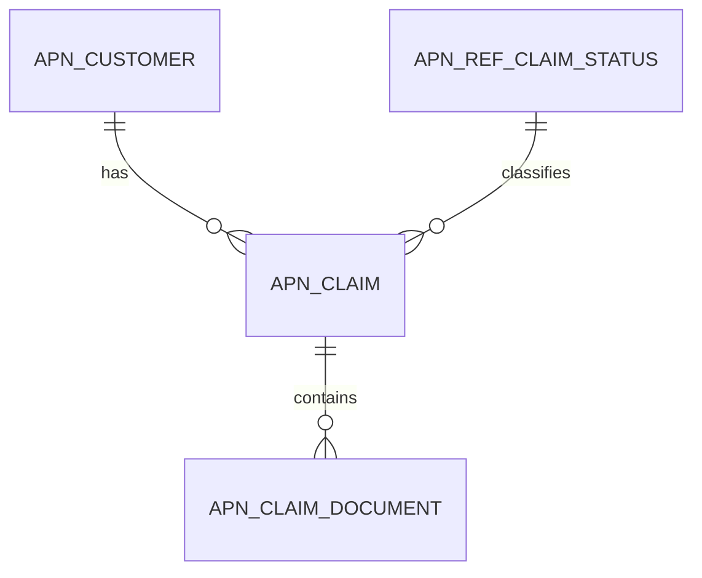

# 02 Database, Record and Data Model Standards

## Table of contents

1. [Purpose](#purpose)
2. [Database-first design](#database-first-design)
3. [Table design rules](#table-design-rules)
4. [Primary key and foreign key rules](#primary-key-and-foreign-key-rules)
5. [Reference data](#reference-data)
6. [Audit and lifecycle fields](#audit-and-lifecycle-fields)
7. [Record type mapping](#record-type-mapping)
8. [Relationship patterns](#relationship-patterns)
9. [Query design](#query-design)
10. [Migration rules](#migration-rules)
11. [Review checklist](#review-checklist)
12. [References](#references)

## Purpose

This file defines the APN standard for Appian database design, record type mapping and data model review.

## Database-first design

Start with the data model before SAIL. Appian records, process writes, grids, reports and security rules depend on clear tables and relationships.

Recommended design order:

```text
Business entity
  -> table
  -> primary key
  -> foreign keys
  -> reference data
  -> audit fields
  -> record type
  -> relationships
  -> query rules
  -> interface and process
```

## Table design rules

| Rule | Standard |
|---|---|
| One table, one purpose | Avoid generic tables that store unrelated entities. |
| Clear ownership | Every table must have a business owner and technical owner. |
| Meaningful fields | Do not use vague column names such as `value`, `flag`, `type1` or `misc`. |
| Controlled status | Use status code fields linked to reference tables where status drives logic. |
| Avoid over-wide tables | If a table has unrelated sections of data, consider separate child tables. |
| Avoid polymorphic links | Prefer one junction table per relationship pair. |

## Primary key and foreign key rules

Primary key pattern:

```text
<entity>_id
```

Examples:

```text
customer_id
claim_id
payment_id
```

Foreign key pattern:

```text
<parent_entity>_id
```

Foreign key constraints should be named clearly:

```sql
CONSTRAINT fk_apn_claim_customer
  FOREIGN KEY (customer_id)
  REFERENCES apn_customer (customer_id)
```

Use a unique constraint when a relationship is truly one-to-one.

## Reference data

Use reference tables for values that are selected, reported, integrated or used in process decisions.

Reference table pattern:

```text
apn_ref_<reference_name>
```

Recommended fields:

```text
<reference>_code
label
description
sort_order
is_active
created_on
created_by
updated_on
updated_by
```

## Audit and lifecycle fields

Business tables should include:

| Field | Purpose |
|---|---|
| `created_on` | When the row was created. |
| `created_by` | User or system that created the row. |
| `updated_on` | When the row was last updated. |
| `updated_by` | User or system that last updated the row. |
| `is_active` | Whether the row is selectable or operationally active. |
| `is_deleted` | Whether the row has been soft deleted. |
| `version_number` | Supports optimistic locking where needed. |

## Record type mapping

Each main table should usually map to one primary record type.

| Database object | Appian object |
|---|---|
| `apn_customer` | `APN_REC_Customer` |
| `apn_claim` | `APN_REC_Claim` |
| `apn_claim_document` | `APN_REC_ClaimDocument` |
| `apn_ref_claim_status` | `APN_REC_ClaimStatus` |

Record type mapping notes should include:

```text
Record type name
Description
Source table
Primary key field
Display field
Field mapping
Relationships
Record actions
Record views
Security
```

## Relationship patterns



Use clear relationship names in Appian, such as:

```text
customer
claimDocuments
claimStatus
statusHistory
```

## Query design

Query rules should:

- use `a!queryRecordType()`
- specify the fields the caller reads
- include `pagingInfo`
- include `fetchTotalCount: true` only when total count is needed
- null-guard inputs used in filters
- filter out deleted rows by default where soft delete is used
- avoid query-in-loop patterns

Example pattern:

```appian
a!localVariables(
  local!customerId: ri!customerId,
  if(
    isnull(local!customerId),
    {},
    a!queryRecordType(
      recordType: recordType!APN_REC_Claim,
      fields: {
        recordType!APN_REC_Claim.fields.claimId,
        recordType!APN_REC_Claim.fields.claimReference,
        recordType!APN_REC_Claim.fields.claimStatusCode
      },
      filters: {
        a!queryFilter(
          field: recordType!APN_REC_Claim.fields.customerId,
          operator: "=",
          value: local!customerId
        ),
        a!queryFilter(
          field: recordType!APN_REC_Claim.fields.isDeleted,
          operator: "=",
          value: false
        )
      },
      pagingInfo: a!pagingInfo(startIndex: 1, batchSize: 50)
    ).data
  )
)
```

## Migration rules

Database changes must be scripted, reviewed and version controlled.

Recommended file naming:

```text
V1.0.0__create_claim_tables.sql
V1.0.1__seed_claim_status_reference_data.sql
V1.0.2__add_claim_indexes.sql
```

Every migration must include rollback guidance or a documented remediation plan.

## Review checklist

| Check | Complete |
|---|---|
| Table names use the project prefix. |  |
| Primary keys are meaningful and not generic `id`. |  |
| Foreign keys and relationships are documented. |  |
| Reference data is separated from free-text values. |  |
| Audit and lifecycle fields are present. |  |
| Indexes match Appian query patterns. |  |
| Record type mapping is documented. |  |
| Security impact has been reviewed. |  |
| Migration and rollback notes are included. |  |

## References

Official Appian 26.4 documentation remains the source of truth:

- https://docs.appian.com/suite/help/26.4/Records.html
- https://docs.appian.com/suite/help/26.4/Record_Type_Object.html
- https://docs.appian.com/suite/help/26.4/record-type-relationships.html
- https://docs.appian.com/suite/help/26.4/Data_Stores.html
