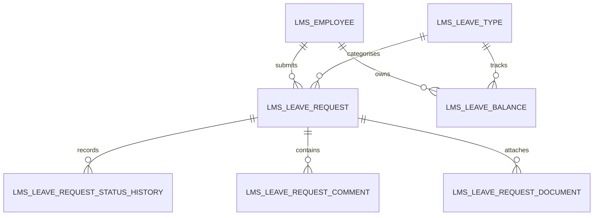
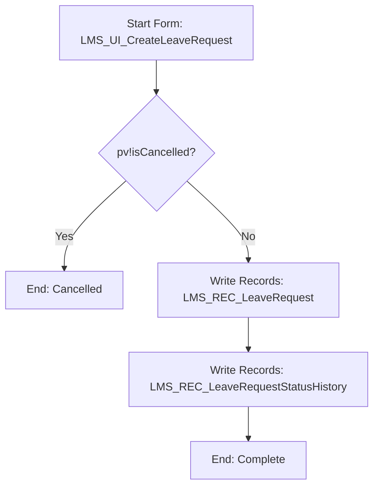

# Appian Application Build Blueprint

## Table of contents

1. [Purpose](#purpose)
2. [AI usage note](#ai-usage-note)
3. [When to use this blueprint](#when-to-use-this-blueprint)
4. [Required input from the prompt](#required-input-from-the-prompt)
5. [Mandatory LLM behaviour](#mandatory-llm-behaviour)
6. [Expected output structure](#expected-output-structure)
7. [Blueprint section 1: Application definition](#blueprint-section-1-application-definition)
8. [Blueprint section 2: Scope and assumptions](#blueprint-section-2-scope-and-assumptions)
9. [Blueprint section 3: User roles and security groups](#blueprint-section-3-user-roles-and-security-groups)
10. [Blueprint section 4: Business capability map](#blueprint-section-4-business-capability-map)
11. [Blueprint section 5: Data model design](#blueprint-section-5-data-model-design)
12. [Blueprint section 6: Database DDL execution plan](#blueprint-section-6-database-ddl-execution-plan)
13. [Blueprint section 7: Record type design](#blueprint-section-7-record-type-design)
14. [Blueprint section 8: Constants and reference data](#blueprint-section-8-constants-and-reference-data)
15. [Blueprint section 9: Expression rules and query rules](#blueprint-section-9-expression-rules-and-query-rules)
16. [Blueprint section 10: SAIL interface design](#blueprint-section-10-sail-interface-design)
17. [Blueprint section 11: Process model design](#blueprint-section-11-process-model-design)
18. [Blueprint section 12: Record actions and related actions](#blueprint-section-12-record-actions-and-related-actions)
19. [Blueprint section 13: Integrations and Web APIs](#blueprint-section-13-integrations-and-web-apis)
20. [Blueprint section 14: Reporting and dashboards](#blueprint-section-14-reporting-and-dashboards)
21. [Blueprint section 15: Error handling and audit design](#blueprint-section-15-error-handling-and-audit-design)
22. [Blueprint section 16: Appian application structure](#blueprint-section-16-appian-application-structure)
23. [Blueprint section 17: Build execution sequence](#blueprint-section-17-build-execution-sequence)
24. [Blueprint section 18: Unit test plan](#blueprint-section-18-unit-test-plan)
25. [Blueprint section 19: End-to-end test script](#blueprint-section-19-end-to-end-test-script)
26. [Blueprint section 20: Deployment and release plan](#blueprint-section-20-deployment-and-release-plan)
27. [Example command](#example-command)
28. [LLM prompt template](#llm-prompt-template)
29. [Quality gate before accepting the generated plan](#quality-gate-before-accepting-the-generated-plan)
30. [Common failure modes](#common-failure-modes)
31. [References](#references)

## Purpose

This document tells an LLM how to generate a full Appian development execution plan for a complete application or major module.

When the user asks something like:

```text
Create a leave tracking and management system in Appian.
```

The LLM must not respond with a high-level summary only. It must produce a detailed, build-oriented plan that explains what to create, in what order, and how each Appian object fits together.

The output should be detailed enough that a developer can follow it step by step and build the application in Appian Designer.

## AI usage note

This file is intended to be used as local LLM context. Do not assume the LLM can open external links.

Official Appian documentation remains the source of truth, but this file defines the required output shape for APN-style Appian application planning.

`APN` is only an example prefix. The LLM must use the application short name supplied in the prompt, such as `LMS` for Leave Management System or `UMS` for User Management Solution.

## When to use this blueprint

Use this blueprint when the user asks for:

- a new Appian application
- a new Appian module
- an end-to-end development plan
- a full build plan
- a technical specification for a complete business process
- an application architecture and implementation plan
- a “go and create this app” style instruction

Example requests:

```text
Create a leave tracking and management system.
Create an Appian app for employee onboarding.
Design a claims management system in Appian.
Build a supplier registration and approval app.
Create a development execution plan for payment exception management.
```

## Required input from the prompt

The LLM should ask for missing critical inputs or use placeholders where the user wants a first draft.

Minimum input:

| Input | Required | Example |
|---|---:|---|
| Application name | Yes | Leave Management System |
| Application short name / prefix | Yes | `LMS` |
| Database prefix | Recommended | `lms` |
| Target Appian version | Yes | Appian 26.4 |
| Primary users | Recommended | Employee, Manager, HR Admin |
| Core business process | Recommended | Request leave, approve leave, track balance |
| Integrations | If applicable | HR system, payroll, calendar |
| Security constraints | If applicable | Managers see team requests only |
| Mobile requirement | Recommended | Employees can request leave from mobile |
| Reporting requirement | Recommended | Leave balance and approval dashboards |

If the prefix is missing, the LLM must not default to `APN`. It must ask for the prefix or use `<PREFIX>` placeholders.

## Mandatory LLM behaviour

The LLM must:

```text
1. Use the supplied application prefix for all Appian object names.
2. Use the supplied database prefix for physical table names.
3. Produce a complete execution plan, not only architecture notes.
4. Start with data model and record types before UI.
5. Use Appian-native process model components.
6. Use Appian SAIL components only.
7. List constants, rules, interfaces, process models, integrations and actions.
8. Provide build order.
9. Provide unit tests and end-to-end tests.
10. Mark assumptions and verification items clearly.
```

The LLM must not:

```text
1. Invent Appian functions, components or parameters.
2. Use Java, JavaScript, React, HTML or CSS inside SAIL.
3. Use APN unless APN is the supplied prefix.
4. Skip database and record type design.
5. Skip process model design.
6. Skip security.
7. Skip test planning.
8. Produce only a generic high-level plan.
```

## Expected output structure

For a complete Appian application request, the LLM must return the following structure.

```text
1. Application definition
2. Scope and assumptions
3. User roles and security groups
4. Business capability map
5. Data model design
6. Database DDL execution plan
7. Record type design
8. Constants and reference data
9. Expression rules and query rules
10. SAIL interface design
11. Process model design
12. Record actions and related actions
13. Integrations and Web APIs
14. Reporting and dashboards
15. Error handling and audit design
16. Appian application structure
17. Build execution sequence
18. Unit test plan
19. End-to-end test script
20. Deployment and release plan
```

Each section must be specific to the requested application.

## Blueprint section 1: Application definition

The LLM must start by restating the application details.

Required format:

```text
Application Name:
Application Short Name / Prefix:
Database Prefix:
Target Appian Version:
Primary Business Purpose:
Primary User Groups:
High-Level Modules:
```

Example:

```text
Application Name: Leave Management System
Application Short Name / Prefix: LMS
Database Prefix: lms
Target Appian Version: 26.4
Primary Business Purpose: Manage employee leave requests, approvals, balances and reporting.
Primary User Groups: Employees, Managers, HR Administrators, System Administrators.
High-Level Modules: Leave request, approval workflow, leave balance, calendar view, reporting, administration.
```

## Blueprint section 2: Scope and assumptions

The LLM must clearly separate scope from assumptions.

Required format:

| Area | Included | Excluded or assumption |
|---|---|---|
| Leave request | Included | Employee submits annual, sick or other leave. |
| Approval | Included | Manager approval required. |
| Payroll integration | Assumption | Mark as optional unless specified. |
| Calendar integration | Assumption | Optional future phase unless specified. |

## Blueprint section 3: User roles and security groups

The LLM must define Appian groups using the supplied prefix.

Example for `LMS`:

| Group | Purpose | Example access |
|---|---|---|
| `LMS_GRP_AllUsers` | Base group for application users. | Access to site. |
| `LMS_GRP_Employees` | Employees who can submit leave. | Create and view own requests. |
| `LMS_GRP_Managers` | Managers who approve leave. | View and approve team requests. |
| `LMS_GRP_HRAdmins` | HR users who manage reference data and balances. | Administer leave types and balances. |
| `LMS_GRP_AppAdmins` | Application support and admin users. | Admin and support access. |
| `LMS_GRP_IntegrationUsers` | Service accounts for integrations. | Web API and connected system access. |

The LLM must specify security at:

- application level
- folder level
- object level
- record type level
- record action visibility
- process model start security
- Web API security where applicable

## Blueprint section 4: Business capability map

The LLM must break the app into capabilities.

Example:

| Capability | Description | Key Appian objects |
|---|---|---|
| Leave request creation | Employee submits a new leave request. | Record type, create form, create process model. |
| Leave approval | Manager approves, returns or rejects a request. | Approval form, approval process model, status history. |
| Leave balance management | HR maintains employee balance. | Balance record, admin interface, update process. |
| Reporting | Users view leave status and trends. | Dashboards, query rules, charts. |
| Administration | Maintain leave types and reference data. | Reference tables and admin screens. |

## Blueprint section 5: Data model design

The LLM must provide a full data model, not just object names.

Required for each table:

```text
Table name:
Purpose:
Primary key:
Columns:
Foreign keys:
Indexes:
Audit fields:
Soft delete field:
Relationship notes:
```

Example leave management tables:

| Table | Purpose |
|---|---|
| `lms_employee` | Employee profile used by the leave app. |
| `lms_leave_type` | Reference table for leave categories. |
| `lms_leave_balance` | Current leave balance by employee and leave type. |
| `lms_leave_request` | Core leave request transaction. |
| `lms_leave_request_status_history` | Status change history for leave requests. |
| `lms_leave_request_comment` | Comments and notes on leave requests. |
| `lms_leave_request_document` | Supporting documents attached to leave requests. |
| `lms_public_holiday` | Public holiday calendar for leave calculations. |
| `lms_int_error_log` | Integration error and support log. |

Relationship diagram:



## Blueprint section 6: Database DDL execution plan

The LLM must list DDL objects in dependency order.

Required format:

| Step | Script/object | Purpose | Depends on |
|---:|---|---|---|
| 1 | `lms_employee` | Employee profile table. | None |
| 2 | `lms_leave_type` | Leave type reference table. | None |
| 3 | `lms_leave_request` | Core request table. | Employee, leave type |
| 4 | `lms_leave_request_status_history` | Request lifecycle history. | Leave request |

For each table, the LLM should provide copy-ready SQL where the user asks for a technical specification. SQL must be clearly marked as database-specific and reviewed before execution.

## Blueprint section 7: Record type design

The LLM must map every core table to an Appian record type.

Required format:

| Record type | Source table | Primary key | Display field | Relationships | Record actions |
|---|---|---|---|---|---|
| `LMS_REC_LeaveRequest` | `lms_leave_request` | `leave_request_id` | `leave_request_reference` | Employee, leave type, status history | Create, edit, submit, approve |

Each record type must include:

- purpose
- source
- fields
- relationships
- record list behaviour
- record views
- actions
- security
- sync considerations where applicable

## Blueprint section 8: Constants and reference data

The LLM must define constants and reference data separately.

Use reference tables when values need governance, reporting, effective dating or admin maintenance.

Use constants for technical values or stable configuration.

Example constants:

| Constant | Type | Purpose | Example value |
|---|---|---|---|
| `LMS_CONS_DefaultPageSize` | Integer | Default grid page size. | `25` |
| `LMS_CONS_MaxAttachmentCount` | Integer | Maximum uploaded documents. | `10` |
| `LMS_CONS_AppAdminGroup` | Group | Application admin group. | `LMS_GRP_AppAdmins` |

Example reference data:

| Reference table | Example values |
|---|---|
| `lms_leave_type` | Annual Leave, Sick Leave, Carer Leave, Unpaid Leave |
| `lms_ref_leave_status` | Draft, Submitted, Approved, Rejected, Cancelled |
| `lms_ref_approval_decision` | Approve, Return, Reject |

## Blueprint section 9: Expression rules and query rules

The LLM must list every required rule with purpose, inputs, output and consumers.

Recommended groups:

| Rule type | Naming pattern | Example |
|---|---|---|
| Query rule | `<PREFIX>_QRY_<Verb><Entity>` | `LMS_QRY_GetLeaveRequestsForEmployee` |
| Validation rule | `<PREFIX>_VAL_<Purpose>` | `LMS_VAL_IsLeaveRequestEditable` |
| Formatting rule | `<PREFIX>_FMT_<Purpose>` | `LMS_FMT_DisplayLeaveStatus` |
| Mapping rule | `<PREFIX>_MAP_<Source>To<Target>` | `LMS_MAP_LeaveRequestToCalendarEvent` |
| Utility rule | `<PREFIX>_UTIL_<Purpose>` | `LMS_UTIL_CalculateBusinessDays` |

Required rule specification:

```text
Rule Name:
Purpose:
Inputs:
Output Type:
Logic Summary:
Consumers:
Null Safety:
Performance Notes:
Unit Tests:
```

Example:

| Rule | Purpose | Inputs | Output | Consumers |
|---|---|---|---|---|
| `LMS_QRY_GetLeaveRequestsForEmployee` | Return active leave requests for an employee. | `employeeId`, `pagingInfo` | Record list | Employee dashboard, manager view |
| `LMS_QRY_GetPendingApprovalsForManager` | Return leave requests awaiting manager approval. | `managerUsername`, `pagingInfo` | Record list | Manager dashboard |
| `LMS_VAL_IsLeaveBalanceSufficient` | Check whether requested leave fits available balance. | `employeeId`, `leaveTypeId`, `daysRequested` | Boolean | Create leave request form |
| `LMS_UTIL_CalculateLeaveDays` | Calculate leave days excluding weekends/public holidays. | `startDate`, `endDate`, `publicHolidays` | Decimal | Leave request form/process |

## Blueprint section 10: SAIL interface design

The LLM must list every interface needed, its purpose, inputs and main components.

Required format:

| Interface | Purpose | Type | Main components | Consumers |
|---|---|---|---|---|
| `LMS_UI_CreateLeaveRequest` | Create leave request form. | Start form | formLayout, date fields, dropdown, validation, buttons | Create process |
| `LMS_UI_LeaveRequestSummary` | Read-only request summary. | Record view | sections, cards, rich text, grid | Record view |
| `LMS_UI_ManagerApprovalForm` | Approval decision form. | User task/start form | radio button, paragraph, buttons | Approval process |
| `LMS_UI_MyLeaveDashboard` | Employee dashboard. | Site page | KPI cards, grid, record actions | Site |
| `LMS_UI_LeaveAdminPage` | HR admin reference page. | Site page | grids, forms, actions | HR admin site |

For each interface, include:

```text
Interface Name:
Purpose:
Rule Inputs:
Local Variables:
Components:
Save Behaviour:
Refresh Behaviour:
Validation:
Security Visibility:
Mobile Notes:
Accessibility Notes:
Unit Tests:
```

The LLM must use SAIL components only and must not use HTML, React or CSS patterns.

## Blueprint section 11: Process model design

The LLM must list every process model required and describe Appian nodes.

Required process model table:

| Process model | Trigger | Purpose | Main nodes |
|---|---|---|---|
| `LMS_PM_CreateLeaveRequest` | Record action or site action | Create draft or submitted leave request. | Start form, XOR cancel, Write Records |
| `LMS_PM_SubmitLeaveRequest` | Related action | Submit request for manager approval. | Status update, Write status history, approval task |
| `LMS_PM_ApproveLeaveRequest` | User task or related action | Manager decision. | Approval form, XOR decision, Write Records |
| `LMS_PM_CancelLeaveRequest` | Related action | Cancel draft or submitted request. | Cancel form, Write Records |
| `LMS_PM_AdjustLeaveBalance` | Related action/admin action | HR adjusts leave balance. | Start form, Write Records, audit |
| `LMS_PM_SyncEmployeeData` | Scheduled/integration | Sync employees from HR source. | Integration, mapping, Write Records, error handling |

For each process model, include:

```text
Process Model Name:
Description:
Trigger:
Process Display Name:
Process Variables:
Start Form or User Task Mapping:
Step-by-Step Flow:
Gateway Logic:
Write Records Nodes:
Subprocesses:
Integration Nodes:
Exception Handling:
Alerts:
Data Management:
Security:
Unit Tests:
```

Example flow:



## Blueprint section 12: Record actions and related actions

The LLM must define how users start process models from record types.

Required format:

| Action | Type | Configured on | Process model | Visibility | Input mapping |
|---|---|---|---|---|---|
| Create Leave Request | Record action | `LMS_REC_LeaveRequest` | `LMS_PM_CreateLeaveRequest` | Employees | New record |
| Submit Leave Request | Related action | `LMS_REC_LeaveRequest` | `LMS_PM_SubmitLeaveRequest` | Request owner | `pv!leaveRequest = rv!record` |
| Approve Leave Request | Related action | `LMS_REC_LeaveRequest` | `LMS_PM_ApproveLeaveRequest` | Managers | `pv!leaveRequest = rv!record` |
| Cancel Leave Request | Related action | `LMS_REC_LeaveRequest` | `LMS_PM_CancelLeaveRequest` | Owner/HR | `pv!leaveRequest = rv!record` |

## Blueprint section 13: Integrations and Web APIs

The LLM must state whether integrations are required.

If no integrations are required, it must say:

```text
No external integrations are required for the first release. Integration-ready extension points are listed below.
```

If integrations are required, define:

| Integration | Type | Purpose | Request | Response | Error handling |
|---|---|---|---|---|---|
| `LMS_INT_GetEmployeeDetails` | Outbound REST | Retrieve employee profile from HR system. | Employee ID | Employee profile dictionary | Log error and manual review |
| `LMS_INT_SendApprovedLeaveToPayroll` | Outbound REST | Send approved leave to payroll. | Leave request payload | Confirmation ID | Retry and error queue |
| `LMS_API_CreateLeaveRequest` | Inbound Web API | Allow external systems to create requests. | Leave request JSON | Appian request ID | Validation error response |

Required integration specification:

```text
Connected System:
Integration Object:
Request Contract:
Response Contract:
Authentication:
Timeout Behaviour:
Retry Behaviour:
Idempotency:
Error Logging:
Security:
Tests:
```

## Blueprint section 14: Reporting and dashboards

The LLM must define reporting needs.

Example:

| Dashboard/report | Audience | Data source | Components |
|---|---|---|---|
| My Leave Dashboard | Employee | Leave request, leave balance | KPI cards, grid |
| Pending Approval Dashboard | Manager | Leave request | Grid, filters |
| Leave Utilisation Dashboard | HR | Leave request, leave balance | Charts, summary cards |
| Exception Dashboard | Support | Error log | Grid, filters, retry actions |

Each dashboard must include query rules, filters, empty states and performance notes.

## Blueprint section 15: Error handling and audit design

The LLM must define audit and error handling.

Required audit objects:

| Object | Purpose |
|---|---|
| Status history table | Track request lifecycle. |
| Comment table | Track business comments. |
| Integration error log | Track failed integration calls. |
| Audit fields | Track created/updated users and timestamps. |

Required error handling:

- validation errors shown at the interface field or form level
- process model exception paths for integration failures
- support dashboard for unresolved errors
- safe logging that avoids exposing sensitive data unnecessarily
- retry rules for retryable errors

## Blueprint section 16: Appian application structure

The LLM must recommend an Appian application structure.

Example:

```text
LMS - Leave Management
  Folders:
    LMS Records
    LMS Interfaces
    LMS Expression Rules
    LMS Process Models
    LMS Constants
    LMS Integrations
    LMS Groups
    LMS Admin
    LMS Deployment Packages
```

Recommended object grouping:

| Folder | Contains |
|---|---|
| `<PREFIX> Records` | Record types and related record views. |
| `<PREFIX> Interfaces` | Forms, dashboards, reusable components. |
| `<PREFIX> Expression Rules` | Query, validation, mapping, utility and formatting rules. |
| `<PREFIX> Process Models` | Workflow models and subprocesses. |
| `<PREFIX> Constants` | Constants and configuration. |
| `<PREFIX> Integrations` | Connected systems, integrations and Web APIs. |
| `<PREFIX> Security` | Groups and security documentation. |
| `<PREFIX> Deployment` | Packages and release artefacts. |

## Blueprint section 17: Build execution sequence

The LLM must provide a step-by-step build plan in dependency order.

Required format:

| Step | Build item | Object type | Depends on | Completion check |
|---:|---|---|---|---|
| 1 | Create groups | Groups | None | Groups exist and membership is tested. |
| 2 | Create database tables | DDL | None | Tables and indexes created. |
| 3 | Create record types | Record types | Tables | Records sync successfully. |
| 4 | Configure relationships | Record types | Record types | Relationships resolve. |
| 5 | Create constants | Constants | Groups/reference data | Constants available. |
| 6 | Create query rules | Expression rules | Record types | Unit tests pass. |
| 7 | Create validation rules | Expression rules | Record types/constants | Unit tests pass. |
| 8 | Create interfaces | Interfaces | Query and validation rules | Interface tests pass. |
| 9 | Create process models | Process models | Interfaces/records | Process paths pass. |
| 10 | Configure record actions | Record actions | Process models | Actions launch correctly. |
| 11 | Create dashboards | Interfaces/site | Query rules | Dashboards load quickly. |
| 12 | Configure integrations | Connected systems/integrations | Credentials/contracts | Success and error tests pass. |
| 13 | Configure site | Site | Interfaces/actions | Role navigation works. |
| 14 | Security review | Security | All objects | Authorised/unauthorised tests pass. |
| 15 | End-to-end test | Test | Full build | Business scenario passes. |
| 16 | Deployment package | Release | Build complete | Package imports cleanly. |

## Blueprint section 18: Unit test plan

The LLM must provide unit tests by Appian layer.

| Layer | Required tests |
|---|---|
| Database | PKs, FKs, seed data, indexes and constraints. |
| Record types | Sync, relationships, security and record actions. |
| Constants | Values, types and usage. |
| Query rules | Null input, empty result, happy path, paging and filters. |
| Validation rules | Valid and invalid scenarios. |
| Interfaces | Load, validation, submit, cancel, read-only, mobile and empty state. |
| Process models | Happy path, cancel path, gateway branches, writes and exceptions. |
| Integrations | Success, timeout, error response and malformed response. |
| Security | Authorised and unauthorised users. |

## Blueprint section 19: End-to-end test script

The LLM must provide scenario-based tests.

Example leave management scenarios:

```text
Scenario 1: Employee submits annual leave request
Actor: Employee
Steps:
1. Open LMS site.
2. Open My Leave Dashboard.
3. Click Create Leave Request.
4. Select Annual Leave.
5. Enter start and end dates.
6. Submit request.
Expected:
- Leave request record created.
- Status is Submitted.
- Status history row created.
- Manager can see pending approval.

Scenario 2: Manager approves leave request
Actor: Manager
Steps:
1. Open Pending Approvals.
2. Open the request.
3. Click Approve.
4. Enter approval comment.
5. Submit decision.
Expected:
- Status changes to Approved.
- Status history row created.
- Employee dashboard shows approved request.
- Balance is adjusted if in scope.
```

## Blueprint section 20: Deployment and release plan

The LLM must include release planning.

Required sections:

```text
Package contents:
Database scripts:
Import customisation file:
Environment-specific values:
Pre-deployment checks:
Deployment steps:
Post-deployment validation:
Rollback approach:
Known risks:
```

## Example command

A good user command:

```text
Create a development execution plan for a Leave Management System in Appian.
Application Name: Leave Management System
Application Short Name / Prefix: LMS
Database Prefix: lms
Target Appian Version: 26.4
Users: Employee, Manager, HR Admin, App Admin
Scope: leave request, approval, leave balance, dashboards and reporting
Integrations: optional HR employee sync and payroll notification
Mobile: employees should be able to submit leave from mobile
```

Expected LLM behaviour:

```text
Return a complete build blueprint with database tables, record types, constants,
query rules, validation rules, SAIL interfaces, process models, record actions,
integrations, dashboards, security, build order, tests and deployment plan.
```

## LLM prompt template

Use this prompt to force the LLM to produce the desired execution plan.

```text
You are an Appian solution architect and technical lead.
Use the local Appian engineering library as your reference.
Do not rely on external URLs being available.

Create a full Appian development execution plan for the application below.
The plan must be detailed enough for a developer to build in Appian Designer.

Application Name: <APPLICATION_NAME>
Application Short Name / Prefix: <PREFIX>
Database Prefix: <database_prefix>
Target Appian Version: 26.4
Users and Roles: <USERS_AND_ROLES>
Scope: <SCOPE>
Integrations: <INTEGRATIONS_OR_NONE>
Mobile Requirements: <MOBILE_REQUIREMENTS>
Reporting Requirements: <REPORTING_REQUIREMENTS>

Rules:
- Use the supplied prefix for all Appian object names.
- Use the supplied database prefix for table names.
- Start with data model and record types before UI.
- Use Appian Expression Language, SAIL and Appian process model concepts only.
- Do not invent Appian functions, SAIL components, parameters, allowed values,
  record fields, groups or process capabilities.
- Do not use Java, JavaScript, React, HTML or CSS inside SAIL.
- Mark assumptions and verification items clearly.

Return the plan using these sections:
1. Application definition
2. Scope and assumptions
3. User roles and security groups
4. Business capability map
5. Data model design
6. Database DDL execution plan
7. Record type design
8. Constants and reference data
9. Expression rules and query rules
10. SAIL interface design
11. Process model design
12. Record actions and related actions
13. Integrations and Web APIs
14. Reporting and dashboards
15. Error handling and audit design
16. Appian application structure
17. Build execution sequence
18. Unit test plan
19. End-to-end test script
20. Deployment and release plan
```

## Quality gate before accepting the generated plan

| Gate | Requirement |
|---|---|
| Prefix gate | All objects use the supplied prefix. |
| Completeness gate | All 20 blueprint sections are present. |
| Data-first gate | Tables and record types are defined before interfaces. |
| Appian-native gate | Process models use Appian nodes and SAIL uses Appian components. |
| Object inventory gate | Constants, rules, interfaces, process models, actions and integrations are listed. |
| Execution gate | Build order is detailed and dependency-aware. |
| Testing gate | Unit and end-to-end tests are provided. |
| Security gate | Groups, record security, action visibility and process security are included. |
| Deployment gate | Release, migration and rollback are included. |
| Verification gate | Uncertain Appian syntax is marked for verification rather than invented. |

## Common failure modes

| Failure mode | Correction |
|---|---|
| LLM gives only high-level architecture | Require the 20-section build blueprint. |
| LLM starts with UI | Force data model, DDL and record types first. |
| LLM skips process models | Require process model table and Appian node flows. |
| LLM skips constants and reference data | Require section 8. |
| LLM skips query rules | Require section 9 with inputs, outputs and consumers. |
| LLM skips build order | Require section 17. |
| LLM uses APN when prefix is LMS | Apply prefix gate. |
| LLM invents Appian parameters | Mark for verification or remove. |
| LLM uses React or HTML | Reject and rewrite using SAIL. |
| LLM misses security | Require security groups and access controls. |
| LLM misses testing | Require unit and E2E tests. |

## References

Local repository references:

- `LLM_USAGE_GUIDE_FOR_APPIAN_DOCUMENTATION.md`
- `01_Naming_and_Object_Standards.md`
- `AI_REVIEW_GUARDRAILS_APPIAN.md`
- `APPIAN_PROCESS_MODEL_DESIGN_BEST_PRACTICES.md`
- `APPIAN_PATTERN_LIBRARY.md`
- `02_Database_Record_and_Data_Model_Standards.md`
- `03_SAIL_Interface_Standards.md`
- `Appian_Functions/functions.md`
- `Appian_Functions/sail-components.md`
- `Appian_Functions/sail-recipes-ux-best-practices.md`

Official Appian documentation remains the source of truth:

- https://docs.appian.com/suite/help/26.4/
- https://docs.appian.com/suite/help/26.4/Appian_Functions.html
- https://docs.appian.com/suite/help/26.4/SAIL_Components.html
- https://docs.appian.com/suite/help/26.4/Records.html
- https://docs.appian.com/suite/help/26.4/Process_Modeling.html
