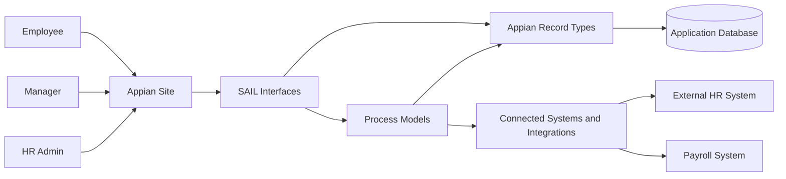
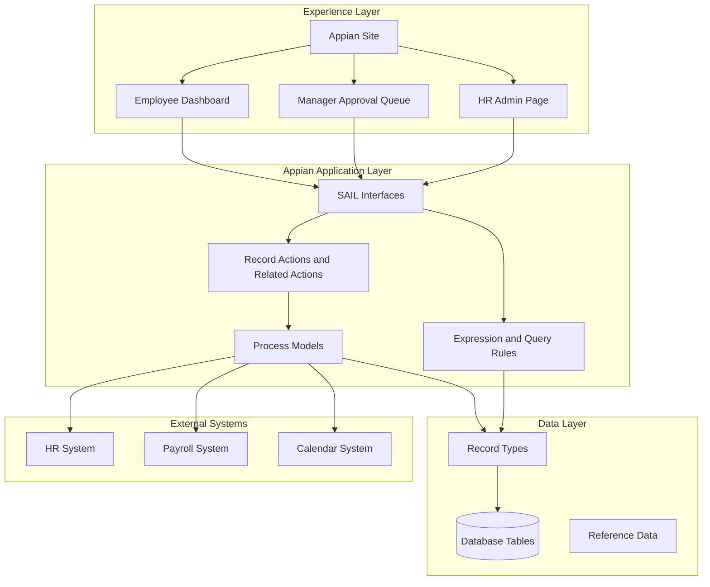
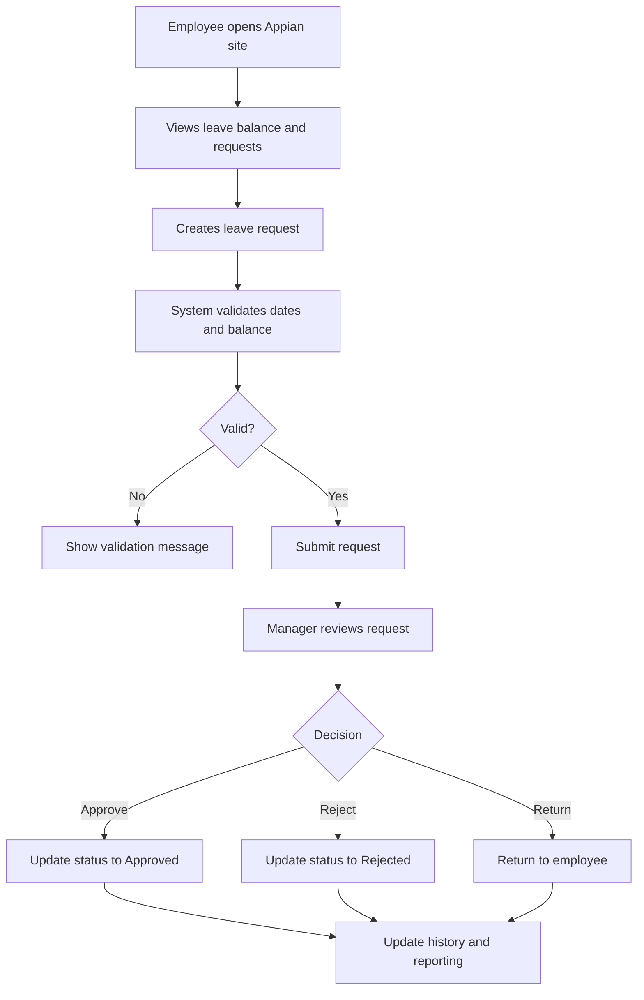
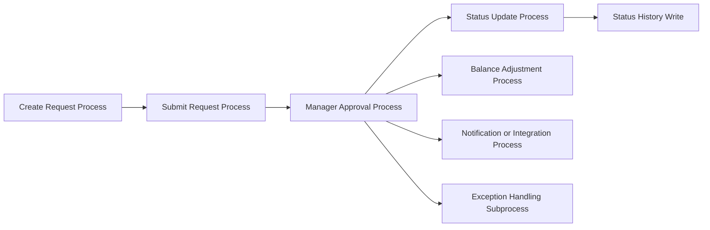
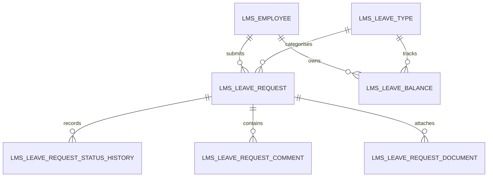
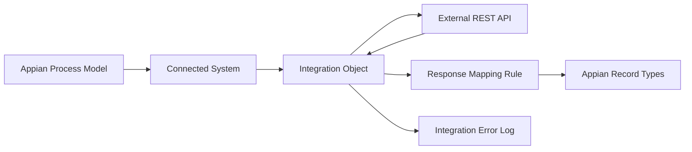
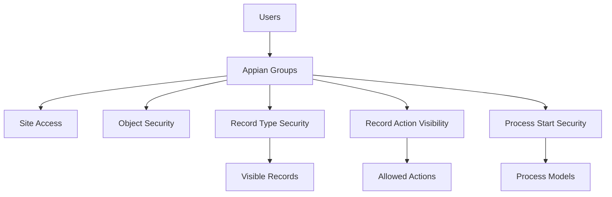

# Appian Application Build Blueprint

## Table of contents

1. [Purpose](#purpose)
2. [AI usage note](#ai-usage-note)
3. [When to use this blueprint](#when-to-use-this-blueprint)
4. [Required input from the prompt](#required-input-from-the-prompt)
5. [Mandatory LLM behaviour](#mandatory-llm-behaviour)
6. [Expected output structure](#expected-output-structure)
7. [Blueprint section 1: Detailed architecture document](#blueprint-section-1-detailed-architecture-document)
8. [Blueprint section 2: Application definition](#blueprint-section-2-application-definition)
9. [Blueprint section 3: Scope and assumptions](#blueprint-section-3-scope-and-assumptions)
10. [Blueprint section 4: User roles and security groups](#blueprint-section-4-user-roles-and-security-groups)
11. [Blueprint section 5: Business capability map](#blueprint-section-5-business-capability-map)
12. [Blueprint section 6: Data model design](#blueprint-section-6-data-model-design)
13. [Blueprint section 7: Database DDL execution plan](#blueprint-section-7-database-ddl-execution-plan)
14. [Blueprint section 8: Record type design](#blueprint-section-8-record-type-design)
15. [Blueprint section 9: Constants and reference data](#blueprint-section-9-constants-and-reference-data)
16. [Blueprint section 10: Expression rules and query rules](#blueprint-section-10-expression-rules-and-query-rules)
17. [Blueprint section 11: SAIL interface design](#blueprint-section-11-sail-interface-design)
18. [Blueprint section 12: Process model design](#blueprint-section-12-process-model-design)
19. [Blueprint section 13: Record actions and related actions](#blueprint-section-13-record-actions-and-related-actions)
20. [Blueprint section 14: Integrations and Web APIs](#blueprint-section-14-integrations-and-web-apis)
21. [Blueprint section 15: Reporting and dashboards](#blueprint-section-15-reporting-and-dashboards)
22. [Blueprint section 16: Error handling and audit design](#blueprint-section-16-error-handling-and-audit-design)
23. [Blueprint section 17: Appian application structure](#blueprint-section-17-appian-application-structure)
24. [Blueprint section 18: Build execution sequence](#blueprint-section-18-build-execution-sequence)
25. [Blueprint section 19: Unit test plan](#blueprint-section-19-unit-test-plan)
26. [Blueprint section 20: End-to-end test script](#blueprint-section-20-end-to-end-test-script)
27. [Blueprint section 21: Deployment and release plan](#blueprint-section-21-deployment-and-release-plan)
28. [Example command](#example-command)
29. [LLM prompt template](#llm-prompt-template)
30. [Quality gate before accepting the generated plan](#quality-gate-before-accepting-the-generated-plan)
31. [Common failure modes](#common-failure-modes)
32. [References](#references)

## Purpose

This document tells an LLM how to generate a full Appian development execution plan for a complete application or major module.

When the user asks something like:

```text
Create a leave tracking and management system in Appian.
```

The LLM must not respond with a high-level summary only. It must produce a detailed, build-oriented architecture and execution plan that explains how the application works, what to build, in what order, and how each Appian object fits together.

The output should be detailed enough that a developer can follow it step by step and build the application in Appian Designer.

## AI usage note

This file is intended to be used as local LLM context. Do not assume the LLM can open external links.

Official Appian documentation remains the source of truth, but this file defines the required output shape for Appian application planning.

`APN` is only an example prefix. The LLM must use the application short name supplied in the prompt, such as `LMS` for Leave Management System or `UMS` for User Management Solution.

## When to use this blueprint

Use this blueprint when the user asks for:

- a new Appian application
- a new Appian module
- an end-to-end development plan
- a full build plan
- a technical specification for a complete business process
- an application architecture and implementation plan
- a “go and create this app” style instruction

## Required input from the prompt

The LLM should ask for missing critical inputs or use placeholders where the user wants a first draft.

| Input | Required | Example |
|---|---:|---|
| Application name | Yes | Leave Management System |
| Application short name / prefix | Yes | `LMS` |
| Database prefix | Recommended | `lms` |
| Target Appian version | Yes | Appian 26.4 |
| Primary users | Recommended | Employee, Manager, HR Admin |
| Core business process | Recommended | Request leave, approve leave, track balance |
| Integrations | If applicable | HR system, payroll, calendar |
| Security constraints | If applicable | Managers see team requests only |
| Mobile requirement | Recommended | Employees can request leave from mobile |
| Reporting requirement | Recommended | Leave balance and approval dashboards |

If the prefix is missing, the LLM must not default to `APN`. It must ask for the prefix or use `<PREFIX>` placeholders.

## Mandatory LLM behaviour

The LLM must:

```text
1. Start with a detailed architecture document.
2. Include Mermaid diagrams that explain how the application works.
3. Use the supplied application prefix for all Appian object names.
4. Use the supplied database prefix for physical table names.
5. Produce a complete development execution plan, not only architecture notes.
6. Start the build design with data model and record types before UI.
7. Use Appian-native process model components.
8. Use Appian SAIL components only.
9. List constants, rules, interfaces, process models, integrations and actions.
10. Provide a dependency-based build order.
11. Provide unit tests and end-to-end tests.
12. Mark assumptions and verification items clearly.
```

The LLM must not:

```text
1. Invent Appian functions, components or parameters.
2. Use Java, JavaScript, React, HTML or CSS inside SAIL.
3. Use APN unless APN is the supplied prefix.
4. Skip the architecture document.
5. Skip database and record type design.
6. Skip process model design.
7. Skip security.
8. Skip test planning.
9. Produce only a generic high-level plan.
```

## Expected output structure

For a complete Appian application request, the LLM must return the following structure.

```text
1. Detailed architecture document
2. Application definition
3. Scope and assumptions
4. User roles and security groups
5. Business capability map
6. Data model design
7. Database DDL execution plan
8. Record type design
9. Constants and reference data
10. Expression rules and query rules
11. SAIL interface design
12. Process model design
13. Record actions and related actions
14. Integrations and Web APIs
15. Reporting and dashboards
16. Error handling and audit design
17. Appian application structure
18. Build execution sequence
19. Unit test plan
20. End-to-end test script
21. Deployment and release plan
```

Each section must be specific to the requested application.

## Blueprint section 1: Detailed architecture document

The blueprint must start with a detailed architecture document before the execution plan.

The architecture document must explain:

- what the application does
- who uses it
- how a user moves through the application
- how Appian records, interfaces, process models, integrations and data tables work together
- how data flows through the solution
- how security is enforced
- how errors and exceptions are handled
- how reporting is produced
- how the application can be extended in later releases

### Required architecture document structure

```text
1. Architecture overview
2. Solution context
3. User journey and operating model
4. Logical application architecture
5. Appian object architecture
6. Data architecture
7. Process architecture
8. Integration architecture
9. Security architecture
10. Reporting and analytics architecture
11. Error handling, audit and support architecture
12. Deployment and environment architecture
13. Extension points and future phases
14. Architecture decisions and rationale
15. Architecture risks and mitigations
```

### Architecture overview

The LLM must write a clear narrative explaining how the application will work end to end.

Example for a leave application:

```text
The Leave Management System is built as an Appian record-centric application.
Employees use a site page to create and track leave requests. Appian record
types provide the core business objects, including Employee, Leave Request,
Leave Type, Leave Balance and Leave Request Status History. SAIL interfaces
provide the employee dashboard, manager approval queue, HR administration pages
and read-only record summaries. Process models orchestrate create, submit,
approve, reject, cancel and leave-balance adjustment flows. Query rules power
record lists, dashboards and validation checks. Optional integrations connect
to HR, payroll or calendar systems through connected systems and integration
objects.
```

### Required architecture diagrams

The LLM must include the following Mermaid diagrams where applicable.

#### Solution context diagram



#### Logical architecture diagram



#### User journey diagram



#### Process architecture diagram



#### Data relationship diagram



#### Integration architecture diagram



#### Security architecture diagram



### Architecture decisions and rationale

The LLM must include a table of major decisions.

| Decision | Rationale | Alternatives considered |
|---|---|---|
| Use record-centric design | Aligns with Appian record views, related actions and reporting. | Process-only task design. |
| Store status history separately | Preserves auditability and supports reporting. | Overwrite current status only. |
| Use reference tables for business statuses | Enables governance and reporting. | Hardcoded values in interfaces. |
| Use process models for approvals | Provides workflow, audit and controlled writes. | Direct record write from interface only. |

### Architecture risks and mitigations

The LLM must include risk and mitigation guidance.

| Risk | Impact | Mitigation |
|---|---|---|
| Missing HR integration contract | Integration mapping may be wrong. | Mark integration payloads as verification items. |
| Broad manager visibility | Managers may see records outside their team. | Define record-level security and manager-to-employee mapping. |
| Leave balance concurrency | Two requests may use the same balance. | Consider locking, approval-time validation or transaction rules. |
| Large dashboards | Slow page loads. | Use indexed queries, paging and dashboard-specific query rules. |

## Blueprint section 2: Application definition

The LLM must restate the application details.

Required format:

```text
Application Name:
Application Short Name / Prefix:
Database Prefix:
Target Appian Version:
Primary Business Purpose:
Primary User Groups:
High-Level Modules:
```

## Blueprint section 3: Scope and assumptions

The LLM must clearly separate scope from assumptions.

Required format:

| Area | Included | Excluded or assumption |
|---|---|---|
| Leave request | Included | Employee submits annual, sick or other leave. |
| Approval | Included | Manager approval required. |
| Payroll integration | Assumption | Mark as optional unless specified. |
| Calendar integration | Assumption | Optional future phase unless specified. |

## Blueprint section 4: User roles and security groups

The LLM must define Appian groups using the supplied prefix.

Example for `LMS`:

| Group | Purpose | Example access |
|---|---|---|
| `LMS_GRP_AllUsers` | Base group for application users. | Access to site. |
| `LMS_GRP_Employees` | Employees who can submit leave. | Create and view own requests. |
| `LMS_GRP_Managers` | Managers who approve leave. | View and approve team requests. |
| `LMS_GRP_HRAdmins` | HR users who manage reference data and balances. | Administer leave types and balances. |
| `LMS_GRP_AppAdmins` | Application support and admin users. | Admin and support access. |
| `LMS_GRP_IntegrationUsers` | Service accounts for integrations. | Web API and connected system access. |

The LLM must specify security at application, folder, object, record type, record action, process model and Web API layers.

## Blueprint section 5: Business capability map

The LLM must break the app into capabilities.

| Capability | Description | Key Appian objects |
|---|---|---|
| Request creation | User submits a new request. | Record type, create form, create process model. |
| Approval workflow | Approver approves, returns or rejects. | Approval form, approval process model, status history. |
| Administration | Admin maintains reference data. | Admin interfaces, reference tables. |
| Reporting | Users view operational status and trends. | Dashboards, query rules, charts. |
| Support | Support reviews exceptions and failed integrations. | Error log, support dashboard, retry action. |

## Blueprint section 6: Data model design

The LLM must provide a full data model, not just object names.

Required for each table:

```text
Table name:
Purpose:
Primary key:
Columns:
Foreign keys:
Indexes:
Audit fields:
Soft delete field:
Relationship notes:
```

Example leave management tables:

| Table | Purpose |
|---|---|
| `lms_employee` | Employee profile used by the leave app. |
| `lms_leave_type` | Reference table for leave categories. |
| `lms_leave_balance` | Current leave balance by employee and leave type. |
| `lms_leave_request` | Core leave request transaction. |
| `lms_leave_request_status_history` | Status change history for leave requests. |
| `lms_leave_request_comment` | Comments and notes on leave requests. |
| `lms_leave_request_document` | Supporting documents attached to leave requests. |
| `lms_public_holiday` | Public holiday calendar for leave calculations. |
| `lms_int_error_log` | Integration error and support log. |

## Blueprint section 7: Database DDL execution plan

The LLM must list DDL objects in dependency order.

| Step | Script/object | Purpose | Depends on |
|---:|---|---|---|
| 1 | Reference tables | Leave status, approval decision and leave type. | None |
| 2 | Parent entity tables | Employee or applicant profile. | Reference tables where applicable |
| 3 | Core transaction table | Leave request, claim, case or application. | Parent and reference tables |
| 4 | Child tables | Status history, comments, documents and audit. | Core transaction table |
| 5 | Integration/support tables | Error log, sync log and manual review queue. | Core tables where applicable |

For each table, the LLM should provide copy-ready SQL where the user asks for a technical specification. SQL must be clearly marked as database-specific and reviewed before execution.

## Blueprint section 8: Record type design

The LLM must map every core table to an Appian record type.

| Record type | Source table | Primary key | Display field | Relationships | Record actions |
|---|---|---|---|---|---|
| `<PREFIX>_REC_LeaveRequest` | `<dbprefix>_leave_request` | `leave_request_id` | `leave_request_reference` | Employee, leave type, status history | Create, edit, submit, approve |

Each record type must include purpose, source, fields, relationships, record list behaviour, record views, actions, security and sync considerations where applicable.

## Blueprint section 9: Constants and reference data

The LLM must define constants and reference data separately.

Use reference tables when values need governance, reporting, effective dating or admin maintenance. Use constants for technical values or stable configuration.

| Constant | Type | Purpose | Example value |
|---|---|---|---|
| `<PREFIX>_CONS_DefaultPageSize` | Integer | Default grid page size. | `25` |
| `<PREFIX>_CONS_MaxAttachmentCount` | Integer | Maximum uploaded documents. | `10` |
| `<PREFIX>_CONS_AppAdminGroup` | Group | Application admin group. | `<PREFIX>_GRP_AppAdmins` |

## Blueprint section 10: Expression rules and query rules

The LLM must list every required rule with purpose, inputs, output and consumers.

| Rule type | Naming pattern | Example |
|---|---|---|
| Query rule | `<PREFIX>_QRY_<Verb><Entity>` | `<PREFIX>_QRY_GetLeaveRequestsForEmployee` |
| Validation rule | `<PREFIX>_VAL_<Purpose>` | `<PREFIX>_VAL_IsLeaveRequestEditable` |
| Formatting rule | `<PREFIX>_FMT_<Purpose>` | `<PREFIX>_FMT_DisplayLeaveStatus` |
| Mapping rule | `<PREFIX>_MAP_<Source>To<Target>` | `<PREFIX>_MAP_LeaveRequestToCalendarEvent` |
| Utility rule | `<PREFIX>_UTIL_<Purpose>` | `<PREFIX>_UTIL_CalculateBusinessDays` |

Required rule specification:

```text
Rule Name:
Purpose:
Inputs:
Output Type:
Logic Summary:
Consumers:
Null Safety:
Performance Notes:
Unit Tests:
```

## Blueprint section 11: SAIL interface design

The LLM must list every interface needed, its purpose, inputs and main components.

| Interface | Purpose | Type | Main components | Consumers |
|---|---|---|---|---|
| `<PREFIX>_UI_CreateLeaveRequest` | Create leave request form. | Start form | formLayout, date fields, dropdown, validation, buttons | Create process |
| `<PREFIX>_UI_LeaveRequestSummary` | Read-only request summary. | Record view | sections, cards, rich text, grid | Record view |
| `<PREFIX>_UI_ManagerApprovalForm` | Approval decision form. | User task/start form | radio button, paragraph, buttons | Approval process |
| `<PREFIX>_UI_MyLeaveDashboard` | Employee dashboard. | Site page | KPI cards, grid, record actions | Site |
| `<PREFIX>_UI_AdminPage` | Admin reference page. | Site page | grids, forms, actions | Admin site |

For each interface, include rule inputs, local variables, components, save behaviour, refresh behaviour, validation, security visibility, mobile notes, accessibility notes and unit tests.

## Blueprint section 12: Process model design

The LLM must list every process model required and describe Appian nodes.

| Process model | Trigger | Purpose | Main nodes |
|---|---|---|---|
| `<PREFIX>_PM_CreateLeaveRequest` | Record action or site action | Create draft or submitted leave request. | Start form, XOR cancel, Write Records |
| `<PREFIX>_PM_SubmitLeaveRequest` | Related action | Submit request for approval. | Status update, write status history, approval task |
| `<PREFIX>_PM_ApproveLeaveRequest` | User task or related action | Manager decision. | Approval form, XOR decision, Write Records |
| `<PREFIX>_PM_CancelLeaveRequest` | Related action | Cancel draft or submitted request. | Cancel form, Write Records |
| `<PREFIX>_PM_AdjustLeaveBalance` | Related action/admin action | HR adjusts leave balance. | Start form, Write Records, audit |
| `<PREFIX>_PM_SyncEmployeeData` | Scheduled/integration | Sync employees from HR source. | Integration, mapping, Write Records, error handling |

For each process model, include process display name, process variables, start form/user task mapping, gateway logic, Write Records nodes, subprocesses, integration nodes, exception handling, alerts, data management, security and unit tests.

## Blueprint section 13: Record actions and related actions

The LLM must define how users start process models from record types.

| Action | Type | Configured on | Process model | Visibility | Input mapping |
|---|---|---|---|---|---|
| Create Leave Request | Record action | `<PREFIX>_REC_LeaveRequest` | `<PREFIX>_PM_CreateLeaveRequest` | Employees | New record |
| Submit Leave Request | Related action | `<PREFIX>_REC_LeaveRequest` | `<PREFIX>_PM_SubmitLeaveRequest` | Request owner | `pv!leaveRequest = rv!record` |
| Approve Leave Request | Related action | `<PREFIX>_REC_LeaveRequest` | `<PREFIX>_PM_ApproveLeaveRequest` | Managers | `pv!leaveRequest = rv!record` |
| Cancel Leave Request | Related action | `<PREFIX>_REC_LeaveRequest` | `<PREFIX>_PM_CancelLeaveRequest` | Owner or admin | `pv!leaveRequest = rv!record` |

## Blueprint section 14: Integrations and Web APIs

The LLM must state whether integrations are required. If no integrations are required, it must say that no external integrations are required for the first release and list integration-ready extension points.

| Integration | Type | Purpose | Request | Response | Error handling |
|---|---|---|---|---|---|
| `<PREFIX>_INT_GetEmployeeDetails` | Outbound REST | Retrieve employee profile from HR system. | Employee ID | Employee profile dictionary | Log error and manual review |
| `<PREFIX>_INT_SendApprovedLeaveToPayroll` | Outbound REST | Send approved leave to payroll. | Leave request payload | Confirmation ID | Retry and error queue |
| `<PREFIX>_API_CreateLeaveRequest` | Inbound Web API | Allow external systems to create requests. | Leave request JSON | Appian request ID | Validation error response |

## Blueprint section 15: Reporting and dashboards

The LLM must define reporting needs.

| Dashboard/report | Audience | Data source | Components |
|---|---|---|---|
| My Dashboard | Employee or requester | Core records and status history | KPI cards, grid |
| Pending Approval Dashboard | Manager or approver | Core records | Grid, filters |
| Utilisation Dashboard | Admin | Core records, balances, reference data | Charts, summary cards |
| Exception Dashboard | Support | Error log | Grid, filters, retry actions |

Each dashboard must include query rules, filters, empty states and performance notes.

## Blueprint section 16: Error handling and audit design

The LLM must define audit and error handling.

Required audit objects:

| Object | Purpose |
|---|---|
| Status history table | Track request lifecycle. |
| Comment table | Track business comments. |
| Integration error log | Track failed integration calls. |
| Audit fields | Track created/updated users and timestamps. |

Required error handling:

- validation errors shown at the interface field or form level
- process model exception paths for integration failures
- support dashboard for unresolved errors
- safe logging that avoids exposing sensitive data unnecessarily
- retry rules for retryable errors

## Blueprint section 17: Appian application structure

The LLM must recommend an Appian application structure.

```text
<PREFIX> - <Application Name>
  Folders:
    <PREFIX> Records
    <PREFIX> Interfaces
    <PREFIX> Expression Rules
    <PREFIX> Process Models
    <PREFIX> Constants
    <PREFIX> Integrations
    <PREFIX> Groups
    <PREFIX> Admin
    <PREFIX> Deployment Packages
```

## Blueprint section 18: Build execution sequence

The LLM must provide a step-by-step build plan in dependency order.

| Step | Build item | Object type | Depends on | Completion check |
|---:|---|---|---|---|
| 1 | Create groups | Groups | None | Groups exist and membership is tested. |
| 2 | Create database tables | DDL | None | Tables and indexes created. |
| 3 | Create record types | Record types | Tables | Records sync successfully. |
| 4 | Configure relationships | Record types | Record types | Relationships resolve. |
| 5 | Create constants | Constants | Groups/reference data | Constants available. |
| 6 | Create query rules | Expression rules | Record types | Unit tests pass. |
| 7 | Create validation rules | Expression rules | Record types/constants | Unit tests pass. |
| 8 | Create interfaces | Interfaces | Query and validation rules | Interface tests pass. |
| 9 | Create process models | Process models | Interfaces/records | Process paths pass. |
| 10 | Configure record actions | Record actions | Process models | Actions launch correctly. |
| 11 | Create dashboards | Interfaces/site | Query rules | Dashboards load quickly. |
| 12 | Configure integrations | Connected systems/integrations | Credentials/contracts | Success and error tests pass. |
| 13 | Configure site | Site | Interfaces/actions | Role navigation works. |
| 14 | Security review | Security | All objects | Authorised/unauthorised tests pass. |
| 15 | End-to-end test | Test | Full build | Business scenario passes. |
| 16 | Deployment package | Release | Build complete | Package imports cleanly. |

## Blueprint section 19: Unit test plan

The LLM must provide unit tests by Appian layer.

| Layer | Required tests |
|---|---|
| Database | PKs, FKs, seed data, indexes and constraints. |
| Record types | Sync, relationships, security and record actions. |
| Constants | Values, types and usage. |
| Query rules | Null input, empty result, happy path, paging and filters. |
| Validation rules | Valid and invalid scenarios. |
| Interfaces | Load, validation, submit, cancel, read-only, mobile and empty state. |
| Process models | Happy path, cancel path, gateway branches, writes and exceptions. |
| Integrations | Success, timeout, error response and malformed response. |
| Security | Authorised and unauthorised users. |

## Blueprint section 20: End-to-end test script

The LLM must provide scenario-based tests with actor, steps and expected results.

```text
Scenario 1: User submits a request
Actor: Requester
Steps:
1. Open the Appian site.
2. Open the dashboard.
3. Click the create action.
4. Complete required fields.
5. Submit.
Expected:
- Core record is created.
- Status history row is created.
- Request appears in the correct dashboard.
- The next responsible user can see the work item.
```

## Blueprint section 21: Deployment and release plan

The LLM must include release planning.

Required sections:

```text
Package contents:
Database scripts:
Import customisation file:
Environment-specific values:
Pre-deployment checks:
Deployment steps:
Post-deployment validation:
Rollback approach:
Known risks:
```

## Example command

```text
Create a development execution plan for a Leave Management System in Appian.
Application Name: Leave Management System
Application Short Name / Prefix: LMS
Database Prefix: lms
Target Appian Version: 26.4
Users: Employee, Manager, HR Admin, App Admin
Scope: leave request, approval, leave balance, dashboards and reporting
Integrations: optional HR employee sync and payroll notification
Mobile: employees should be able to submit leave from mobile
```

## LLM prompt template

```text
You are an Appian solution architect and technical lead.
Use the local Appian engineering library as your reference.
Do not rely on external URLs being available.

Create a full Appian development execution plan for the application below.
The plan must start with a detailed architecture document and must be detailed
enough for a developer to build in Appian Designer.

Application Name: <APPLICATION_NAME>
Application Short Name / Prefix: <PREFIX>
Database Prefix: <database_prefix>
Target Appian Version: 26.4
Users and Roles: <USERS_AND_ROLES>
Scope: <SCOPE>
Integrations: <INTEGRATIONS_OR_NONE>
Mobile Requirements: <MOBILE_REQUIREMENTS>
Reporting Requirements: <REPORTING_REQUIREMENTS>

Rules:
- Use the supplied prefix for all Appian object names.
- Use the supplied database prefix for table names.
- Start with the detailed architecture document.
- Include Mermaid diagrams explaining the solution context, logical architecture,
  user journey, process architecture, data model, integration architecture and security architecture.
- Start the build plan with data model and record types before UI.
- Use Appian Expression Language, SAIL and Appian process model concepts only.
- Do not invent Appian functions, SAIL components, parameters, allowed values,
  record fields, groups or process capabilities.
- Do not use Java, JavaScript, React, HTML or CSS inside SAIL.
- Mark assumptions and verification items clearly.

Return the 21-section blueprint defined in APPIAN_APPLICATION_BUILD_BLUEPRINT.md.
```

## Quality gate before accepting the generated plan

| Gate | Requirement |
|---|---|
| Architecture gate | Detailed architecture document is first and includes diagrams. |
| Prefix gate | All objects use the supplied prefix. |
| Completeness gate | All 21 blueprint sections are present. |
| Data-first gate | Tables and record types are defined before interfaces. |
| Appian-native gate | Process models use Appian nodes and SAIL uses Appian components. |
| Object inventory gate | Constants, rules, interfaces, process models, actions and integrations are listed. |
| Execution gate | Build order is detailed and dependency-aware. |
| Testing gate | Unit and end-to-end tests are provided. |
| Security gate | Groups, record security, action visibility and process security are included. |
| Deployment gate | Release, migration and rollback are included. |
| Verification gate | Uncertain Appian syntax is marked for verification rather than invented. |

## Common failure modes

| Failure mode | Correction |
|---|---|
| LLM gives only high-level architecture | Require the 21-section build blueprint. |
| LLM skips architecture diagrams | Require the architecture gate. |
| LLM starts with UI | Force architecture, data model, DDL and record types first. |
| LLM skips process models | Require process model table and Appian node flows. |
| LLM skips constants and reference data | Require section 9. |
| LLM skips query rules | Require section 10 with inputs, outputs and consumers. |
| LLM skips build order | Require section 18. |
| LLM uses APN when prefix is LMS | Apply prefix gate. |
| LLM invents Appian parameters | Mark for verification or remove. |
| LLM uses React or HTML | Reject and rewrite using SAIL. |
| LLM misses security | Require security groups and access controls. |
| LLM misses testing | Require unit and E2E tests. |

## References

Local repository references:

- `LLM_USAGE_GUIDE_FOR_APPIAN_DOCUMENTATION.md`
- `01_Naming_and_Object_Standards.md`
- `AI_REVIEW_GUARDRAILS_APPIAN.md`
- `APPIAN_PROCESS_MODEL_DESIGN_BEST_PRACTICES.md`
- `APPIAN_PATTERN_LIBRARY.md`
- `02_Database_Record_and_Data_Model_Standards.md`
- `03_SAIL_Interface_Standards.md`
- `Appian_Functions/functions.md`
- `Appian_Functions/sail-components.md`
- `Appian_Functions/sail-recipes-ux-best-practices.md`

Official Appian documentation remains the source of truth:

- https://docs.appian.com/suite/help/26.4/
- https://docs.appian.com/suite/help/26.4/Appian_Functions.html
- https://docs.appian.com/suite/help/26.4/SAIL_Components.html
- https://docs.appian.com/suite/help/26.4/Records.html
- https://docs.appian.com/suite/help/26.4/Process_Modeling.html
