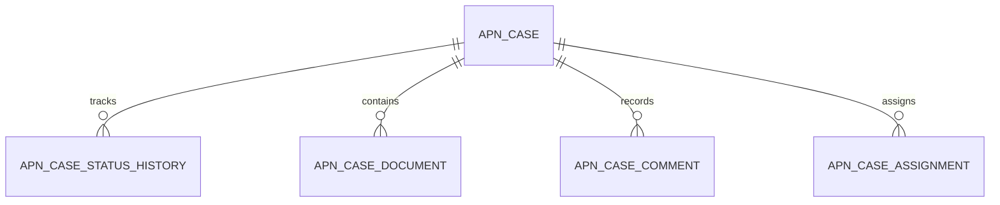
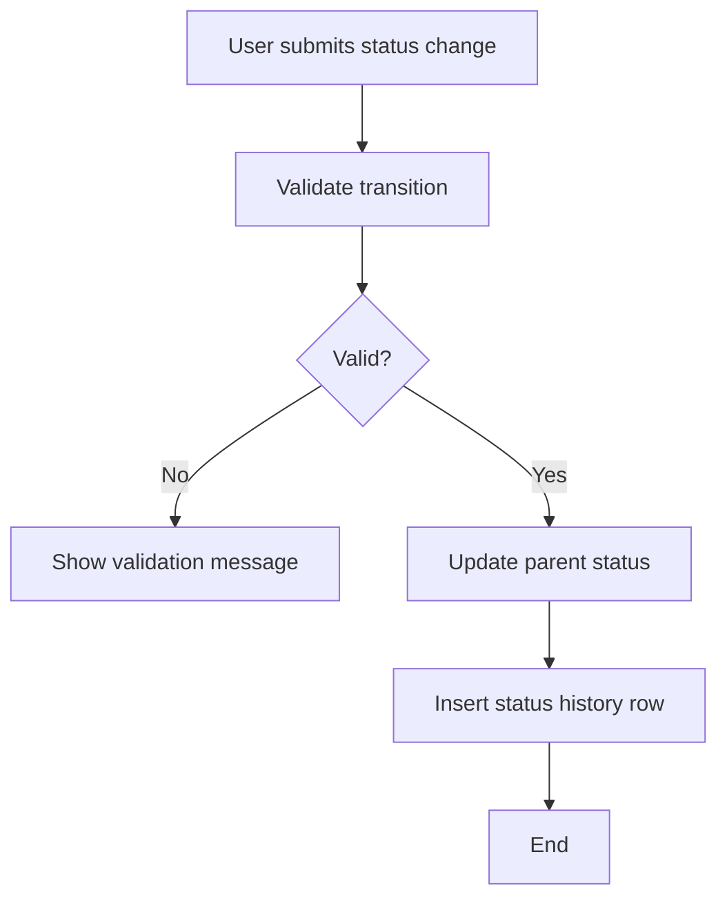
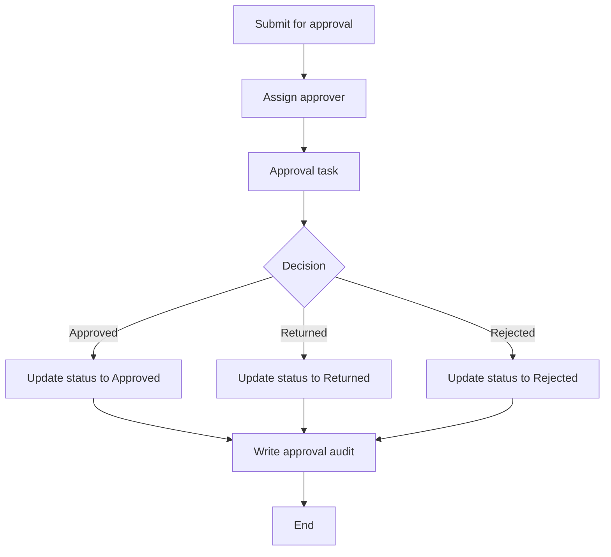
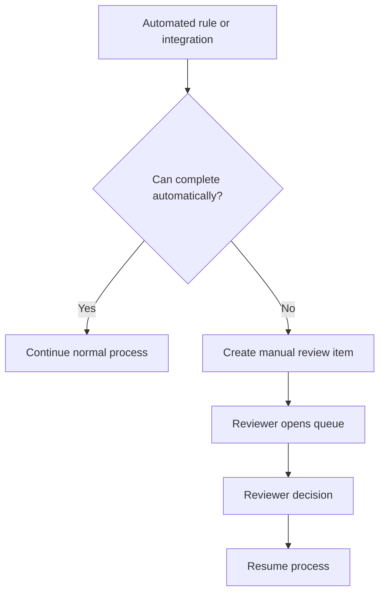
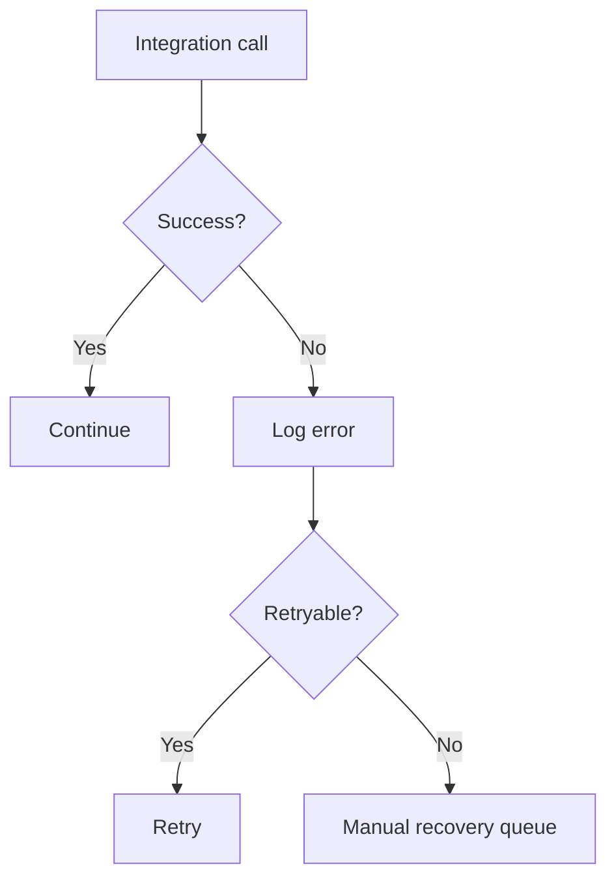
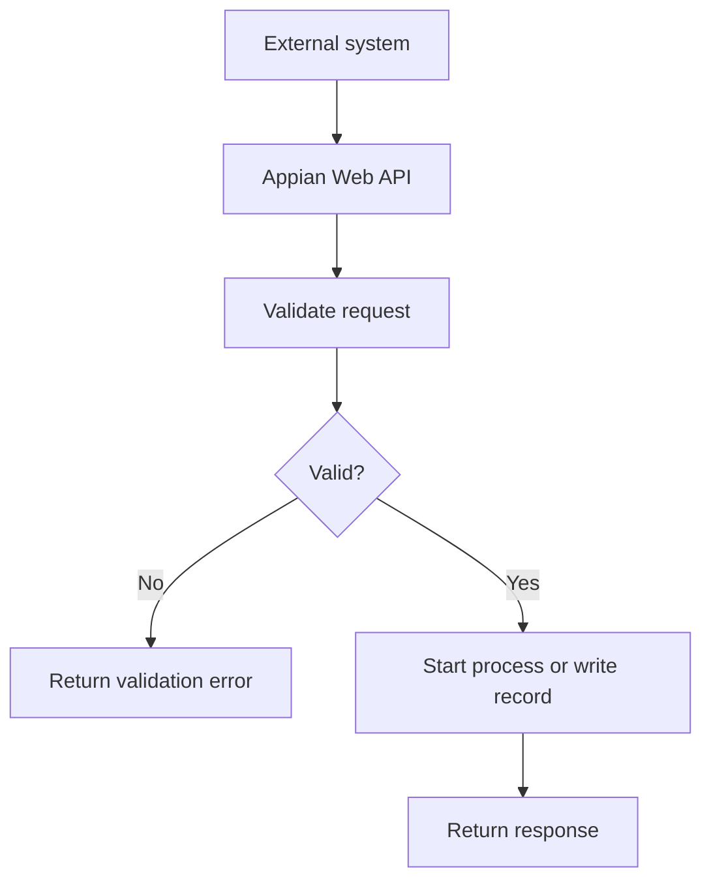

# Appian Pattern Library

## Table of contents

1. [Purpose](#purpose)
2. [How to use this pattern library](#how-to-use-this-pattern-library)
3. [Pattern specification format](#pattern-specification-format)
4. [Pattern 1: Case management](#pattern-1-case-management)
5. [Pattern 2: Status history](#pattern-2-status-history)
6. [Pattern 3: Document attachment](#pattern-3-document-attachment)
7. [Pattern 4: Comments and notes](#pattern-4-comments-and-notes)
8. [Pattern 5: Approval workflow](#pattern-5-approval-workflow)
9. [Pattern 6: Assignment queue](#pattern-6-assignment-queue)
10. [Pattern 7: Manual review queue](#pattern-7-manual-review-queue)
11. [Pattern 8: Exception and dead-letter handling](#pattern-8-exception-and-dead-letter-handling)
12. [Pattern 9: Outbound REST integration](#pattern-9-outbound-rest-integration)
13. [Pattern 10: Inbound Web API](#pattern-10-inbound-web-api)
14. [Pattern 11: Reference data management](#pattern-11-reference-data-management)
15. [Pattern 12: Audit trail](#pattern-12-audit-trail)
16. [Pattern 13: Search and filter page](#pattern-13-search-and-filter-page)
17. [Pattern 14: Dashboard and KPI page](#pattern-14-dashboard-and-kpi-page)
18. [Pattern 15: Payment or financial transaction workflow](#pattern-15-payment-or-financial-transaction-workflow)
19. [Pattern selection checklist](#pattern-selection-checklist)
20. [AI usage guardrails](#ai-usage-guardrails)
21. [References](#references)

## Purpose

This document provides reusable Appian design patterns for APN-style Appian delivery.

It is intended to help architects, developers and AI assistants design common Appian features consistently without copying domain-specific implementations from other projects.

This document is a recommended house standard. Official Appian documentation remains the source of truth for exact platform behaviour, function signatures, SAIL component parameters and compatibility.

## How to use this pattern library

Use this library when designing a new feature or reviewing AI-generated Appian specifications.

The patterns are intentionally generic. Replace the example names, fields, groups and user journeys with the current project kit details.

Do not copy a pattern blindly. Confirm:

- the business process genuinely needs the pattern
- the data model fits the project
- the security model is appropriate
- the Appian objects already exist or are planned
- the pattern is mobile and accessibility safe where required
- the exact SAIL functions and component parameters are verified against Appian 26.4 documentation

## Pattern specification format

Each pattern should be documented using this structure when applied to a project.

```text
Pattern Name:
Business Purpose:
When to Use:
When Not to Use:
Core Data Objects:
Appian Objects:
Security Model:
Process Flow:
Interface Pattern:
Integration Pattern:
Performance Considerations:
Test Scenarios:
Risks and Anti-patterns:
Official Appian References:
```

## Pattern 1: Case management

### Business purpose

Use this pattern where a business object moves through a managed lifecycle with ownership, status, tasks, documents, notes, decisions and audit history.

### When to use

Use this pattern for:

- claims
- applications
- service requests
- investigations
- complaints
- registrations
- reviews
- support cases

### Core data objects

Recommended generic tables:

```text
apn_case
apn_case_status_history
apn_case_document
apn_case_comment
apn_case_assignment
```

Recommended Appian objects:

```text
APN_REC_Case
APN_REC_CaseStatusHistory
APN_REC_CaseDocument
APN_REC_CaseComment
APN_REC_CaseAssignment
APN_PM_CreateCase
APN_PM_UpdateCaseStatus
APN_UI_CaseSummary
APN_UI_CaseSearch
```

### Relationship diagram



### Design standards

| Area | Standard |
|---|---|
| Status | Use governed reference data or constants where status drives logic. |
| Ownership | Store current owner or assigned group explicitly. |
| History | Store status changes in an append-only child table. |
| Documents | Store Appian document ID in a child attachment table. |
| Comments | Store user-visible notes separately from core case fields. |
| Security | Apply record type security, action visibility and process start security. |

### Anti-patterns

- storing all comments in one long text field on the case table
- overwriting status without retaining history
- relying on UI hiding as the only security control
- using free-text status values where workflow depends on them

## Pattern 2: Status history

### Business purpose

Use this pattern to capture lifecycle changes for a parent record.

### Core data objects

```text
apn_<entity>
apn_<entity>_status_history
apn_ref_<entity>_status
```

### Recommended fields

| Field | Purpose |
|---|---|
| `<entity>_status_history_id` | Primary key. |
| `<entity>_id` | Parent record foreign key. |
| `from_status_code` | Previous status. |
| `to_status_code` | New status. |
| `change_reason` | Optional reason. |
| `changed_on` | Change timestamp. |
| `changed_by` | User or system that made the change. |

### Process flow



### Review checks

- status transition rules are documented
- history is append-only
- current status and status history remain consistent
- status values are governed
- status update process includes tests

## Pattern 3: Document attachment

### Business purpose

Use this pattern to link Appian documents to business records.

### Core data objects

```text
apn_<entity>_document
```

Recommended fields:

| Field | Purpose |
|---|---|
| `<entity>_document_id` | Primary key. |
| `<entity>_id` | Parent record foreign key. |
| `document_id` | Appian document identifier. |
| `document_name` | Display name. |
| `document_type_code` | Optional governed type. |
| `uploaded_on` | Upload timestamp. |
| `uploaded_by` | Uploading user. |
| `is_deleted` | Soft delete flag. |

### Design standards

- store document metadata separately from the parent table
- secure the Appian folder as well as the record data
- document whether files are uploaded in the form or after parent write
- if child records need the generated parent primary key, write parent first, then document mapping rows

### Anti-patterns

- storing only the file name and not the Appian document ID
- ignoring folder security
- allowing attachments without document type where classification is required
- deleting attachment rows physically when audit history is required

## Pattern 4: Comments and notes

### Business purpose

Use this pattern to capture business notes, comments or internal commentary for a parent record.

### Core data objects

```text
apn_<entity>_comment
```

Recommended fields:

| Field | Purpose |
|---|---|
| `<entity>_comment_id` | Primary key. |
| `<entity>_id` | Parent record foreign key. |
| `comment_text` | Comment body. |
| `comment_type_code` | Internal, external, review, system note, etc. |
| `created_on` | Comment timestamp. |
| `created_by` | Commenting user or system. |
| `is_deleted` | Soft delete flag where needed. |

### Design standards

- use a child table instead of appending text into one parent field
- separate internal and external comment types where visibility differs
- enforce security through record security or query filtering, not only UI hiding
- make comments append-only unless edit requirements are explicit

## Pattern 5: Approval workflow

### Business purpose

Use this pattern where a record requires a decision from an authorised user or group.

### Core data objects

```text
apn_<entity>
apn_<entity>_approval
apn_<entity>_status_history
```

### Process flow



### Design standards

| Area | Standard |
|---|---|
| Decision values | Governed values, not uncontrolled text. |
| Approver | Store approver and decision timestamp. |
| Comments | Require decision comments where appropriate. |
| Security | Approve action visible only to authorised approval groups. |
| Audit | Store approval history separately from current state. |

### Anti-patterns

- allowing the requester to approve their own request when policy forbids it
- storing approval history only in process history
- hiding approval button without process start security

## Pattern 6: Assignment queue

### Business purpose

Use this pattern to manage work assigned to users or groups.

### Core data objects

```text
apn_assignment
apn_assignment_history
```

Recommended fields:

| Field | Purpose |
|---|---|
| `assignment_id` | Primary key. |
| `record_type_code` | Optional classifier if using a generic assignment model. |
| `record_id` | Business record identifier. |
| `assigned_to_user` | Assigned user. |
| `assigned_to_group` | Assigned group. |
| `assignment_status_code` | Open, accepted, completed, cancelled, etc. |
| `assigned_on` | Assignment timestamp. |
| `assigned_by` | Assigning user or system. |
| `due_on` | Due date or SLA target. |

### Design standards

- prefer explicit entity-specific assignment tables where relationships and security differ significantly
- use group assignment where work can be pulled by a team
- use user assignment where accountability is individual
- maintain assignment history for reassignment and audit

## Pattern 7: Manual review queue

### Business purpose

Use this pattern when automation cannot complete a decision and a human must review the item.

### Core data objects

```text
apn_manual_review_item
apn_manual_review_decision
```

### Process flow



### Design standards

- capture why the item entered manual review
- capture review priority and due date
- capture reviewer decision and comments
- provide queue filters for status, priority, age and assigned user
- avoid burying manual review inside process monitor only

## Pattern 8: Exception and dead-letter handling

### Business purpose

Use this pattern for failed integrations, failed automated processing, invalid inbound messages or records that require support intervention.

### Core data objects

```text
apn_int_error_log
apn_manual_recovery_queue
```

Recommended fields:

| Field | Purpose |
|---|---|
| `error_id` | Primary key. |
| `correlation_id` | Trace across process and integration. |
| `source_system` | Where the error originated. |
| `operation_name` | Integration or process operation. |
| `error_type_code` | Validation, timeout, system, security, mapping, etc. |
| `error_message` | Sanitised message. |
| `payload_reference` | Optional reference to stored payload. |
| `retry_count` | Retry attempts. |
| `error_status_code` | Open, retried, resolved, ignored. |
| `created_on` | Error timestamp. |

### Process flow



### Design standards

- do not expose raw sensitive payloads to all support users
- store correlation IDs
- distinguish retryable and non-retryable errors
- provide support dashboards
- document escalation paths

## Pattern 9: Outbound REST integration

### Business purpose

Use this pattern when Appian calls an external API.

### Required specification details

```text
Connected System:
Integration Object:
Method:
Purpose:
Authentication:
Request contract:
Response contract:
Timeout behaviour:
Retry behaviour:
Idempotency:
Error handling:
Logging:
Security owner:
```

### Design standards

- always obtain a representative response before writing wrapper rules
- treat response bodies as dictionaries unless explicitly mapped
- use `index()` with safe defaults
- do not hardcode credentials
- do not call slow integrations on every interface refresh

### Response wrapper pattern

```appian
a!localVariables(
  local!response: rule!APN_INT_SearchCustomer(criteria: ri!criteria),
  local!body: index(local!response, "body", {}),
  local!records: index(local!body, "records", {}),
  a!forEach(
    items: local!records,
    expression: a!map(
      externalId: tostring(index(fv!item, "id", null)),
      displayName: tostring(index(fv!item, "displayName", ""))
    )
  )
)
```

## Pattern 10: Inbound Web API

### Business purpose

Use this pattern when external systems call Appian.

### Required specification details

| Area | Required detail |
|---|---|
| Endpoint purpose | Business operation. |
| Authentication | How the caller authenticates. |
| Authorisation | Which callers are allowed. |
| Request schema | Required and optional fields. |
| Validation | Field and business rules. |
| Idempotency | Duplicate request behaviour. |
| Response schema | Success and error response. |
| Logging | Request ID, correlation ID and outcome. |
| Error handling | Validation, business and system errors. |

### Process flow



## Pattern 11: Reference data management

### Business purpose

Use this pattern for governed values used across interfaces, queries, reports or integrations.

### Core data objects

```text
apn_ref_<reference_name>
```

Recommended fields:

```text
<reference>_code
label
description
sort_order
is_active
effective_from
effective_to
created_on
created_by
updated_on
updated_by
```

### Design standards

- use stable codes for logic and integration
- use labels for user display
- do not reorder constant lists where index-based access exists
- prefer reference tables where values need governance, reporting or environment-independent maintenance

## Pattern 12: Audit trail

### Business purpose

Use this pattern where data changes must be traceable beyond standard created/updated fields.

### Core data objects

```text
apn_audit_event
```

Recommended fields:

| Field | Purpose |
|---|---|
| `audit_event_id` | Primary key. |
| `entity_type_code` | Entity affected. |
| `entity_id` | Entity identifier. |
| `event_type_code` | Created, updated, approved, deleted, exported, etc. |
| `event_summary` | Human-readable summary. |
| `event_payload` | Optional sanitised detail. |
| `created_on` | Event timestamp. |
| `created_by` | User or system. |
| `correlation_id` | Cross-system trace. |

### Design standards

- avoid storing sensitive data in audit payloads unless required and secured
- use audit events for business-relevant events, not every minor UI interaction
- ensure support users can search audit history where appropriate

## Pattern 13: Search and filter page

### Business purpose

Use this pattern for operational search pages, work queues and reporting entry points.

### Interface pattern

```text
Filter panel
Result summary
Paged grid
Row actions
Empty state
Export or report action where approved
```

### Design standards

- do not load large result sets on first render unless required
- use explicit Search and Reset actions where filters are complex
- use paging and sorting
- select only required record fields
- provide clear empty states
- keep mobile behaviour in mind

## Pattern 14: Dashboard and KPI page

### Business purpose

Use this pattern to provide operational visibility and management oversight.

### Recommended components

```text
KPI cards
Trend charts
Status breakdown
Ageing queues
Exception counts
Recent activity
Drill-through links
```

### Design standards

- KPIs must have clear definitions
- charts must have accessible labels and empty states
- dashboard queries must be optimised
- avoid dashboards that require full-table scans on every refresh
- provide drill-through to grids where action is required

## Pattern 15: Payment or financial transaction workflow

### Business purpose

Use this pattern where Appian manages approvals, status, audit and integration around payment or financial transactions.

### Core data objects

```text
apn_payment
apn_payment_status_history
apn_payment_error
apn_ref_payment_status
```

### Design standards

| Area | Standard |
|---|---|
| Amount | Use appropriate decimal precision. |
| Status | Governed status values. |
| Approval | Separate approval history from current payment state. |
| Integration | Use idempotency where external payment calls may repeat. |
| Audit | Log status changes, user decisions and external references. |
| Security | Restrict payment actions to authorised groups. |

### Anti-patterns

- storing money as text
- not handling duplicate external submissions
- exposing sensitive payment details unnecessarily
- treating integration success as guaranteed

## Pattern selection checklist

| Question | Yes or no |
|---|---|
| Does the feature need lifecycle tracking? |  |
| Does the feature need status history? |  |
| Does the feature need documents? |  |
| Does the feature need comments or notes? |  |
| Does the feature need assignment or queue management? |  |
| Does the feature need approval? |  |
| Does the feature call external systems? |  |
| Does the feature expose a Web API? |  |
| Does the feature need manual review? |  |
| Does the feature need exception recovery? |  |
| Does the feature need operational reporting? |  |
| Does the feature have sensitive data? |  |

## AI usage guardrails

When asking AI to use this library, use this instruction:

```text
Use APPIAN_PATTERN_LIBRARY.md as pattern guidance only. Do not copy example
object names blindly. Replace table names, record types, groups, fields and
processes with the current project kit values. Generate Appian SAIL and
Expression Language only. Do not invent Appian functions, component
parameters, allowed values or record fields. Mark anything requiring official
Appian documentation verification.
```

Review AI output for:

- non-Appian syntax
- invented SAIL parameters
- invented Appian functions
- copied example names that do not match the project kit
- missing security
- missing audit
- missing tests
- missing rollback or exception handling

## References

Official Appian 26.4 documentation remains the source of truth:

- https://docs.appian.com/suite/help/26.4/
- https://docs.appian.com/suite/help/26.4/Records.html
- https://docs.appian.com/suite/help/26.4/Record_Type_Object.html
- https://docs.appian.com/suite/help/26.4/record-type-relationships.html
- https://docs.appian.com/suite/help/26.4/SAIL_Components.html
- https://docs.appian.com/suite/help/26.4/Appian_Functions.html
- https://docs.appian.com/suite/help/26.4/Process_Modeling.html
- https://docs.appian.com/suite/help/26.4/Integration_Object.html
- https://docs.appian.com/suite/help/26.4/Web_APIs.html
