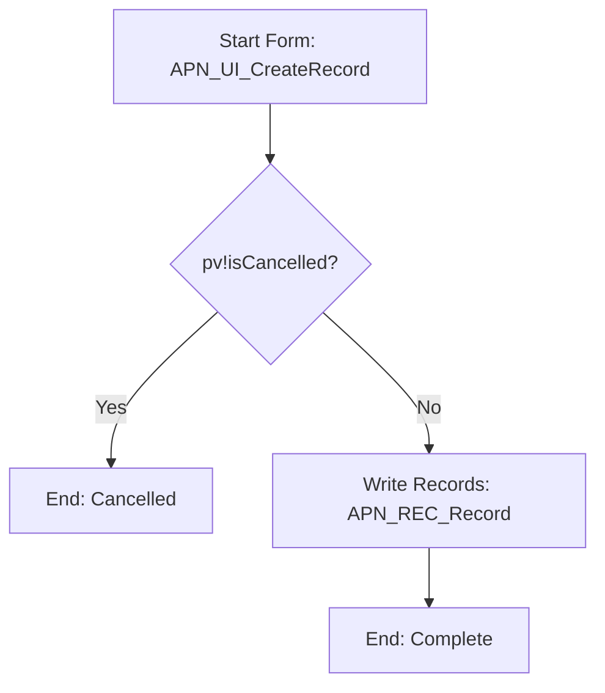
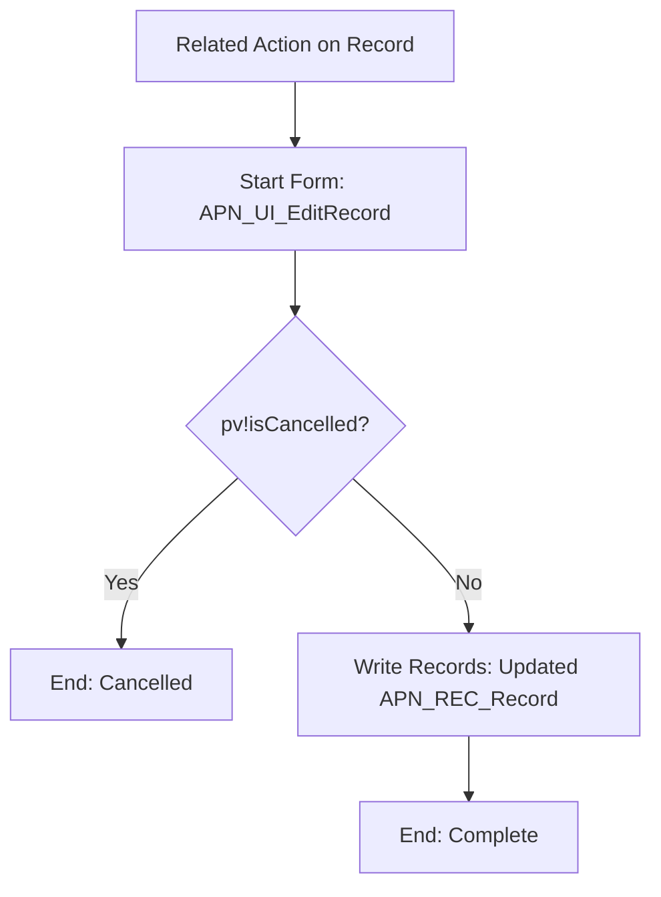
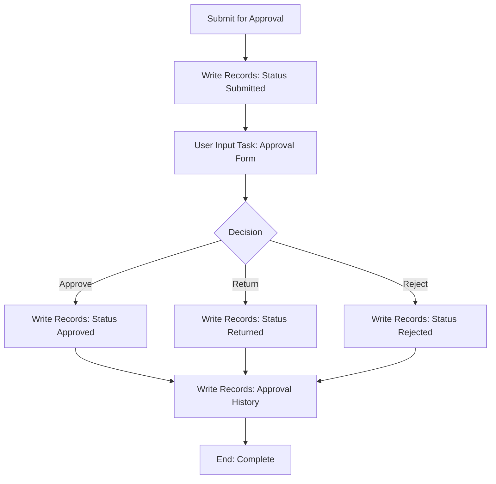
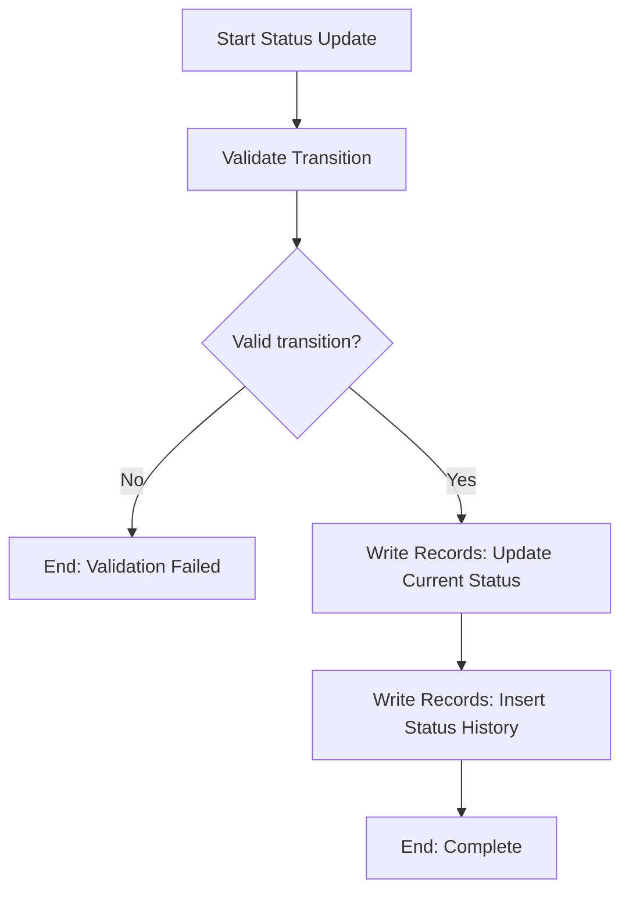
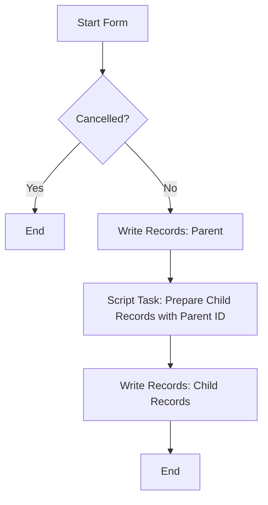
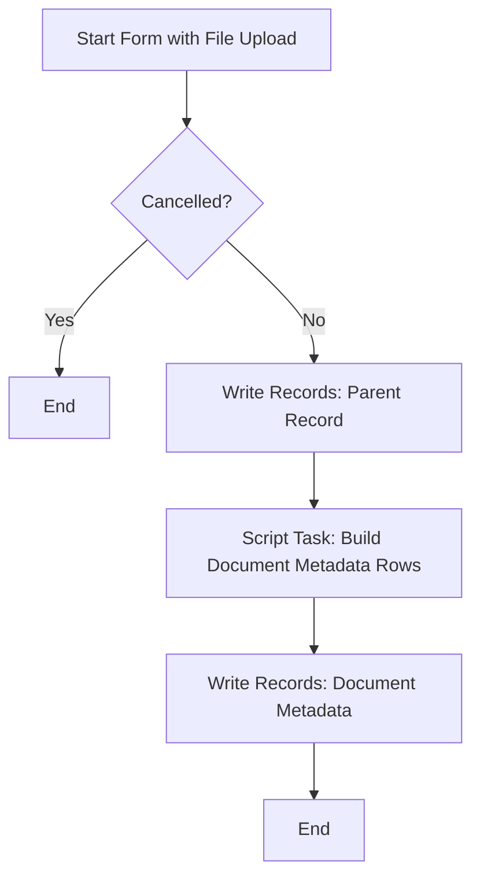
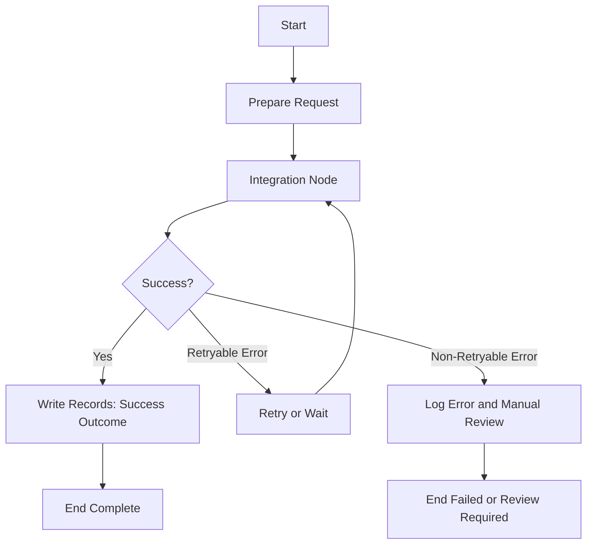
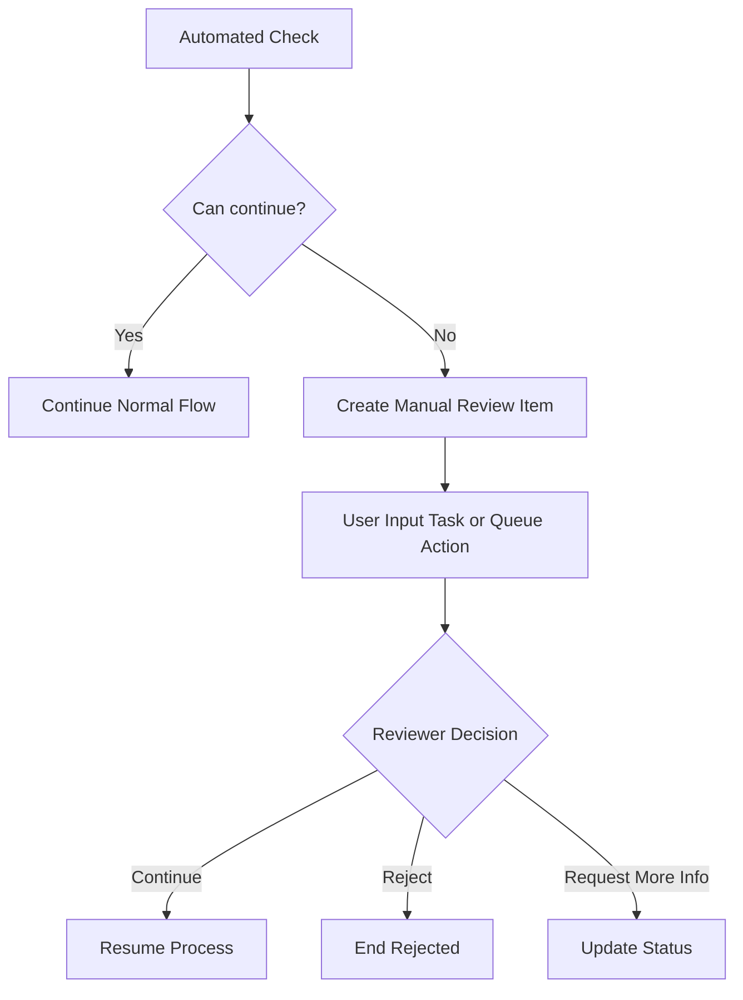
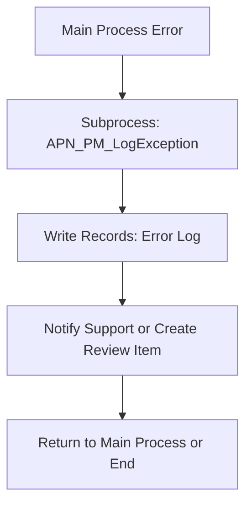
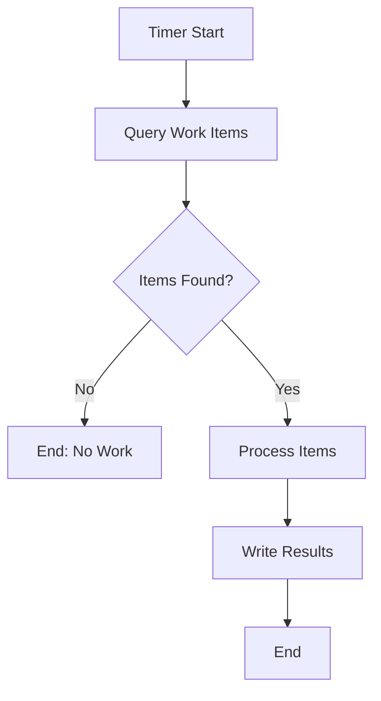

# Appian Process Model Design Best Practices

## Table of contents

1. [Purpose](#purpose)
2. [AI usage note](#ai-usage-note)
3. [Core rule: Appian process model only](#core-rule-appian-process-model-only)
4. [When a process model is required](#when-a-process-model-is-required)
5. [When a process model is not required](#when-a-process-model-is-not-required)
6. [Process model design principles](#process-model-design-principles)
7. [Appian process model component catalogue](#appian-process-model-component-catalogue)
8. [Required process design output from an LLM](#required-process-design-output-from-an-llm)
9. [Standard process model specification format](#standard-process-model-specification-format)
10. [Pattern 1: Create record with start form](#pattern-1-create-record-with-start-form)
11. [Pattern 2: Edit record with related action](#pattern-2-edit-record-with-related-action)
12. [Pattern 3: Approval workflow](#pattern-3-approval-workflow)
13. [Pattern 4: Status update workflow](#pattern-4-status-update-workflow)
14. [Pattern 5: Parent record with child record write](#pattern-5-parent-record-with-child-record-write)
15. [Pattern 6: Document upload and metadata write](#pattern-6-document-upload-and-metadata-write)
16. [Pattern 7: Integration orchestration](#pattern-7-integration-orchestration)
17. [Pattern 8: Manual review queue](#pattern-8-manual-review-queue)
18. [Pattern 9: Exception subprocess](#pattern-9-exception-subprocess)
19. [Pattern 10: Scheduled process](#pattern-10-scheduled-process)
20. [Process variables best practices](#process-variables-best-practices)
21. [Rule input and process variable mapping](#rule-input-and-process-variable-mapping)
22. [Gateway design standards](#gateway-design-standards)
23. [Write Records design standards](#write-records-design-standards)
24. [Subprocess design standards](#subprocess-design-standards)
25. [Integration node design standards](#integration-node-design-standards)
26. [Exception handling standards](#exception-handling-standards)
27. [Security standards](#security-standards)
28. [Performance standards](#performance-standards)
29. [Testing standards](#testing-standards)
30. [Common AI mistakes](#common-ai-mistakes)
31. [Mandatory LLM prompt for process design](#mandatory-llm-prompt-for-process-design)
32. [Process design review checklist](#process-design-review-checklist)
33. [References](#references)

## Purpose

This document defines APN best practices for designing Appian process models.

It is intended for architects, developers and AI assistants that need to produce Appian-native process designs. When an LLM is asked to build an Appian app, it must describe process flows using Appian process model concepts, not generic BPMN, Java services, React workflows or pseudo-code.

This is a recommended house standard. Official Appian documentation remains the source of truth for exact platform behaviour, smart service configuration, process node options and version-specific features.

## AI usage note

This file is intended to be self-contained for AI-assisted Appian process design. Do not assume the AI tool can fetch or read external URLs. The official links at the end are for human verification and traceability.

When an LLM generates a process design, it must use the rules and patterns in this file directly.

## Core rule: Appian process model only

AI-generated process designs must be expressed in Appian process model terms.

Use Appian concepts such as:

- process model
- start event
- start form
- user input task
- script task
- smart service node
- Write Records node
- XOR gateway
- AND gateway
- OR gateway
- subprocess
- timer event
- message event
- exception flow
- process variables
- activity chaining
- node inputs and outputs
- alerts
- data management/archive settings
- terminate end event
- record action
- related action

Do not describe Appian process models using only generic code terms such as:

```text
controller
service class
repository
Java method
React submit handler
Node.js worker
Express route
Spring Boot service
frontend state machine
```

If a technical specification includes those terms, it must clearly be outside Appian process model design.

## When a process model is required

Use an Appian process model when the feature needs orchestration, workflow state, record writes, task assignment, integrations, approvals or auditable business events.

Typical use cases:

| Use case | Process model needed? | Reason |
|---|---:|---|
| Create a business record from a form | Yes | Requires form submission and Write Records. |
| Edit an existing record through a related action | Yes | Requires controlled update and audit stamping. |
| Approval decision | Yes | Requires user task, decision branch and status update. |
| Integration call with retry or failure handling | Yes | Requires orchestration and exception path. |
| Upload document and write metadata | Usually yes | Requires document handling and child record write. |
| Manual review queue item | Yes | Requires workflow and assignment. |
| Scheduled batch job | Yes | Requires timer or scheduled trigger. |
| Read-only dashboard | Usually no | Query rules and interfaces may be enough. |
| Simple calculated display | No | Expression rule or custom record field may be enough. |

## When a process model is not required

Do not create a process model just because an interface exists.

A process model is usually not required for:

- read-only record views
- read-only dashboards
- simple search pages
- reusable display components
- simple formatting rules
- calculations that do not write data
- data retrieval that can be handled by expression rules

Avoid over-engineering. Use the smallest Appian object set that meets the business requirement.

## Process model design principles

| Principle | Standard |
|---|---|
| Thin orchestration | Keep business orchestration in the process, but complex calculations in expression rules. |
| Start with the trigger | Identify whether the process starts from a record action, related action, timer, Web API or subprocess. |
| Use Appian write nodes | Prefer Write Records for record-backed data writes where suitable. |
| Keep flows readable | Use clear node names and avoid dense gateway chains. |
| Make cancellation explicit | Use `pv!isCancelled` and an XOR gateway where a form can be cancelled. |
| Stamp audit fields deliberately | Capture who did what and when. |
| Configure alerts | Every process must have an alert recipient group. |
| Plan exceptions | Every integration and critical write path needs failure behaviour. |
| Test each path | Happy path, cancel path, exception path and security path must be tested. |

## Appian process model component catalogue

Use this catalogue when asking an LLM to describe process models.

| Appian process component | Purpose | LLM output expectation |
|---|---|---|
| Start Event | Entry point for the process. | State trigger and whether it has a start form. |
| Start Form | First user interface shown when process starts. | List interface name and PV-to-RI mapping. |
| User Input Task | Human task after the process has already started. | State assignee, form, task name and outputs. |
| Script Task | Lightweight calculation, variable update or merge step. | State exact purpose and outputs. Avoid unnecessary script tasks. |
| Write Records | Writes record-backed data. | State record type, source PV and output mapping. |
| Smart Service Node | Performs Appian-supported service action. | State service purpose, inputs, outputs and errors. |
| Integration Node | Calls an integration. | State request, response, timeout and error path. |
| XOR Gateway | One path based on conditions. | List all conditions and default path. |
| AND Gateway | Parallel paths. | Explain why parallel execution is required. |
| OR Gateway | Conditional multiple paths. | Use only when the logic genuinely needs it. |
| Subprocess | Reusable or isolated process logic. | State sync or async behaviour and parameters. |
| Timer Event | Delayed or scheduled continuation. | State timing rule and business reason. |
| Message Event | Event-driven continuation. | State message source and correlation. |
| End Event | Process completion. | State success, cancelled or failed ending. |
| Terminate End Event | Ends all active process paths. | Use where no lingering paths should remain. |

## Required process design output from an LLM

When asked to build an Appian app, an LLM must provide process design in this structure.

```text
Process Model Name:
Process Display Name:
Trigger:
Start Form or Start Event:
Process Variables:
Rule Input Mapping:
Flow Steps:
Gateway Logic:
Write Records Nodes:
Integration Nodes:
Subprocesses:
Exception Handling:
Alerts:
Data Management:
Security:
Unit Tests:
E2E Test Scenarios:
```

If any section is not applicable, the LLM must state `Not applicable` and explain why.

## Standard process model specification format

Use this format in Appian technical specifications.

```text
Process Model Name: APN_PM_CreateClaim
Description: [Story #] - Creates a new claim from a start form.
Trigger: Related action on APN_REC_Customer
Process Display Name: "Create Claim - " & pv!parentRecord[customer reference field]
Alerts: APN_GRP_Admins
Data Management: Archive after agreed project retention period
End Event: Terminate end event

Process Variables:
| Name | Type | Parameter | Default | Purpose |
|---|---|---:|---|---|
| parentRecord | APN_REC_Customer | Yes | None | Parent customer context. |
| record | APN_REC_Claim | Yes | Blank claim | Claim being created. |
| isCancelled | Boolean | No | false | Controls cancel path. |

Form Mapping:
| Interface RI | Direction | Process variable | Notes |
|---|---|---|---|
| ri!parentRecord | Input | pv!parentRecord | Shows parent context. |
| ri!record | Input/Output | pv!record | Captures claim data. |
| ri!isCancelled | Output | pv!isCancelled | Controls XOR gateway. |

Flow:
1. Start Form: APN_UI_CreateClaim
2. XOR Gateway: Is Cancelled?
3. If yes: End Cancelled
4. If no: Write Records to APN_REC_Claim
5. End Complete
```

## Pattern 1: Create record with start form

### Use when

Use this for simple create flows where the first user interaction is a form.

### Flow



### Appian nodes

| Step | Appian node | Purpose |
|---|---|---|
| 1 | Start Form | Displays create form. |
| 2 | XOR Gateway | Checks `pv!isCancelled`. |
| 3 | End Event | Ends cancelled path. |
| 4 | Write Records | Writes the record. |
| 5 | Terminate End Event | Completes process cleanly. |

### Best practices

- mark PVs used by the start form as parameters when launched by record action context
- stamp created and updated audit fields in the form submit where appropriate
- use Write Records for record-backed writes
- keep process flow short and readable

## Pattern 2: Edit record with related action

### Use when

Use this when editing an existing record from its record summary or a grid row.

### Flow



### Process variables

| Name | Type | Parameter | Purpose |
|---|---|---:|---|
| record | Record type | Yes | Existing record passed from `rv!record`. |
| isCancelled | Boolean | No | Cancel control. |

### Best practices

- pass the existing record or identifier from the related action
- avoid re-querying the record if the record context is already available and complete
- ensure action visibility and process start security match
- apply optimistic locking where concurrent edits are a risk

## Pattern 3: Approval workflow

### Use when

Use this when a user or group must approve, return or reject a record.

### Flow



### Best practices

- store decision, decision maker, decision timestamp and comments
- require comments for rejected or returned decisions where policy requires it
- do not rely only on task assignment for security
- configure process alerts
- include tests for each decision path

## Pattern 4: Status update workflow

### Use when

Use this when a process changes a record status and must retain history.

### Flow



### Best practices

- validate allowed status transitions before writing
- write current status and status history in a controlled sequence
- keep status values governed through reference data or constants
- test invalid transitions

## Pattern 5: Parent record with child record write

### Use when

Use this when a process creates a parent record and then needs the generated parent primary key to create child records.

### Flow



### Best practices

- write parent first when child rows need the generated parent ID
- use the Write Records output to populate child foreign keys
- keep child preparation logic simple and documented
- test with zero, one and multiple child records

## Pattern 6: Document upload and metadata write

### Use when

Use this when users upload documents and metadata needs to be written to a child table.

### Flow



### Best practices

- confirm document folder security
- store document ID and metadata in a child table
- do not store only the file name
- support zero documents where documents are optional
- test document upload, no document upload and invalid file scenarios

## Pattern 7: Integration orchestration

### Use when

Use this when a process must call an external system.

### Flow



### Best practices

- obtain a real or representative response payload before writing mapping logic
- log correlation IDs
- distinguish retryable and non-retryable errors
- avoid calling slow integrations inside interface refresh loops
- document idempotency for state-changing calls

## Pattern 8: Manual review queue

### Use when

Use this when automation cannot complete a decision and human review is needed.

### Flow



### Best practices

- store manual review reason
- store reviewer decision and comments
- provide queue filters and assignment rules
- do not rely on process monitor as the business queue

## Pattern 9: Exception subprocess

### Use when

Use this for reusable exception logging, alerting or manual recovery.

### Flow



### Best practices

- pass correlation ID, operation name, error type and safe error message
- do not store sensitive payloads without security review
- make support visibility clear
- avoid swallowing errors silently

## Pattern 10: Scheduled process

### Use when

Use this for nightly checks, periodic syncs, SLA monitoring or scheduled reminders.

### Flow



### Best practices

- limit batch size
- log run start and end
- handle partial failures
- avoid one process instance doing too much work without monitoring
- include operational dashboard or log where needed

## Process variables best practices

| Standard | Guidance |
|---|---|
| Use clear business names | `claimRecord`, `approvalDecision`, `isCancelled`. |
| Avoid unnecessary PVs | Do not create one PV per form field when the record PV can hold the data. |
| Mark start form context as parameters | Required when record actions pass context at launch. |
| Use Boolean flags carefully | Make gateway conditions readable. |
| Keep document arrays separate | Uploaded documents often need separate handling from record writes. |
| Avoid storing large payloads unnecessarily | Use references or logs where appropriate. |

## Rule input and process variable mapping

Use this mapping style in every specification.

| Interface rule input | Direction | Process variable | Notes |
|---|---|---|---|
| `ri!parentRecord` | Input | `pv!parentRecord` | Parent context. |
| `ri!record` | Input/Output | `pv!record` | Working business record. |
| `ri!isCancelled` | Output | `pv!isCancelled` | Controls cancel gateway. |
| `ri!documents` | Output | `pv!documents` | Uploaded documents. |

Direction legend:

```text
Input: process sends data to form
Output: form sends data to process
Input/Output: process initialises value and receives updates
```

## Gateway design standards

| Gateway | Use when | Standard |
|---|---|---|
| XOR | Exactly one path should be taken. | Define each condition and default path. |
| AND | Parallel paths must run. | Use only where parallelism is genuinely needed. |
| OR | One or more conditional paths may run. | Avoid unless simpler XOR logic is insufficient. |

Best practices:

- give gateways meaningful names
- avoid back-to-back gateways without an intervening activity node
- ensure every gateway has a clear default or else path
- keep conditions simple and readable

## Write Records design standards

Document every Write Records node.

```text
Node Name:
Record Type:
Source PV:
Write Purpose:
Output Mapping:
Failure Behaviour:
```

Best practices:

- use one Write Records node for independent writes where appropriate
- use separate nodes when a child needs the parent generated primary key
- map outputs back to PVs where later nodes need generated IDs
- test write failure paths where critical

## Subprocess design standards

Use subprocesses for reusable or isolated process logic.

| Subprocess type | Use when |
|---|---|
| Synchronous subprocess | Parent must wait for completion. |
| Asynchronous subprocess | Parent can continue without waiting. |
| Exception subprocess | Reusable logging, alerting or recovery. |
| Utility subprocess | Shared operational step across multiple processes. |

Document subprocess inputs and outputs clearly.

## Integration node design standards

Every integration node should document:

| Item | Required |
|---|---|
| Connected system | Yes |
| Integration object | Yes |
| Request mapping | Yes |
| Response mapping | Yes |
| Success criteria | Yes |
| Retry behaviour | Yes, if applicable |
| Failure path | Yes |
| Correlation ID | Yes where traceability is needed |
| Idempotency | Yes for state-changing calls |

## Exception handling standards

Every process specification should define:

- what happens when validation fails
- what happens when Write Records fails
- what happens when an integration times out
- what happens when an integration returns a business error
- what support users can see
- how the user is notified
- whether retry is safe
- whether manual review is required

## Security standards

Security must be enforced beyond UI visibility.

| Layer | Requirement |
|---|---|
| Record action visibility | Only authorised groups see actions. |
| Process model security | Only authorised groups can start process. |
| User input task assignment | Task assigned to correct user or group. |
| Record type security | Data access controlled by role. |
| Integration security | Credentials managed in connected systems. |
| Support security | Error logs and payloads restricted. |

## Performance standards

| Area | Standard |
|---|---|
| Process length | Avoid unnecessary nodes and script tasks. |
| Large batches | Use batch patterns and limits. |
| Integrations | Avoid repeated calls where one call can serve the process. |
| Documents | Avoid storing large payloads in PVs longer than needed. |
| Subprocesses | Use async where parent does not need to wait. |
| Archive settings | Configure data management to avoid process bloat. |

## Testing standards

Every process model must include tests for:

| Test type | Examples |
|---|---|
| Happy path | Submit form, write record, complete. |
| Cancel path | Cancel form, no write. |
| Validation path | Invalid data blocks progress. |
| Gateway path | Each gateway branch tested. |
| Write path | Record created or updated correctly. |
| Integration path | Success, timeout and business error. |
| Security path | Unauthorised user cannot start process. |
| Alert path | Support receives alert or error log. |
| Data management | Process completes and archives as expected. |

## Common AI mistakes

| Mistake | Correction |
|---|---|
| Describing a Java service instead of an Appian process model | Use Appian process nodes and PVs. |
| Missing process variables | Include name, type, parameter flag and default. |
| Missing start form mapping | Map PVs to RIs and state direction. |
| Using `ri!` as process variables | Use `pv!` in process model descriptions. |
| Using `pv!` inside SAIL interface code | Use `ri!` in interfaces. |
| No cancel path | Add `pv!isCancelled` and XOR gateway where form can be cancelled. |
| No alerts | Configure alerts to admin or support group. |
| No data management | Define archive or deletion setting. |
| No exception handling | Add failure, retry or manual review paths. |
| No security beyond button hiding | Configure action visibility and process start security. |
| Creating many script tasks for simple field stamping | Stamp fields in form submit where appropriate. |
| Child write before parent ID exists | Write parent first, then child. |
| Consecutive gateways | Insert an activity or merge script task between gateways. |
| Process design has no tests | Add unit and end-to-end process tests. |

## Mandatory LLM prompt for process design

Use this prompt when asking an LLM to design an Appian process model.

```text
Design the Appian process model using Appian-native process components only.
Do not describe the flow as Java services, React handlers, controllers or
pseudo-code. Use Appian terms: start form, process variables, rule inputs,
user input task, script task, Write Records, smart service, XOR gateway,
subprocess, integration node, alerts, data management and terminate end event.

For each process model, provide:
1. Process model name using the project naming standard.
2. Process display name.
3. Trigger, such as record action, related action, timer, Web API or subprocess.
4. Process variables with type, parameter flag, default and purpose.
5. Rule input mapping between PVs and interface RIs.
6. Step-by-step process flow.
7. Gateway conditions.
8. Write Records nodes and output mappings.
9. Integration nodes and exception paths where applicable.
10. Alerts, data management and security.
11. Unit tests and end-to-end test scenarios.

Use the project prefix, record types, groups and tables from the project kit.
Do not invent Appian functions, SAIL parameters, record fields, groups or
process capabilities. Mark anything requiring official Appian verification.
```

## Process design review checklist

| Review item | Pass or fail |
|---|---|
| Process uses Appian-native components only. |  |
| Trigger is clearly defined. |  |
| Process model name follows project convention. |  |
| Process display name is meaningful. |  |
| Process variables are listed with type and parameter flag. |  |
| Start form or user task mapping is documented. |  |
| Cancel path is defined where relevant. |  |
| Gateway conditions are clear. |  |
| Write Records nodes are documented. |  |
| Parent-child write order is correct. |  |
| Integration success and failure paths are documented. |  |
| Exception handling is defined. |  |
| Alerts are configured. |  |
| Data management/archive setting is defined. |  |
| Record action visibility is aligned with process start security. |  |
| Unit tests cover every branch. |  |
| End-to-end test scenarios are included. |  |

## References

Official Appian 26.4 documentation remains the source of truth:

- https://docs.appian.com/suite/help/26.4/Process_Modeling.html
- https://docs.appian.com/suite/help/26.4/Process_Model_Object.html
- https://docs.appian.com/suite/help/26.4/Smart_Services.html
- https://docs.appian.com/suite/help/26.4/Records.html
- https://docs.appian.com/suite/help/26.4/record-actions.html
- https://docs.appian.com/suite/help/26.4/Write_Records_Smart_Service.html
- https://docs.appian.com/suite/help/26.4/Integration_Object.html
- https://docs.appian.com/suite/help/26.4/SAIL_Components.html
