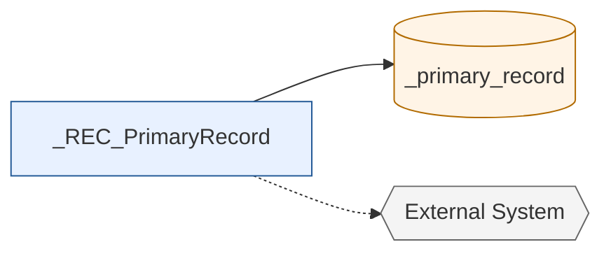
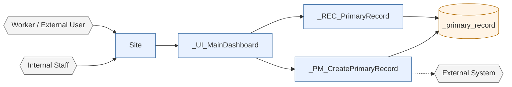
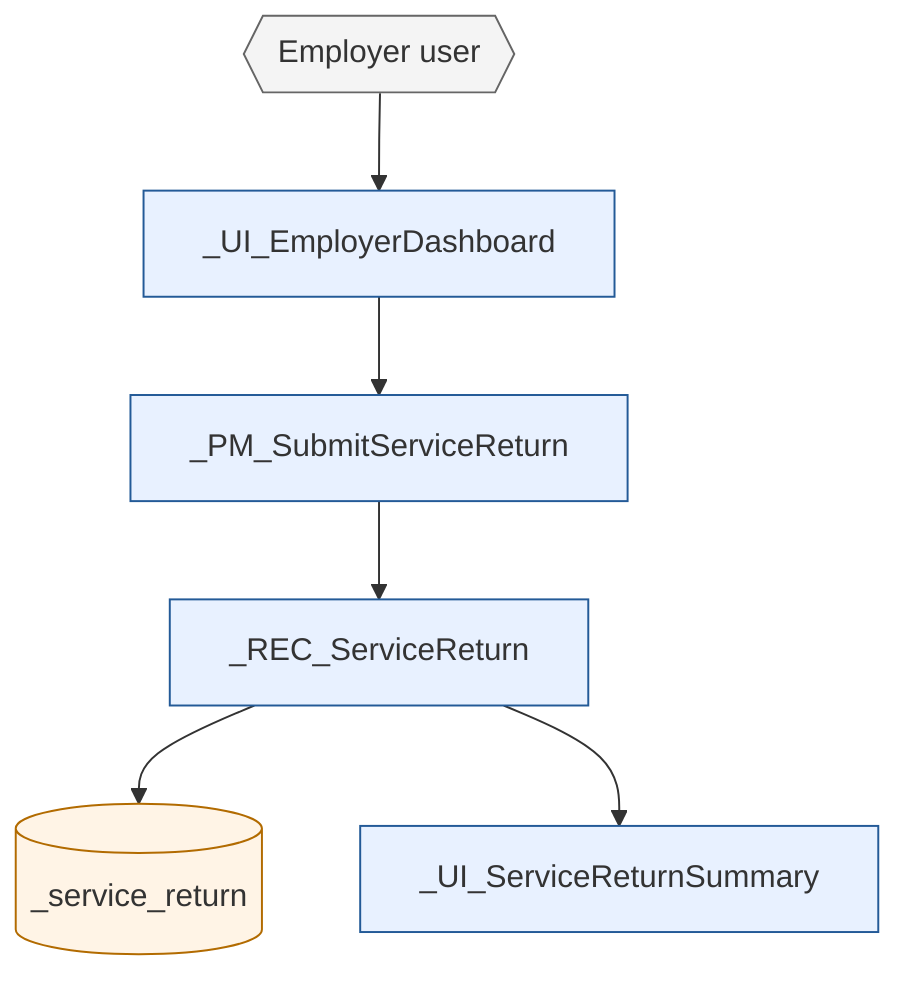
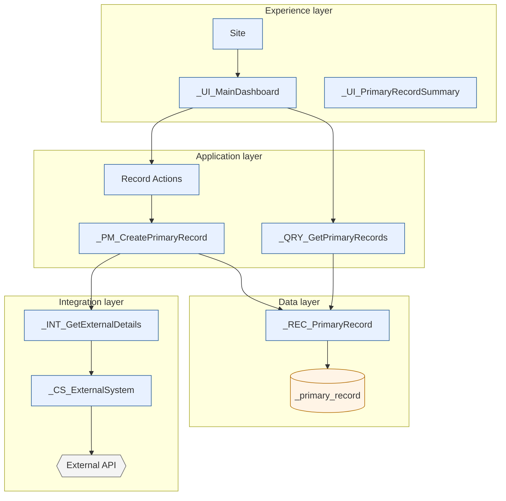
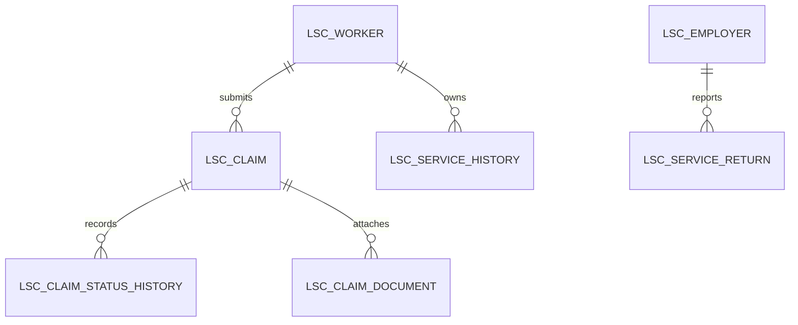
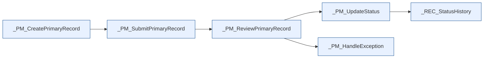
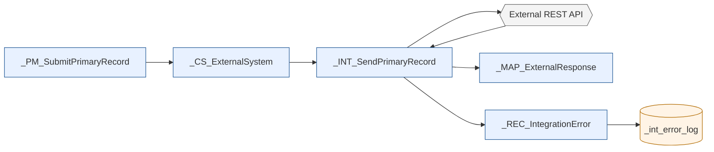
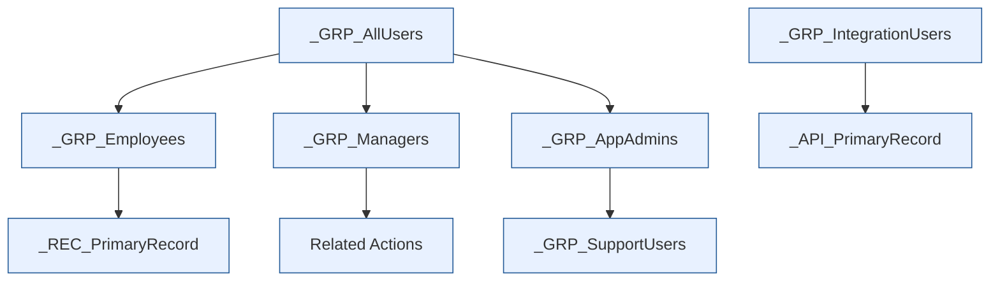
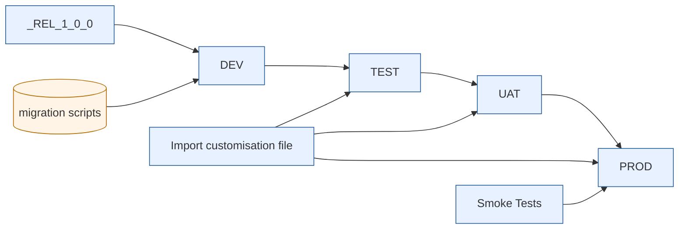

# Appian Architecture Document Template

## Table of contents

1. [Purpose](#purpose)
2. [How to use this template](#how-to-use-this-template)
3. [AI usage note](#ai-usage-note)
4. [Document control](#document-control)
5. [Architecture overview](#architecture-overview)
6. [Assumptions, constraints and dependencies](#assumptions-constraints-and-dependencies)
7. [Non-functional requirements](#non-functional-requirements)
8. [Capacity and sizing](#capacity-and-sizing)
9. [Compliance and regulatory alignment](#compliance-and-regulatory-alignment)
10. [Solution context](#solution-context)
11. [Business operating model](#business-operating-model)
12. [User journey](#user-journey)
13. [Logical application architecture](#logical-application-architecture)
14. [Appian object architecture](#appian-object-architecture)
15. [Data architecture](#data-architecture)
16. [Record type architecture](#record-type-architecture)
17. [Process architecture](#process-architecture)
18. [Interface and UX architecture](#interface-and-ux-architecture)
19. [Integration architecture](#integration-architecture)
20. [Identity and access management](#identity-and-access-management)
21. [Security architecture](#security-architecture)
22. [Data lifecycle and retention](#data-lifecycle-and-retention)
23. [Reporting and analytics architecture](#reporting-and-analytics-architecture)
24. [Observability and operations](#observability-and-operations)
25. [Error handling, audit and support architecture](#error-handling-audit-and-support-architecture)
26. [Testing strategy](#testing-strategy)
27. [DevOps and CI/CD](#devops-and-cicd)
28. [Deployment and environment architecture](#deployment-and-environment-architecture)
29. [Architecture decisions](#architecture-decisions)
30. [Risks and mitigations](#risks-and-mitigations)
31. [Glossary and acronyms](#glossary-and-acronyms)
32. [References](#references)
33. [Architecture review checklist](#architecture-review-checklist)
34. [Changelog](#changelog)

## Purpose

This template defines the structure of a production-grade Appian architecture document for Appian Cloud 26.4.

Use it at the start of a full application build blueprint. The document must explain how the application works before the detailed build plan starts. It must support enterprise procurement, security review, engineering handover and stakeholder understanding.

The intended audience includes developers, solution architects, security reviewers, client stakeholders and non-Appian readers. Explain Appian concepts in plain English where they first appear.

## How to use this template

### Who fills each section

| Section | Primary author | Contributors | Reviewers |
|---|---|---|---|
| Document control, scope and assumptions | Solution architect | Product owner, delivery lead | Architecture lead |
| Non-functional requirements | Solution architect | Platform owner, security, business owner | Security reviewer |
| Data, record and process architecture | Appian lead developer | Data lead, business analyst | Solution architect |
| Integration, IAM and security | Integration architect | IdP owner, security team | Security reviewer |
| DevOps, deployment and operations | Release lead | Appian admin, support lead | Change manager |
| Testing strategy | Test lead | Accessibility, security, performance testers | Product owner |

### Recommended sequencing

Draft the document in this order:

1. Confirm the Project Kit: application name, short name, database prefix, scope, users and integrations.
2. Complete assumptions, constraints, dependencies and NFRs.
3. Draft the solution context, user journey and logical architecture diagrams.
4. Define data, record type and process architecture.
5. Define integration, IAM, security and compliance controls.
6. Define observability, testing, DevOps and deployment approach.
7. Complete architecture decisions, risks and review checklist.

### How to handle TBD items

Use `TBD - <owner> - <target date>` for unknowns. Do not invent values. Do not remove unresolved items from the document.

Example:

| Item | Current value | Owner | Due |
|---|---|---|---|
| Payroll integration response sample | TBD - Payroll owner to provide sample JSON | Integration lead | `<DATE>` |

### Architecture review board sign-off

Seek architecture review board or equivalent governance sign-off when:

- the solution processes sensitive or PROTECTED information
- the solution introduces a new external integration or inbound API
- the solution changes identity, security or role-based access patterns
- the solution has material performance, availability, RTO or RPO requirements
- the solution introduces significant data retention, deletion or migration obligations
- the architecture decisions affect multiple applications or shared platforms

## AI usage note

The LLM must follow these rules when filling this template:

1. Use the supplied application short name for Appian object names. Never invent prefixes.
2. Use the supplied database prefix for table names. Never invent table names.
3. Use only record names, table names and group names supplied in the Project Kit, generated in an earlier approved section, or explicitly marked as proposed.
4. Every diagram must reference at least one named Appian object using the supplied prefix, for example `<PREFIX>_REC_<Entity>` or `<PREFIX>_PM_<Process>`.
5. Placeholders must remain in angle brackets until filled, for example `<PREFIX>`, `<APPLICATION_NAME>` and `<database_prefix>`.
6. All Mermaid diagrams must be syntactically valid and renderable on GitHub.
7. Use plain Australian English, active voice and no marketing language.
8. Explain Appian terms for non-Appian readers.
9. Do not use Java, JavaScript, React, HTML or CSS inside SAIL examples.
10. Do not invent Appian functions, SAIL components, process model capabilities, compatibility flags or platform limits.
11. Where guidance is a recommendation rather than Appian-enforced, label it as a recommendation.

## Document control

| Field | Value |
|---|---|
| Application name | `<APPLICATION_NAME>` |
| Application short name / prefix | `<PREFIX>` |
| Database prefix | `<database_prefix>` |
| Target Appian version | `26.4` |
| Hosting model | Appian Cloud |
| Classification | OFFICIAL / OFFICIAL: Sensitive / PROTECTED |
| Document owner | `<OWNER>` |
| Status | Draft / Review / Approved |
| Last updated | `<DATE>` |
| Architecture review required | Yes / No |

### Mini-example

| Field | Value |
|---|---|
| Application name | Long Service Claims |
| Application short name / prefix | LSC |
| Database prefix | lsc |
| Classification | OFFICIAL: Sensitive |

### Version history

| Version | Date | Author | Change summary |
|---|---|---|---|
| 0.1 | `<DATE>` | `<AUTHOR>` | Initial draft for architecture review. |
| 0.2 | `<DATE>` | `<AUTHOR>` | Updated security and integration sections after review. |

### Reviewers and approvers

| Name | Role | Review area | Approval required |
|---|---|---|---|
| `<NAME>` | Solution architect | Overall architecture | Yes |
| `<NAME>` | Security reviewer | Security, IAM, compliance | Yes |
| `<NAME>` | Product owner | Business scope and user journey | Yes |
| `<NAME>` | Platform owner | Appian Cloud, DevOps, operations | Yes |

### Distribution list

| Audience | Distribution method | Notes |
|---|---|---|
| Delivery team | Project repository | Working document. |
| Security reviewers | Secure document link | Include diagrams and NFRs. |
| Client stakeholders | PDF or read-only link | Remove internal-only notes if required. |

## Architecture overview

Write a concise narrative that explains what the application does, who uses it, and how Appian supports the business process.

### Mini-example

```text
The Long Service Claims application is a record-centric Appian Cloud solution.
Workers submit service and claim information through Appian interfaces. Case
workers review records, request evidence, update statuses and complete approvals.
Appian record types hold the core worker, employer, service and claim data.
Process models orchestrate submissions, reviews, escalations and notifications.
Dashboards provide operational visibility for case workers, managers and support
users.
```

Include:

- core business purpose
- main user groups
- main modules
- key Appian record types
- key process models
- key integrations
- reporting outcomes
- major assumptions and exclusions

## Assumptions, constraints and dependencies

Keep assumptions, constraints and dependencies separate. An assumption may be wrong, a constraint limits the design, and a dependency is something the solution relies on.

### Assumptions

| Assumption | Impact if incorrect | Owner | Due date |
|---|---|---|---|
| Managers approve requests within Appian rather than by email. | Approval process model and task design may change. | Product owner | `<DATE>` |
| `<Assumption>` | `<Impact>` | `<Owner>` | `<DATE>` |

### Constraints

| Constraint | Design impact | Mitigation |
|---|---|---|
| Appian Cloud is the target platform. | Infrastructure-level controls are implemented through Appian Cloud and tenant configuration. | Align with Appian Cloud security and deployment patterns. |
| `<Constraint>` | `<Impact>` | `<Mitigation>` |

### Dependencies

| Dependency | Type | Required by | Status |
|---|---|---|---|
| Identity provider metadata | IAM | SSO configuration | TBD - IdP owner |
| `<Dependency>` | `<Type>` | `<Required by>` | `<Status>` |

## Non-functional requirements

Document testable NFRs. Do not use vague terms such as “fast” or “highly available” without a measurable target.

| NFR area | Requirement | Target | Validation method |
|---|---|---|---|
| Performance | Dashboard initial load | Under 3 seconds for 95th percentile with agreed test data | Performance test |
| Concurrent users | Active business users | `<number>` concurrent users | Load test or platform sizing review |
| Data volume | Core transaction records | `<number>` records in year 1, `<number>` annual growth | Data volume projection |
| Availability | Service availability | `<SLA>` | Appian Cloud service reporting |
| RTO | Recovery time objective | `<duration>` | DR plan review |
| RPO | Recovery point objective | `<duration>` | DR plan review |
| Accessibility | User-facing interfaces | WCAG 2.2 AA target | Accessibility test |
| Browser support | Supported browsers | `<browsers>` | Cross-browser test |
| Device support | Supported devices | Desktop, tablet, mobile as agreed | Responsive UI test |
| Auditability | Business events | Status, decision, comment and integration events retained | Audit review |

## Capacity and sizing

Document capacity assumptions early so platform owners can confirm Appian Cloud sizing.

| Capacity item | Estimate | Basis | Owner |
|---|---:|---|---|
| Appian Cloud sizing tier | `<tier or TBD>` | Platform sizing review | Platform owner |
| Named users | `<number>` | Business user estimate | Product owner |
| Concurrent users | `<number>` | Peak usage assumption | Product owner |
| New process instances per day | `<number>` | Transaction estimate | Solution architect |
| Open process instances | `<number>` | SLA and long-running process estimate | Appian lead |
| Documents uploaded per month | `<number>` | Evidence and attachment estimate | Business owner |
| Average document size | `<size>` | Business estimate | Business owner |
| Database growth per year | `<size>` | Record and audit projection | Data lead |

### Capacity notes

- Record large data, dashboard, process and document assumptions clearly.
- Confirm long-running process volumes and archive settings.
- Confirm whether document storage or database growth requires additional governance.

## Compliance and regulatory alignment

State compliance obligations and how the architecture addresses them. Do not claim certification or compliance unless it has been verified for the tenant and project.

| Area | Requirement | Architecture response | Evidence or owner |
|---|---|---|---|
| IRAP | Applicable / Not applicable / TBD | Use Appian Cloud tenant controls and agency assurance process. | Security owner |
| Essential Eight | Applicable / Not applicable / TBD | Align identity, patching, logging and access controls with organisational standard. | Security owner |
| VPDSS | Applicable / Not applicable / TBD | Map data handling and access controls to Victorian Protective Data Security Standards where relevant. | Security owner |
| PROTECTED handling | Applicable / Not applicable / TBD | Confirm classification, encryption, access and logging controls before processing PROTECTED data. | Data owner |
| SOC 2 | Applicable / Not applicable / TBD | Reference Appian assurance evidence where available through approved channels. | Platform owner |
| Data residency | Required region | Confirm Appian Cloud region and data storage location. | Platform owner |
| Privacy | PII or sensitive data classification | Classify fields, restrict access and define retention. | Privacy owner |

## Solution context

Explain where the Appian application fits in the wider enterprise landscape.

### Mermaid diagram conventions

Use these conventions in all diagrams:

| Shape | Meaning | Example |
|---|---|---|
| Rectangle | Appian object or internal component | `<PREFIX>_UI_Dashboard` |
| Cylinder | Database or persistent data store | `(<database_prefix>_claim)` |
| Hexagon | External system or external actor | `{{HR System}}` |
| Dashed line | Optional or future integration | `-.->` |

Use colour classes consistently:



### Solution context diagram



## Business operating model

Describe how the business will use the solution day to day.

| Business area | Appian capability | Owner | Example entry |
|---|---|---|---|
| Claims operations | Case queue, claim record summary and approval process | Operations manager | LSC case workers manage `LSC_REC_Claim` from a claims dashboard. |
| `<Area>` | `<Capability>` | `<Owner>` | `<Example>` |

## User journey

Describe each major user journey and the Appian objects that support it.

| Journey | Actor | Start point | End point | Key Appian objects |
|---|---|---|---|---|
| Submit service return | Employer user | Employer dashboard | Submitted service return record | `LSC_UI_EmployerDashboard`, `LSC_PM_SubmitServiceReturn`, `LSC_REC_ServiceReturn` |
| `<Journey>` | `<Role>` | `<Start>` | `<End>` | `<Objects>` |



## Logical application architecture

The logical architecture separates the solution into layers so non-Appian readers can see how user experience, workflow, data, integration and security work together.

| Layer | Role in the architecture | Appian implementation |
|---|---|---|
| Experience layer | Presents dashboards, forms, summaries and user actions. | Appian Site, SAIL interfaces and record views. |
| Application layer | Applies business rules, validations and workflow orchestration. | Expression rules, process models, record actions and related actions. |
| Data layer | Stores business data and exposes it through record types. | Appian record types backed by database tables. |
| Integration layer | Connects Appian to external systems. | Connected systems, integration objects and Web APIs. |
| Security layer | Enforces identity, access and authorisation. | Groups, object security, record security and process start security. |
| Operations layer | Supports monitoring, logging, deployment and support. | Health monitoring, logs, deployment packages and support dashboards. |



## Appian object architecture

Define object naming and ownership so developers build consistently.

### Naming conventions

| Object type | Pattern | Casing | Example row |
|---|---|---|---|
| Record type | `<PREFIX>_REC_<Entity>` | PascalCase entity | `LSC_REC_Worker` |
| Form interface | `<PREFIX>_UI_<Action><Entity>Form` | PascalCase purpose | `LSC_UI_UpdateWorkerForm` |
| Dashboard interface | `<PREFIX>_UI_<RoleOrPurpose>Dashboard` | PascalCase purpose | `LSC_UI_CaseWorkerDashboard` |
| Summary interface | `<PREFIX>_UI_<Entity>Summary` | PascalCase purpose | `LSC_UI_WorkerSummary` |
| Related action interface | `<PREFIX>_UI_<Action><Entity>` | PascalCase purpose | `LSC_UI_SubmitServiceReturn` |
| Query rule | `<PREFIX>_QRY_<Verb><Entity>` | PascalCase purpose | `LSC_QRY_GetWorkerById` |
| Decision rule | `<PREFIX>_DEC_<Decision>` | PascalCase purpose | `LSC_DEC_IsClaimEligible` |
| Process model | `<PREFIX>_PM_<Action><Entity>` | PascalCase purpose | `LSC_PM_SubmitClaim` |
| Site | `<PREFIX> Site` | Human readable | `LSC Site` |
| Site page | `<PREFIX> <Page Name>` | Human readable | `LSC Claims Dashboard` |
| Document folder | `<PREFIX>_DOC_<Purpose>` | PascalCase purpose | `LSC_DOC_WorkerEvidence` |
| Knowledge centre | `<PREFIX>_KC_<Purpose>` | PascalCase purpose | `LSC_KC_Documents` |
| Data store | `<PREFIX>_DS_<Domain>` | PascalCase purpose | `LSC_DS_Claims` |
| Connected system | `<PREFIX>_CS_<System>` | PascalCase system | `LSC_CS_ServiceNSW` |
| OAuth credential | `<PREFIX>_OAuth_<System>` | PascalCase system | `LSC_OAuth_ServiceNSW` |

Recommendation: keep names clear and short enough for Appian Designer lists and deployment reviews. If a name becomes long, remove filler words rather than abbreviating business terms beyond recognition.

## Data architecture

Describe the table structure, primary keys, audit fields, relationships, indexing and large-object usage.

### Mini-example

| Table | Purpose | Record type | Notes |
|---|---|---|---|
| `lsc_worker` | Stores worker profile data. | `LSC_REC_Worker` | Parent record for claims and service history. |
| `<database_prefix>_<entity>` | `<Purpose>` | `<PREFIX>_REC_<Entity>` | `<Notes>` |

### Data design standards

| Area | Recommendation | Example |
|---|---|---|
| Primary key | Use numeric surrogate key unless the project has an approved natural key requirement. | `worker_id` |
| Foreign key | Use `<parent_entity>_id` and index it. | `employer_id` |
| Soft delete | Use `is_deleted` or `is_active` consistently across the project. | `is_deleted BOOLEAN DEFAULT FALSE` |
| Audit columns | Include `created_by`, `created_on`, `modified_by`, `modified_on`. | `modified_on DATETIME` |
| Indexes | Index fields used in joins, filters, status queues and date ranges. | `idx_lsc_claim_status` |
| JSON/CLOB | Use only for payload snapshots, unstructured notes or external payload audit where justified. | Store payload reference rather than uncontrolled large JSON where possible. |



## Record type architecture

Explain how Appian record types expose business data, relationships, security and actions.

| Record type | Source | Display field | Relationships | Record views | Actions |
|---|---|---|---|---|---|
| `LSC_REC_Worker` | `lsc_worker` | `worker_reference` | `LSC_REC_Employer` many-to-one | Worker Summary, Worker Service History | Submit Service Return, Update Contact Details |
| `<PREFIX>_REC_<Entity>` | `<table>` | `<field>` | `<relationships>` | `<views>` | `<actions>` |

### Sync and source-backed decision criteria

| Option | Use when | Notes |
|---|---|---|
| Synced record type | Appian needs fast record lists, reporting, relationships and user filters. | Recommended for most core operational records. |
| Source-backed or direct query pattern | Data is large, external, volatile or not suitable for sync. | Document performance and security trade-offs. |
| External system via integration | Data is read on demand from a system of record. | Do not assume response shape without sample payload. |

### Record-level security patterns

- Use group-based access for broad roles.
- Use record-level security rules where visibility depends on ownership, team, region, employer or case assignment.
- Do not rely only on hiding buttons in the interface.
- Document every security rule in business language and Appian implementation terms.

### Search, filters and performance

| Area | Design requirement |
|---|---|
| User filters | Define filters for status, owner, date, type and region where needed. |
| Search | Document searchable fields and expected search behaviour. |
| Related records | Avoid loading heavy related lists on initial page load unless needed. |
| Performance | Use paging and select only required fields in query rules. |

## Process architecture

Appian process models orchestrate business steps, human tasks, automated writes, integrations and exception paths.



| Process model | Trigger | Purpose | Main Appian nodes |
|---|---|---|---|
| `LSC_PM_SubmitClaim` | Related action | Submits claim for assessment. | Start form, XOR gateway, Write Records, subprocess |
| `<PREFIX>_PM_<Process>` | Record action / related action / timer / Web API | `<Purpose>` | `<Nodes>` |

### Process design guidance

| Topic | Recommendation |
|---|---|
| Subprocess vs called process | Use subprocess for reusable logic within a parent flow. Use a separate called process when lifecycle, ownership or monitoring differs. |
| Exception flow | Add explicit error paths for integration failures and critical write failures. |
| Escalation timers | Use timers for SLA reminders or escalations, and document timing rules. |
| Archival settings | Define process data management and archive settings for every process. |
| Performance | Keep process variables lean. Avoid storing large payloads longer than needed. |
| Attended vs unattended | Identify whether a step requires a user task or can run unattended. |

## Interface and UX architecture

| Interface | Type | Purpose | Primary user | Mobile notes |
|---|---|---|---|---|
| `LSC_UI_WorkerSummary` | Record summary | Shows worker details and service history. | Case worker | Desktop and tablet. |
| `<PREFIX>_UI_<Dashboard>` | Dashboard | `<Purpose>` | `<Role>` | `<Notes>` |
| `<PREFIX>_UI_<Form>` | Form | `<Purpose>` | `<Role>` | `<Notes>` |

Include:

- site navigation and page groups
- dashboard layout and KPI definitions
- form patterns and validation approach
- record summary page structure
- mobile support approach
- accessibility approach against WCAG 2.2 AA target
- portal-safe components where portals are in scope

## Integration architecture

Document both outbound integrations and inbound Web APIs.



| Integration | Direction | System | Purpose | Error handling |
|---|---|---|---|---|
| `LSC_INT_SendApprovedClaim` | Outbound | Payment platform | Sends approved claim details. | Retry once, then log to `LSC_REC_IntegrationError`. |
| `<PREFIX>_INT_<Purpose>` | Outbound / Inbound | `<System>` | `<Purpose>` | `<Pattern>` |

### Integration standards

| Area | Standard |
|---|---|
| Retry | Retry only where the operation is safe and idempotent. |
| Circuit breaker | Recommendation: pause repeated calls after repeated failures and route to manual review. |
| Idempotency | Use correlation IDs or external reference IDs for state-changing calls. |
| Payload size | Document expected and maximum payload size. Avoid large payloads in process variables. |
| Timeout | Document timeout standard per integration type. |
| Secrets | Store credentials in connected systems or approved credential mechanisms. Do not hardcode secrets. |
| BYOK/KMS | Document project requirements for key management where applicable. |
| Inbound API rate limiting | Document expected rate, caller identity and rejection behaviour. |

## Identity and access management

Describe authentication, federation and service access.

| IAM area | Design | Example entry |
|---|---|---|
| SSO protocol | OAuth 2.0 / OIDC / SAML / TBD | OIDC federation with agency IdP. |
| Identity provider | `<IdP>` | Okta / Entra ID / Service NSW / TBD |
| MFA | `<Requirement>` | Enforced by IdP for internal users. |
| Session management | `<Requirement>` | Follow tenant and IdP session policy. |
| Service accounts | `<Accounts>` | `<PREFIX>_GRP_IntegrationUsers` for API calls. |
| API authentication | `<Pattern>` | API key, OAuth client credentials, mutual TLS or TBD. |

## Security architecture

State the principle of least privilege. Users and service accounts receive only the access required for their role.



| Group | Site | Records | Actions | Processes | Admin |
|---|---|---|---|---|---|
| `LSC_GRP_CaseWorkers` | Yes | Assigned claims | Assess, request evidence | Claim assessment processes | No |
| `<PREFIX>_GRP_<Role>` | Yes/No | `<Access>` | `<Actions>` | `<Processes>` | Yes/No |

### Role mapping

| Role type | Use when | Notes |
|---|---|---|
| Basic role mapping | Access is broad and group-based. | Suitable for standard employee, manager and admin roles. |
| Custom record-level role mapping | Access depends on row-level attributes such as team, region, employer or assignment. | Document rule logic and test cases. |
| System administrator separation | Admin platform permissions must be separated from business approval authority. | Avoid giving broad business authority to technical admins by default. |

## Data lifecycle and retention

| Data type | Retention | Archive rule | Purge rule | Right-to-erasure handling |
|---|---|---|---|---|
| Claim records | `<period>` | Archive closed records after `<period>` | Purge only after approval | Assess against Privacy Act and business record obligations. |
| Audit history | `<period>` | Retain with parent record | Do not purge separately unless approved | Usually exempt from direct deletion where legal retention applies. |
| Documents | `<period>` | Archive with parent record | Purge after retention period | Confirm sensitive evidence handling. |
| Integration logs | `<period>` | Archive after support window | Purge payloads before metadata where appropriate | Remove sensitive payloads where not required. |

Document Privacy Act and GDPR-style right-to-erasure requirements where applicable. If deletion conflicts with statutory retention, document the business and legal basis.

## Reporting and analytics architecture

| Report/dashboard | Audience | Data source | Filters | Components |
|---|---|---|---|---|
| Claims operations dashboard | Case workers | `LSC_REC_Claim`, `LSC_REC_Worker` | Status, assignee, date | KPI cards, grid, charts |
| `<Dashboard>` | `<Role>` | `<Record types>` | `<Filters>` | KPI cards, grids, charts |

State how dashboards avoid full-table scans, use paging and respect record-level security.

## Observability and operations

| Area | Design | Example entry |
|---|---|---|
| Health monitoring | `<Approach>` | Use Appian Health Check and operational dashboards. |
| Log forwarding | `<Approach>` | Forward relevant logs to Splunk where configured. |
| Alert thresholds | `<Threshold>` | Alert support if integration failures exceed `<number>` in `<duration>`. |
| CLR usage | `<Usage>` | Use Custom Log Reader where approved for tenant log analysis. |
| Support dashboard | `<Dashboard>` | `<PREFIX>_UI_SupportDashboard` for unresolved errors. |
| Operational owner | `<Owner>` | Application support lead. |

## Error handling, audit and support architecture

| Area | Design | Example entry |
|---|---|---|
| Validation errors | Show clear field or form validation. | Date range cannot be in the past. |
| Process exceptions | Route to exception subprocess or support queue. | `LSC_PM_HandleIntegrationException`. |
| Integration errors | Log correlation ID, operation, safe message and retry count. | `LSC_REC_IntegrationError`. |
| Audit history | Store status, decision, comment and integration events. | `lsc_claim_status_history`. |
| Support dashboard | Provide filters for status, date, severity and owner. | `LSC_UI_SupportDashboard`. |

## Testing strategy

| Test type | Scope | Owner | Evidence |
|---|---|---|---|
| Expression rule unit tests | Query, validation, mapping and formatting rules. | Appian developer | Rule test cases. |
| Interface tests | Load, validation, save, cancel, read-only and mobile behaviour. | Appian developer / tester | Test script evidence. |
| Process model tests | Happy path, cancellation, gateway branches and exception paths. | Appian developer / tester | Process test results. |
| Integration tests | Success, timeout, retry, malformed response and error mapping. | Integration tester | Test payloads and logs. |
| UAT | Business scenarios and acceptance criteria. | Business testers | UAT sign-off. |
| Performance tests | Dashboard load, query performance and process volume. | Performance tester | Test report. |
| Security / penetration tests | Authentication, authorisation, APIs and sensitive data. | Security tester | Security report. |
| Accessibility tests | WCAG 2.2 AA target for key journeys. | Accessibility tester | Accessibility report. |

## DevOps and CI/CD

| Area | Recommendation | Example entry |
|---|---|---|
| Branch strategy | Use feature branches and pull requests for documentation, DDL and supporting artefacts. | `feature/lsc-claim-assessment`. |
| Package management | Maintain Appian deployment packages per release. | `LSC_REL_1.0.0_ClaimMVP`. |
| Customisation file | Externalise environment-specific values. | Endpoint URLs, credentials references and group mappings. |
| Automated deployment | Use approved Appian deployment tooling where available. | Deployment API / pipeline runner / manual import. |
| Rollback | Define object, data and configuration rollback. | Restore previous package and reverse DDL where safe. |
| Code review | Review SAIL, rules, process design, DDL, security and deployment artefacts. | Pull request checklist. |

## Deployment and environment architecture



| Environment | Purpose | Secrets and configuration | Smoke test |
|---|---|---|---|
| DEV | Build | Development endpoints and credentials | Developer smoke test |
| TEST | System testing | Test endpoints and credentials | System test smoke pack |
| UAT | User acceptance | UAT endpoints and credentials | UAT smoke pack |
| PROD | Production | Production endpoints and credentials | Production smoke pack |

### Database migration approach

| Approach | Use when | Notes |
|---|---|---|
| Liquibase | Organisation standard supports database change tracking. | Preferred where already adopted. |
| Flyway | Organisation standard supports migration scripts. | Suitable for versioned SQL scripts. |
| Manual reviewed SQL | Small release or no migration tooling. | Must include execution order, validation and rollback. |

### Post-deployment smoke test checklist

| Smoke test | Expected result |
|---|---|
| Application site opens | Authorised user can access `<PREFIX> Site`. |
| Dashboard loads | `<PREFIX>_UI_MainDashboard` renders without error. |
| Record list loads | `<PREFIX>_REC_PrimaryRecord` list is available. |
| Create action launches | `<PREFIX>_PM_CreatePrimaryRecord` starts correctly. |
| Integration health check passes | Configured endpoint returns expected response or known test response. |
| Security check passes | Unauthorised user cannot access restricted action. |

## Architecture decisions

| Decision | Rationale | Alternatives considered | Status |
|---|---|---|---|
| Use record-centric Appian design | Supports record views, related actions, security and reporting. | Process-only design. | Proposed |
| `<Decision>` | `<Rationale>` | `<Alternatives>` | Proposed / Approved |

## Risks and mitigations

| Risk | Impact | Mitigation | Owner |
|---|---|---|---|
| Integration contract is not final | Mapping and error handling may change. | Mark payload mapping as TBD and review when samples are supplied. | Integration lead |
| `<Risk>` | `<Impact>` | `<Mitigation>` | `<Owner>` |

## Glossary and acronyms

| Term | Meaning |
|---|---|
| Appian record type | Appian object that exposes business data, relationships, record views and actions. |
| SAIL | Appian expression language used to build interfaces. |
| Process model | Appian workflow object that orchestrates user tasks, automated steps and data writes. |
| Connected system | Appian object that stores connection and authentication details for integrations. |
| IRAP | Information Security Registered Assessors Program. |
| VPDSS | Victorian Protective Data Security Standards. |
| RTO | Recovery time objective. |
| RPO | Recovery point objective. |
| PII | Personally identifiable information. |
| `<TERM>` | `<Definition>` |

## References

| Reference | Purpose | Link or location |
|---|---|---|
| Appian 26.4 documentation | Platform source of truth | https://docs.appian.com/suite/help/26.4/ |
| Appian Records documentation | Record type design | https://docs.appian.com/suite/help/26.4/Records.html |
| Appian SAIL components | Interface component verification | https://docs.appian.com/suite/help/26.4/SAIL_Components.html |
| Appian Process Modelling | Process model verification | https://docs.appian.com/suite/help/26.4/Process_Modeling.html |
| Internal security standard | Security review basis | `<Internal link>` |
| Related architecture document | Dependency or parent architecture | `<Document link>` |

## Architecture review checklist

### Context

| Check | Pass or fail |
|---|---|
| Application name, prefix and database prefix are documented. |  |
| Classification and distribution list are documented. |  |
| Assumptions, constraints and dependencies are separated. |  |
| Non-Appian readers can understand the solution overview. |  |

### Design

| Check | Pass or fail |
|---|---|
| Each diagram references at least one named Appian object using the supplied prefix. |  |
| Logical architecture explains each layer in writing. |  |
| Appian object naming covers records, interfaces, process models, sites, folders, integrations and credentials. |  |
| Every record type has documented source, display field, relationships, security and actions. |  |
| Every major process has trigger, flow, exception handling and archive settings. |  |
| Interface and UX architecture covers dashboards, forms, summaries, mobile and accessibility. |  |

### Security

| Check | Pass or fail |
|---|---|
| Principle of least privilege is stated. |  |
| IAM approach covers SSO, IdP, MFA, sessions, service accounts and API authentication. |  |
| Group hierarchy and role mapping are documented. |  |
| Record action visibility and process start security are documented. |  |
| Sensitive data classification and handling are documented. |  |

### Integration

| Check | Pass or fail |
|---|---|
| Each integration has direction, system, purpose and error handling. |  |
| Retry, idempotency, timeout and payload size are addressed. |  |
| Secrets management is documented. |  |
| Inbound API authentication and rate limiting are addressed where applicable. |  |

### Data

| Check | Pass or fail |
|---|---|
| Primary key, foreign key and index strategy are documented. |  |
| Audit columns and soft-delete approach are documented. |  |
| JSON/CLOB usage is justified. |  |
| Retention, archival, purge and right-to-erasure handling are documented. |  |

### Operations

| Check | Pass or fail |
|---|---|
| Observability covers monitoring, logs, alert thresholds and support dashboards. |  |
| Capacity and sizing covers users, processes, documents and database growth. |  |
| Deployment approach covers packages, customisation files, secrets and database migration. |  |
| Post-deployment smoke tests are documented. |  |

### Governance

| Check | Pass or fail |
|---|---|
| Compliance and regulatory alignment is documented without unsupported claims. |  |
| Testing strategy covers unit, integration, UAT, performance, security and accessibility. |  |
| Architecture decisions include rationale and alternatives. |  |
| Risks include owner and mitigation. |  |
| Architecture review board sign-off need is recorded. |  |

## Changelog

| Date | Change |
|---|---|
| `<DATE>` | Added How to use this template, stronger AI usage note, enterprise NFRs, capacity, compliance, IAM, data lifecycle, observability, testing, DevOps, expanded architecture sections, Mermaid conventions, quality examples, glossary, references and grouped review checklist. |
