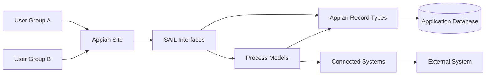
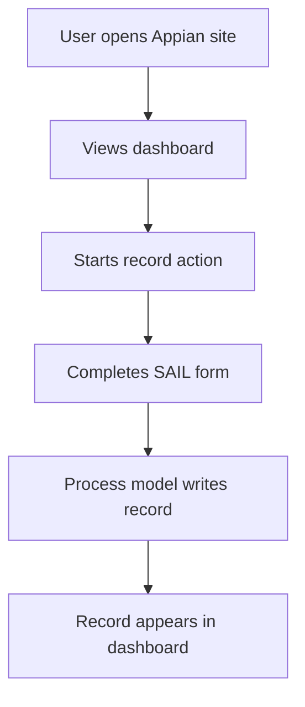
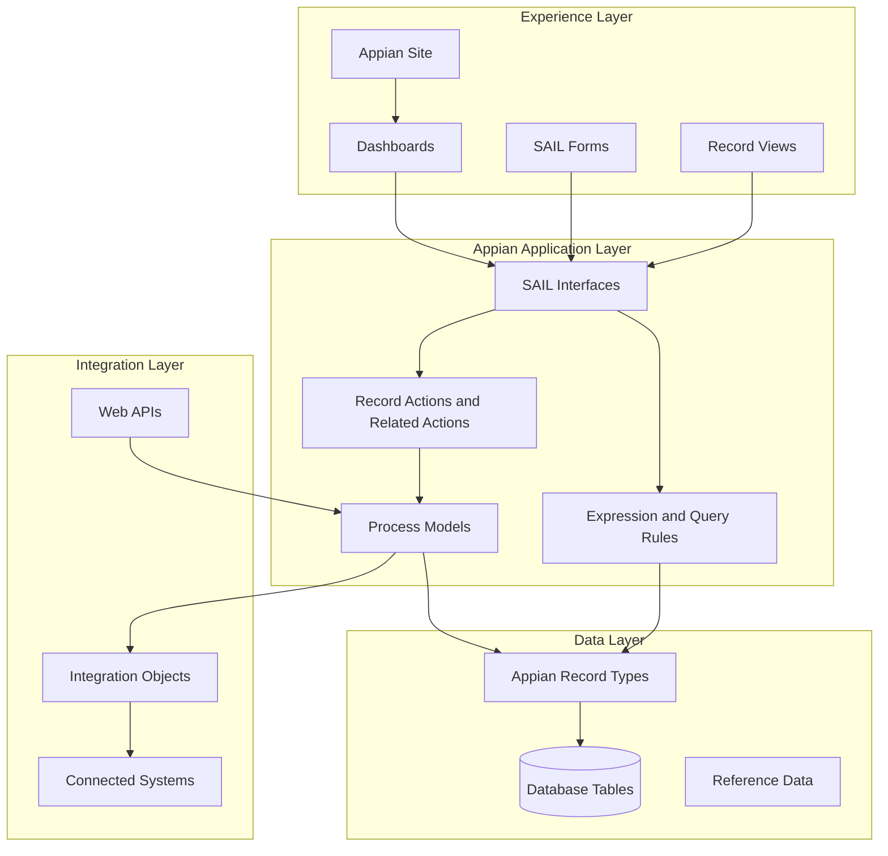
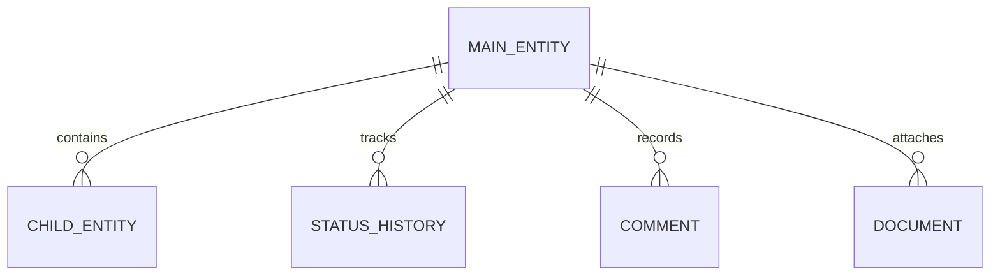
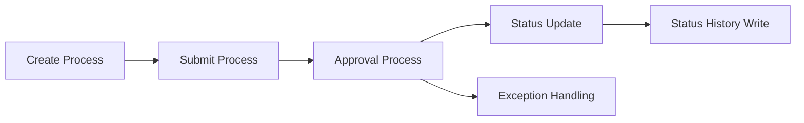
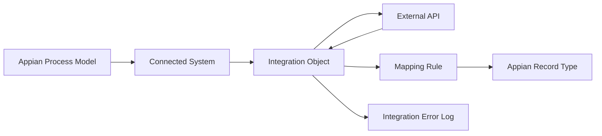
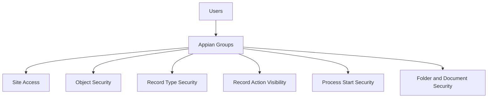
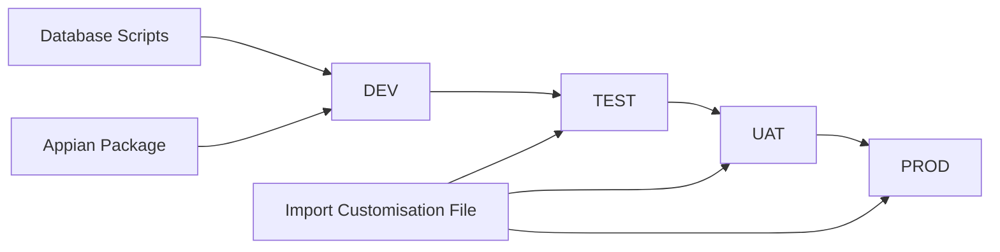

# Appian Architecture Document Template

## Table of contents

1. [Purpose](#purpose)
2. [AI usage note](#ai-usage-note)
3. [Document control](#document-control)
4. [Architecture overview](#architecture-overview)
5. [Solution context](#solution-context)
6. [Business operating model](#business-operating-model)
7. [User journey](#user-journey)
8. [Logical application architecture](#logical-application-architecture)
9. [Appian object architecture](#appian-object-architecture)
10. [Data architecture](#data-architecture)
11. [Record type architecture](#record-type-architecture)
12. [Process architecture](#process-architecture)
13. [Interface and UX architecture](#interface-and-ux-architecture)
14. [Integration architecture](#integration-architecture)
15. [Security architecture](#security-architecture)
16. [Reporting and analytics architecture](#reporting-and-analytics-architecture)
17. [Error handling, audit and support architecture](#error-handling-audit-and-support-architecture)
18. [Deployment and environment architecture](#deployment-and-environment-architecture)
19. [Architecture decisions](#architecture-decisions)
20. [Risks and mitigations](#risks-and-mitigations)
21. [Architecture review checklist](#architecture-review-checklist)

## Purpose

This template defines the structure of a detailed Appian architecture document.

Use this document at the start of a full application build blueprint. It explains how the Appian application works before the detailed build plan starts.

## AI usage note

The LLM must use the supplied application short name and database prefix.

Do not default to `APN` unless the supplied prefix is `APN`.

Do not use generic architecture diagrams only. Diagrams must be specific to Appian concepts such as Appian Site, SAIL interfaces, record types, process models, expression rules, connected systems, integrations, Web APIs, groups and database tables.

## Document control

| Field | Value |
|---|---|
| Application name | `<APPLICATION_NAME>` |
| Application short name / prefix | `<PREFIX>` |
| Database prefix | `<database_prefix>` |
| Target Appian version | `26.4` |
| Document owner | `<OWNER>` |
| Last updated | `<DATE>` |
| Status | Draft / Review / Approved |

## Architecture overview

```text
<Explain the application in plain English. Describe what it does, who uses it, the main business flow, and how Appian will support that flow.>
```

Include:

- core business purpose
- main user groups
- main modules
- key records
- key workflows
- key integrations
- reporting outcomes

## Solution context

Explain where the Appian application fits in the wider enterprise landscape.



## Business operating model

| Business area | Appian capability | Owner | Notes |
|---|---|---|---|
| `<Area>` | `<Capability>` | `<Owner>` | `<Notes>` |

## User journey

Describe each major user journey.

| Journey | Actor | Start point | End point | Key Appian objects |
|---|---|---|---|---|
| `<Journey>` | `<Role>` | `<Start>` | `<End>` | `<Objects>` |



## Logical application architecture



## Appian object architecture

| Object group | Naming pattern | Purpose |
|---|---|---|
| Records | `<PREFIX>_REC_<Entity>` | Business data objects. |
| Interfaces | `<PREFIX>_UI_<Purpose>` | Forms, dashboards and record views. |
| Query rules | `<PREFIX>_QRY_<Purpose>` | Record queries and data retrieval. |
| Validation rules | `<PREFIX>_VAL_<Purpose>` | Business validation. |
| Process models | `<PREFIX>_PM_<Purpose>` | Workflow orchestration. |
| Integrations | `<PREFIX>_INT_<Purpose>` | Outbound integration calls. |
| Web APIs | `<PREFIX>_API_<Purpose>` | Inbound APIs. |
| Groups | `<PREFIX>_GRP_<Role>` | Security roles. |
| Constants | `<PREFIX>_CONS_<Purpose>` | Configuration values. |

## Data architecture

Describe the table structure, core entities, parent-child relationships and audit approach.



| Table | Purpose | Record type | Notes |
|---|---|---|---|
| `<database_prefix>_<entity>` | `<Purpose>` | `<PREFIX>_REC_<Entity>` | `<Notes>` |

## Record type architecture

| Record type | Source | Display field | Relationships | Record views | Actions |
|---|---|---|---|---|---|
| `<PREFIX>_REC_<Entity>` | `<table>` | `<field>` | `<relationships>` | `<views>` | `<actions>` |

Include:

- synced or unsynced design
- record relationships
- record-level security
- record list and search requirements
- related actions
- record view interfaces

## Process architecture



| Process model | Trigger | Purpose | Main Appian nodes |
|---|---|---|---|
| `<PREFIX>_PM_<Process>` | Record action / related action / timer / Web API | `<Purpose>` | Start form, XOR, Write Records, subprocess |

## Interface and UX architecture

| Interface | Type | Purpose | Primary user | Mobile notes |
|---|---|---|---|---|
| `<PREFIX>_UI_<Dashboard>` | Dashboard | `<Purpose>` | `<Role>` | `<Notes>` |
| `<PREFIX>_UI_<Form>` | Form | `<Purpose>` | `<Role>` | `<Notes>` |
| `<PREFIX>_UI_<Summary>` | Record view | `<Purpose>` | `<Role>` | `<Notes>` |

Include:

- site navigation
- dashboard layout
- form patterns
- record summary pages
- mobile considerations
- accessibility considerations

## Integration architecture



| Integration | Direction | System | Purpose | Error handling |
|---|---|---|---|---|
| `<PREFIX>_INT_<Purpose>` | Outbound | `<System>` | `<Purpose>` | `<Pattern>` |
| `<PREFIX>_API_<Purpose>` | Inbound | `<System>` | `<Purpose>` | `<Pattern>` |

## Security architecture



| Group | Site | Records | Actions | Processes | Admin |
|---|---|---|---|---|---|
| `<PREFIX>_GRP_<Role>` | Yes/No | `<Access>` | `<Actions>` | `<Processes>` | Yes/No |

## Reporting and analytics architecture

| Report/dashboard | Audience | Data source | Filters | Components |
|---|---|---|---|---|
| `<Dashboard>` | `<Role>` | `<Record types>` | `<Filters>` | KPI cards, grids, charts |

## Error handling, audit and support architecture

| Area | Design |
|---|---|
| Validation errors | `<Field/form validation approach>` |
| Process exceptions | `<Exception handling approach>` |
| Integration errors | `<Error log and retry/manual review approach>` |
| Audit history | `<Status history, audit fields, comment records>` |
| Support dashboard | `<Support view of failed items>` |

## Deployment and environment architecture



| Environment | Purpose | Notes |
|---|---|---|
| DEV | Build | `<Notes>` |
| TEST | System testing | `<Notes>` |
| UAT | User acceptance | `<Notes>` |
| PROD | Production | `<Notes>` |

## Architecture decisions

| Decision | Rationale | Alternatives considered | Status |
|---|---|---|---|
| `<Decision>` | `<Rationale>` | `<Alternatives>` | Proposed / Approved |

## Risks and mitigations

| Risk | Impact | Mitigation | Owner |
|---|---|---|---|
| `<Risk>` | `<Impact>` | `<Mitigation>` | `<Owner>` |

## Architecture review checklist

| Check | Pass or fail |
|---|---|
| Architecture starts with clear business and Appian context. |  |
| Diagrams use Appian concepts, not generic web architecture only. |  |
| Data architecture is connected to record type architecture. |  |
| Process architecture uses Appian process model components. |  |
| Interface architecture identifies dashboards, forms and record views. |  |
| Integration architecture includes error handling. |  |
| Security architecture covers groups, records, actions and processes. |  |
| Reporting architecture identifies data sources and filters. |  |
| Deployment architecture includes environments and promotion path. |  |
| Architecture decisions and risks are documented. |  |
