# Appian Feature Technical Specification Template

## Table of contents

1. [Purpose](#purpose)
2. [AI usage note](#ai-usage-note)
3. [Specification header](#specification-header)
4. [Story references and acceptance criteria](#story-references-and-acceptance-criteria)
5. [Scope](#scope)
6. [Design decisions](#design-decisions)
7. [Dependencies](#dependencies)
8. [Object inventory](#object-inventory)
9. [Database DDL](#database-ddl)
10. [Record types](#record-types)
11. [Constants and reference data](#constants-and-reference-data)
12. [Expression rules and query rules](#expression-rules-and-query-rules)
13. [SAIL interfaces](#sail-interfaces)
14. [Process models](#process-models)
15. [Record actions and related actions](#record-actions-and-related-actions)
16. [Integrations and Web APIs](#integrations-and-web-apis)
17. [Security](#security)
18. [Performance considerations](#performance-considerations)
19. [Unit tests](#unit-tests)
20. [End-to-end implementation checklist](#end-to-end-implementation-checklist)
21. [End-to-end test script](#end-to-end-test-script)
22. [Deployment notes](#deployment-notes)
23. [Open questions](#open-questions)

## Purpose

This template defines the structure of a build-ready Appian feature technical specification.

Use this for one feature, one story group or one coherent work package. The specification should be detailed enough for a developer to build the feature in Appian Designer.

## AI usage note

Use the supplied application prefix and database prefix from the Project Kit.

Do not default to `APN` unless the supplied project prefix is `APN`.

Do not invent Appian functions, SAIL components, parameters, record fields, process variables, groups, tables or integrations.

## Specification header

| Field | Value |
|---|---|
| Feature name | `<FEATURE_NAME>` |
| Application name | `<APPLICATION_NAME>` |
| Application short name / prefix | `<PREFIX>` |
| Database prefix | `<database_prefix>` |
| Target Appian version | `26.4` |
| Author | `<AUTHOR>` |
| Status | Draft / Review / Approved |
| Last updated | `<DATE>` |

## Story references and acceptance criteria

| Story ID | Story | Acceptance criteria |
|---|---|---|
| `<ID>` | As a `<role>`, I want to `<action>`, so that `<outcome>`. | `<Criteria>` |

## Scope

### In scope

| Item | Description |
|---|---|
| `<Item>` | `<Description>` |

### Out of scope

| Item | Reason |
|---|---|
| `<Item>` | `<Reason>` |

### Assumptions

| Assumption | Impact | Owner to confirm |
|---|---|---|
| `<Assumption>` | `<Impact>` | `<Owner>` |

## Design decisions

| Decision | Rationale | Alternatives considered | Status |
|---|---|---|---|
| `<Decision>` | `<Rationale>` | `<Alternatives>` | Proposed / Approved |

## Dependencies

| Dependency | Type | Required before build? | Notes |
|---|---|---:|---|
| `<Dependency>` | Record type / group / integration / table / rule | Yes/No | `<Notes>` |

## Object inventory

| Object name | Object type | New or existing | Purpose | Depends on |
|---|---|---|---|---|
| `<PREFIX>_REC_<Entity>` | Record type | New | `<Purpose>` | Table |
| `<PREFIX>_UI_<Purpose>` | Interface | New | `<Purpose>` | Rules |
| `<PREFIX>_QRY_<Purpose>` | Expression rule | New | `<Purpose>` | Record type |
| `<PREFIX>_PM_<Purpose>` | Process model | New | `<Purpose>` | Interface, record type |

## Database DDL

### DDL notes

```text
<Explain database assumptions, engine, schema, migration order and rollback notes.>
```

### Tables

For each new or changed table, include:

```text
Table name:
Purpose:
Primary key:
Columns:
Foreign keys:
Indexes:
Audit fields:
Soft delete:
Seed data:
Rollback:
```

### SQL

```sql
-- Replace with project-specific, reviewed DDL.
-- Use the supplied database prefix.
CREATE TABLE <database_prefix>_<entity> (
  <entity>_id INT NOT NULL AUTO_INCREMENT,
  created_by VARCHAR(255) NOT NULL,
  created_on DATETIME NOT NULL,
  updated_by VARCHAR(255) NOT NULL,
  updated_on DATETIME NOT NULL,
  is_deleted BOOLEAN NOT NULL DEFAULT FALSE,
  PRIMARY KEY (<entity>_id)
);
```

## Record types

For each record type:

```text
Record Type Name:
Source Table:
Primary Key:
Display Field:
Fields:
Relationships:
Record List:
Record Views:
Record Actions:
Related Actions:
Security:
Sync Settings:
Tests:
```

| Record type | Source table | Primary key | Display field | Relationships | Actions |
|---|---|---|---|---|---|
| `<PREFIX>_REC_<Entity>` | `<database_prefix>_<entity>` | `<entity>_id` | `<display_field>` | `<relationships>` | `<actions>` |

## Constants and reference data

### Constants

| Constant | Type | Value | Purpose |
|---|---|---|---|
| `<PREFIX>_CONS_<Purpose>` | Integer / Text / Group | `<Value>` | `<Purpose>` |

### Reference data

| Reference table | Code | Label | Active | Sort order |
|---|---|---|---|---|
| `<database_prefix>_ref_<name>` | `<CODE>` | `<Label>` | true | 10 |

## Expression rules and query rules

For each rule:

```text
Rule Name:
Purpose:
Inputs:
Output Type:
Logic Summary:
Consumers:
Null Safety:
Performance Notes:
Unit Tests:
```

### Query rule pattern

```appian
a!localVariables(
  local!id: ri!id,
  if(
    isnull(local!id),
    {},
    a!queryRecordType(
      recordType: recordType!<PREFIX>_REC_<Entity>,
      fields: {
        recordType!<PREFIX>_REC_<Entity>.fields.<fieldOne>,
        recordType!<PREFIX>_REC_<Entity>.fields.<fieldTwo>
      },
      filters: a!queryFilter(
        field: recordType!<PREFIX>_REC_<Entity>.fields.<idField>,
        operator: "=",
        value: local!id
      ),
      pagingInfo: a!pagingInfo(
        startIndex: 1,
        batchSize: 50
      )
    ).data
  )
)
```

## SAIL interfaces

For each interface:

```text
Interface Name:
Purpose:
Interface Type:
Rule Inputs:
Local Variables:
Components:
Save Behaviour:
Refresh Behaviour:
Validation:
Security Visibility:
Mobile Notes:
Accessibility Notes:
Unit Tests:
```

### Form skeleton

```appian
a!localVariables(
  local!workingRecord: ri!record,

  a!formLayout(
    titleBar: a!headerTemplateSimple(
      title: "<Title>",
      secondaryText: "<Instruction>"
    ),
    contents: {
      a!sectionLayout(
        label: "Details",
        contents: {
          a!textField(
            label: "Name",
            value: local!workingRecord.name,
            saveInto: local!workingRecord.name,
            required: true
          )
        }
      )
    },
    buttons: a!buttonLayout(
      primaryButtons: {
        a!buttonWidget(
          label: "Submit",
          style: "SOLID",
          submit: true,
          saveInto: a!save(ri!record, local!workingRecord),
          validate: true
        )
      },
      secondaryButtons: {
        a!buttonWidget(
          label: "Cancel",
          style: "OUTLINE",
          submit: true,
          saveInto: a!save(ri!isCancelled, true),
          validate: false
        )
      }
    )
  )
)
```

## Process models

For each process model:

```text
Process Model Name:
Description:
Trigger:
Process Display Name:
Process Variables:
Start Form or User Task Mapping:
Step-by-Step Flow:
Gateway Logic:
Write Records Nodes:
Subprocesses:
Integration Nodes:
Exception Handling:
Alerts:
Data Management:
Security:
Unit Tests:
```

### Process variable table

| PV | Type | Parameter | Default | Purpose |
|---|---|---:|---|---|
| `record` | `<PREFIX>_REC_<Entity>` | Yes | Blank/existing | Business record. |
| `isCancelled` | Boolean | No | false | Cancel gateway. |

### Process flow

```mermaid
flowchart TD
  A[Start Form: <PREFIX>_UI_<Form>] --> B{pv!isCancelled?}
  B -- Yes --> C[End: Cancelled]
  B -- No --> D[Write Records: <PREFIX>_REC_<Entity>]
  D --> E[End: Complete]
```



## Record actions and related actions

| Action | Type | Configured on | Process model | Visibility | Input mapping |
|---|---|---|---|---|---|
| `<Action>` | Record action / Related action | `<Record type>` | `<Process model>` | `<Group>` | `<Mapping>` |

## Integrations and Web APIs

If no integrations are required, state this clearly.

For each integration:

```text
Integration Name:
Connected System:
Direction:
Method:
Endpoint:
Authentication:
Request Contract:
Response Contract:
Success Criteria:
Error Handling:
Retry:
Idempotency:
Tests:
```

## Security

| Layer | Requirement |
|---|---|
| Application | `<Groups>` |
| Folder | `<Groups>` |
| Object | `<Groups>` |
| Record type | `<Security rule>` |
| Record action | `<Visibility>` |
| Process model | `<Start security>` |
| Document folder | `<Security>` |
| Web API | `<Authentication and authorisation>` |

## Performance considerations

| Area | Consideration |
|---|---|
| Query rules | Fields selected, paging, indexes. |
| Interfaces | Refresh behaviour, query reuse, mobile performance. |
| Process models | Avoid unnecessary nodes and long-running instances. |
| Integrations | Timeouts, retry and async patterns. |
| Dashboards | Aggregation strategy and filters. |

## Unit tests

| Layer | Test ID | Scenario | Expected result |
|---|---|---|---|
| Rule | UT-001 | Null input | Empty result or safe default. |
| Interface | UT-002 | Required fields blank | Validation shown. |
| Process | UT-003 | Cancel path | No record written. |

## End-to-end implementation checklist

| Step | Build item | Object type | Owner | Dependency | Status | Validation |
|---:|---|---|---|---|---|---|
| 1 | Create table | Database | `<Owner>` | None | Not started | Table exists. |
| 2 | Create record type | Record type | `<Owner>` | Table | Not started | Sync works. |
| 3 | Create query rule | Expression rule | `<Owner>` | Record type | Not started | Unit tests pass. |

## End-to-end test script

```text
Scenario ID:
Scenario Name:
Actor:
Preconditions:
Test Data:
Steps:
Expected Results:
Actual Results:
Pass/Fail:
Defect Reference:
```

## Deployment notes

| Area | Detail |
|---|---|
| Package contents | `<Objects>` |
| Database scripts | `<Scripts>` |
| Import customisation | `<Values>` |
| Pre-deployment checks | `<Checks>` |
| Post-deployment checks | `<Checks>` |
| Rollback | `<Rollback approach>` |

## Open questions

| Question | Owner | Required before build? | Notes |
|---|---|---|---|
| `<Question>` | `<Owner>` | Yes/No | `<Notes>` |
